## Overview

The meta-mcp server acts as an intelligent intermediary between AI clients and
multiple MCP servers. It provides tool discovery, unified access to multiple MCP
servers through a single endpoint, and intelligent routing of requests to
appropriate MCP tools.

Key features include:

- **Tool discovery**: Uses hybrid search (semantic + keyword) to find the right
  tools for your tasks
- **Unified access**: Single endpoint to access all your MCP servers without
  managing multiple connections
- **Tool management**: Seamlessly manage large numbers of MCP tools across
  different servers
- **Intelligent routing**: Automatically routes requests to the appropriate MCP
  server based on tool requirements

This approach helps you avoid problems associated with context overload and tool
confusion by narrowing down the toolset to only those relevant for a given task.
It also simplifies client configurations by providing a single access point to
multiple MCP servers.

The meta-mcp workflow:

1. Your AI client sends the request to meta-mcp
2. Meta-mcp uses hybrid search (semantic + keyword) to find relevant tools
   across all connected MCP servers
3. Meta-mcp server returns the short list of matching tools to the client
4. Client selects one tool from the short list and uses meta-mcp to call that
   tool
5. Results are returned from meta-mcp to the client

## Metadata

<MCPMetadata name='meta-mcp' />

## Usage

The meta-mcp server is specifically designed to work with
[ToolHive groups](../guides-cli/group-management.md). The recommended setup is
to run meta-mcp in its own dedicated group (e.g., "meta") and have other MCP
servers in a separate group (e.g., "default"). This keeps client configurations
clean and allows meta-mcp to discover and route to tools across all connected
MCP servers.

Clients using meta-mcp should be configured to connect only to the meta group.
The meta-mcp server discovers and routes requests to tools in the default group.

```mermaid
flowchart TB
  subgraph meta["ToolHive group: meta"]
    direction TB
    metamcp["meta-mcp server"]
  end
  subgraph def["ToolHive group: default"]
    direction TB
    mcp1["mcp1"]
    mcp2["mcp2"]
    mcp3["mcp3"]
  end

  client(["Client"]) <-- connects --> meta
  metamcp <-. discovers/routes .-> def
  client x-. 🚫 .-x def
```



<Tabs groupId='mode' queryString='mode'>
<TabItem value='ui' label='UI'>

The meta-mcp server uses ToolHive groups to function. While you need the
ToolHive UI to run meta-mcp, it doesn't support group management yet, so you'll
need to use the CLI for setup.

</TabItem>
<TabItem value='cli' label='CLI' default>

:::info[Prerequisites]

You need both the ToolHive CLI and UI to use the meta-mcp server because it
depends on the UI's API server for tool discovery and management.

- ToolHive UI (version >= 0.6.0) must be running during setup and operation
- ToolHive CLI (version >= 0.3.1)

:::

**Step 1: Create a dedicated group and run meta-mcp**

```bash
# Create the meta group
thv group create meta

# Run meta-mcp in the dedicated group
thv run --group meta meta-mcp
```

**Step 2: Configure your AI client for the meta group**

```bash
# Register your AI client with the meta group
thv client setup

# Verify the configuration
thv client list-registered
```

:::note

If your client was previously registered with the default group, unregister it.
For example, to unregister Cursor:

```bash
thv client remove cursor --group default
```

:::

**Step 3: Add MCP servers to the default group**

```bash
# Add MCP servers that you want to access through meta-mcp
thv run github
thv run fetch
thv run time

# Verify the configuration - meta-mcp should be in 'meta' group, others in 'default'
thv list
```

</TabItem>
</Tabs>

## Sample prompts

Once meta-mcp is configured and running, you can use the same prompts you would
normally use with individual MCP servers. The meta-mcp server automatically
discovers and routes to appropriate tools.

Using the example MCP servers above, here are some sample prompts:

- "Get the details of GitHub issue 1911 from the stacklok/toolhive repo"
- "List recent PRs from the stacklok/toolhive repo"
- "Fetch the latest news articles about AI"
- "What is the current time in Tokyo?"

## Available tools

The meta-mcp server provides two tools of its own for tool discovery and
execution.

### `find_tool`

Discovers available tools that match your requirements using hybrid search
(semantic + keyword).

**Parameters:**

- `tool_description`: Description of the task or capability needed (e.g., "web
  search", "analyze CSV file")
- `tool_keywords`: Space-separated keywords of the task or capability needed
  (e.g., "list issues github", "SQL query postgres")

### `call_tool`

Executes a specific tool with provided parameters after discovery.

**Parameters:**

- `server_name`: Name of the MCP server providing the tool
- `tool_name`: Name of the tool to execute
- `parameters`: Dictionary of arguments required by the tool

## Recommended practices

- **Use descriptive group names**: Keep meta-mcp in a dedicated group to
  maintain clean client configurations
- **Regular updates**: Keep both ToolHive and meta-mcp updated for the latest
  features and compatibility

:::tip[Best Practice]

Start with a small set of MCP servers in the default group and gradually add
more as you become familiar with meta-mcp's tool discovery capabilities. This
makes it easier to understand which tools are being used for different tasks.

:::
