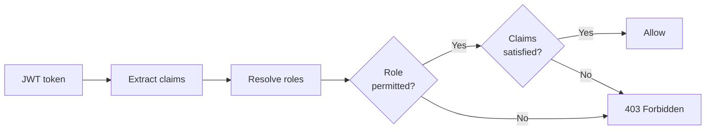

The Registry server provides a claims-based authorization model that controls
who can manage sources, registries, and entries. Authorization builds on top of
[authentication](./authentication.mdx). You need OAuth authentication enabled
before configuring authorization.

## How authorization works

When a client accesses registry data, the server checks three layers in order:

1. **Registry claims** (access gate): can the caller access this registry at
   all? If the registry has claims and the caller's JWT doesn't satisfy them,
   the server returns `403 Forbidden` before any data is returned.
2. **Entry claims** (visibility filter): which entries can the caller see? Each
   entry can carry claims inherited from its source (for synced sources) or set
   explicitly (via publish payload or Kubernetes annotation). Only entries whose
   claims the caller's JWT satisfies are included in the response.
3. **Role checks** (admin operations): can the caller perform this write
   operation? Publishing, deleting, and managing sources/registries require
   specific [roles](#configure-roles).

When a caller makes an API request, the server:

1. Extracts the caller's claims from their JWT token
2. Resolves the caller's roles based on those claims and the `authz`
   configuration
3. Checks whether the caller's role permits the operation
4. Checks whether the caller's claims satisfy the resource's claims



## Configure roles

Define roles in the `auth.authz.roles` section of your configuration file. Each
role maps to a list of claim rules. If a caller's JWT claims match any rule in
the list, they are granted that role.

```yaml title="config-authz.yaml"
auth:
  mode: oauth
  oauth:
    resourceUrl: https://registry.example.com
    providers:
      - name: keycloak
        issuerUrl: https://keycloak.example.com/realms/mcp
        audience: registry-api
  # highlight-start
  authz:
    roles:
      superAdmin:
        - role: 'super-admin'
      manageSources:
        - org: 'acme'
          role: 'admin'
      manageRegistries:
        - org: 'acme'
          role: 'admin'
      manageEntries:
        - role: 'writer'
  # highlight-end
```

### Available roles

| Role               | Grants access to                                              |
| ------------------ | ------------------------------------------------------------- |
| `superAdmin`       | All operations; bypasses all claim checks                     |
| `manageSources`    | Create, update, delete, and list sources via the admin API    |
| `manageRegistries` | Create, update, delete, and list registries via the admin API |
| `manageEntries`    | Publish and delete MCP server versions and skills             |

### Role rule matching

Each role is defined as a list of claim maps. A caller is granted the role if
their JWT claims match **any** map in the list (OR logic). Within a single map,
**all** key-value pairs must match (AND logic).

```yaml title="Example: grant manageSources to org admins OR platform leads"
authz:
  roles:
    manageSources:
      # Rule 1: any admin in the acme org
      - org: 'acme'
        role: 'admin'
      # Rule 2: anyone with the platform-lead role
      - role: 'platform-lead'
```

Claim values can be strings or arrays. When a JWT claim is an array (for
example, `role: ["admin", "writer"]`), the server checks whether any element
matches the required value. A rule with `role: "admin"` would match this JWT
because `"admin"` is one of the array elements.

### Super-admin role

The `superAdmin` role bypasses **all** claim checks across the entire server. A
super-admin can:

- Access any registry regardless of its claims
- See all entries regardless of source or entry claims
- Manage any source or registry, even those with claims outside their JWT
- Publish and delete entries without claim validation

Use this role sparingly and only for platform operators who need unrestricted
access.

## Configure claims on sources and registries

Claims are key-value pairs attached to sources and registries in your
configuration file. They act as access boundaries: only callers whose JWT claims
satisfy the resource's claims can access it.

### Source claims

For synced sources (Git, API, File), claims on a source are **inherited by all
entries** during sync. Every MCP server or skill ingested from that source
carries the source's claims.

For Kubernetes and managed sources, source claims control who can manage the
source via the admin API but are **not** inherited by entries. Kubernetes
entries get claims from the
[`authz-claims` annotation](./configuration.mdx#per-entry-claims-via-annotation)
on each CRD. Managed source entries get claims from the publish request payload.

```yaml title="config-source-claims.yaml"
sources:
  - name: platform-tools
    git:
      repository: https://github.com/acme/platform-tools.git
      branch: main
      path: registry.json
    syncPolicy:
      interval: '30m'
    # highlight-start
    claims:
      org: 'acme'
      team: 'platform'
    # highlight-end

  - name: data-tools
    git:
      repository: https://github.com/acme/data-tools.git
      branch: main
      path: registry.json
    syncPolicy:
      interval: '30m'
    claims:
      org: 'acme'
      team: 'data'
```

With this configuration:

- Entries from `platform-tools` are visible only to callers with `org: "acme"`
  **and** `team: "platform"` in their JWT
- Entries from `data-tools` are visible only to callers with `org: "acme"`
  **and** `team: "data"` in their JWT
- A super-admin sees all entries regardless of claims

### Registry claims

Claims on a registry act as an **access gate** for the consumer API. Before
returning any data from a registry's endpoints, the server checks that the
caller's JWT claims satisfy the registry's claims.

```yaml title="config-registry-claims.yaml"
registries:
  - name: platform
    sources: ['platform-tools']
    # highlight-start
    claims:
      org: 'acme'
      team: 'platform'
    # highlight-end

  - name: public
    sources: ['community-tools']
    # No claims - accessible to all authenticated users
```

A caller who requests `GET /registry/platform/v0.1/servers` must have JWT claims
that include `org: "acme"` and `team: "platform"`. Otherwise, the server returns
`403 Forbidden`.

### Claim containment

The server uses **containment** (superset check) for claim validation: the
caller's claims must be a superset of the resource's claims. For example:

| Resource claims                   | Caller JWT claims                 | Result                             |
| --------------------------------- | --------------------------------- | ---------------------------------- |
| `{org: "acme"}`                   | `{org: "acme", team: "platform"}` | Allowed                            |
| `{org: "acme", team: "platform"}` | `{org: "acme"}`                   | Denied                             |
| `{}` (no claims)                  | `{org: "acme"}`                   | Denied (default-deny on unlabeled) |
| `{org: "acme"}`                   | `{org: "contoso"}`                | Denied                             |

### Unlabeled resources

When `auth.authz` is configured, sources, registries, and entries with no claims
are treated as **default-deny**: invisible to every authenticated caller except
a super-admin.

Anonymous mode and [auth-only mode](#auth-only-mode) bypass the gate entirely,
so unlabeled resources remain accessible there.

To make a resource reachable under full authorization, attach claims to it:

- **Sources and registries**: set the `claims` field on the source or registry
  in your configuration file.
- **Entries from synced sources**: set claims on the source so they're inherited
  during sync.
- **Entries on Kubernetes sources**: use the
  [`authz-claims` annotation](./configuration.mdx#per-entry-claims-via-annotation)
  on the CRD.
- **Entries on managed sources**: include `claims` in the publish payload, or
  call `PUT /v1/entries/{type}/{name}/claims` from a super-admin.

:::info[Upgrading from earlier releases]

Releases before v1.4.1 treated an unlabeled resource as visible to every
authenticated caller, but only on single-resource paths like
`GET /v1/sources/{name}`. List endpoints already filtered them out, so the same
row could appear via one path and not another.

After upgrading to v1.4.1 or later with `auth.authz` configured, those unlabeled
rows become invisible to every non-super-admin caller. To restore access, a
super-admin can tag them in place via the per-entry claims endpoint, or
operators can add a tenant-wide claim to the source so synced entries inherit it
on the next sync.

:::

## Claims on published entries

When you publish an MCP server version or skill to a managed source, you can
attach claims to the entry. The server enforces three rules:

1. **Claims are required when authentication is enabled.** Publishing without
   claims, or with an empty `claims` object, against an authenticated endpoint
   returns `400 Bad Request`. Without claims, the entry would be invisible to
   every non-super-admin caller, so the server rejects the request up front.
2. **Publish claims must be a subset of the publisher's JWT claims.** Every
   claim key in the publish request must exist in the publisher's JWT with a
   matching value. For example, if your JWT has
   `{org: "acme", team: "platform"}`, you can publish entries with
   `{org: "acme"}` or `{org: "acme", team: "platform"}`, but not
   `{org: "contoso"}` (a value your JWT doesn't have).
3. **Subsequent versions must have the same claims as the first.** Once you
   publish the first version of an entry with specific claims, all future
   versions must carry the exact same claims. If the first version had none,
   subsequent versions must also have none. This prevents accidentally narrowing
   or broadening visibility across versions.

```bash title="Publish a server with claims"
curl -X POST \
  https://registry.example.com/v1/entries \
  -H "Authorization: Bearer $TOKEN" \
  -H "Content-Type: application/json" \
  -d '{
    "server": {
      "$schema": "https://static.modelcontextprotocol.io/schemas/2025-12-11/server.schema.json",
      "name": "io.github.acme/my-server",
      "description": "Team-scoped MCP server",
      "version": "1.0.0"
    },
    "claims": {
      "org": "acme",
      "team": "platform"
    }
  }'
```

See the [Registry API reference](../reference/registry-api.mdx) for the full
server payload schema, including `packages`, `remotes`, and `_meta` fields.

### Update claims on an existing entry

Use `PUT /v1/entries/{type}/{name}/claims` to change the claims on every version
of a previously published entry. The `type` path parameter is either `server` or
`skill`.

```bash title="Update claims on a published server"
curl -X PUT \
  "https://registry.example.com/v1/entries/server/io.github.acme%2Fmy-server/claims" \
  -H "Authorization: Bearer $TOKEN" \
  -H "Content-Type: application/json" \
  -d '{
    "claims": {
      "org": "acme",
      "team": "platform"
    }
  }'
```

Because entry names contain a slash separating namespace from server name,
URL-encode the slash as `%2F` so the path is treated as a single `{name}` path
parameter.

Pass an empty `claims` object (`{"claims": {}}`) to clear claims entirely. The
same authorization rules apply: your JWT claims must satisfy both the existing
claims on the entry (so you can modify it) and the new claims you're setting (so
you can't escalate visibility beyond what you're entitled to). Successful
updates return `204 No Content`.

## Admin API claim scoping

When authorization is enabled, the admin API endpoints for managing sources and
registries are also scoped by claims:

- **List sources/registries**: Only returns resources whose claims the caller's
  JWT satisfies.
- **Get source/registry by name**: Returns `404 Not Found` (not `403`) when the
  caller's claims don't match. This prevents information disclosure about
  resources the caller cannot access.
- **List source/registry entries**: `GET /v1/sources/{name}/entries` and
  `GET /v1/registries/{name}/entries` return the raw entries (servers and skills
  with versions and claims) in a source or registry. These endpoints follow the
  same claim scoping: the parent source or registry must be accessible to the
  caller.
- **Create source/registry**: The request claims must be a subset of the
  caller's JWT claims.
- **Update/delete source/registry**: The caller's JWT claims must satisfy the
  existing resource's claims.

## Auth-only mode

When OAuth authentication is enabled but the `auth.authz` block is omitted from
your configuration, the server runs in **auth-only mode**. In this mode:

- Callers must still authenticate with a valid JWT token
- All claims-based filtering is disabled. Every authenticated caller sees all
  entries regardless of source or registry claims
- Role checks are pass-throughs, so every authenticated caller can reach every
  endpoint
- `GET /v1/me` reports every defined role for authenticated callers, reflecting
  that authorization isn't being enforced
- The server logs a warning at startup:
  `Authorization not configured, per-entry claims filtering disabled (auth-only mode)`

Auth-only mode is useful when you need identity verification without
multi-tenant visibility controls, for example, a single-team deployment where
all authenticated users should have the same access.

To enable full authorization, add the `auth.authz` block with
[role definitions](#configure-roles).

## Anonymous mode

When authentication is set to `anonymous`, all authorization checks are
bypassed. There are no JWT claims to validate, so all sources, registries, and
entries are accessible without restriction. This is suitable for development and
testing environments only.

## Check your identity and permissions

Use the `GET /v1/me` endpoint to verify your authenticated identity and resolved
roles:

```bash
curl -H "Authorization: Bearer $TOKEN" \
  https://registry.example.com/v1/me
```

```json title="Example response"
{
  "subject": "user@example.com",
  "roles": ["manageSources", "manageEntries"]
}
```

This is useful for debugging authorization issues. You can confirm which roles
your JWT grants and whether the expected claims are present. The endpoint
returns `401 Unauthorized` in anonymous mode since there is no identity to
report.

## Complete example

This example shows a multi-team setup with full RBAC and claims-based scoping:

```yaml title="config-multi-tenant.yaml"
sources:
  - name: platform-tools
    git:
      repository: https://github.com/acme/platform-tools.git
      branch: main
      path: registry.json
    syncPolicy:
      interval: '30m'
    claims:
      org: 'acme'
      team: 'platform'

  - name: data-tools
    git:
      repository: https://github.com/acme/data-tools.git
      branch: main
      path: registry.json
    syncPolicy:
      interval: '30m'
    claims:
      org: 'acme'
      team: 'data'

  - name: shared
    managed: {}
    claims:
      org: 'acme'

registries:
  - name: platform
    sources: ['platform-tools', 'shared']
    claims:
      org: 'acme'
      team: 'platform'

  - name: data
    sources: ['data-tools', 'shared']
    claims:
      org: 'acme'
      team: 'data'

auth:
  mode: oauth
  oauth:
    resourceUrl: https://registry.example.com
    providers:
      - name: keycloak
        issuerUrl: https://keycloak.example.com/realms/mcp
        audience: registry-api
  authz:
    roles:
      superAdmin:
        - role: 'super-admin'
      manageSources:
        - org: 'acme'
          role: 'admin'
      manageRegistries:
        - org: 'acme'
          role: 'admin'
      manageEntries:
        - role: 'writer'
```

With this configuration:

- **Platform team members** (JWT with `org: "acme"`, `team: "platform"`) can
  access the `platform` registry and see entries from `platform-tools` and
  `shared`.
- **Data team members** (JWT with `org: "acme"`, `team: "data"`) can access the
  `data` registry and see entries from `data-tools` and `shared`.
- **Writers** in the `acme` org (JWT with `org: "acme"`, `role: "writer"`) can
  publish to the `shared` managed source. The `org: "acme"` claim on the source
  is what makes it reachable to non-super-admin callers under default-deny.
- **Admins** (JWT with `org: "acme"`, `role: "admin"`) can manage sources and
  registries within the `acme` org.
- **Super-admins** (JWT with `role: "super-admin"`) can access and manage
  everything.

Every entry published to the `shared` source must carry claims (publishing
without claims is rejected when authentication is enabled), and those claims
must be a subset of the publisher's JWT. To narrow visibility within a registry,
publish with team-scoped claims like `{org: "acme", team: "platform"}` so only
that team's registry surfaces the entry. See
[Claims on published entries](#claims-on-published-entries) for the full rules.

## Next steps

- [Configure authentication](./authentication.mdx) to set up OAuth providers
- [Configure sources and registries](./configuration.mdx) to set up your data
  sources
- [Manage skills](./skills.mdx) to publish and discover reusable skills

## Related information

- [Registry server introduction](./intro.mdx) - architecture and features
  overview
