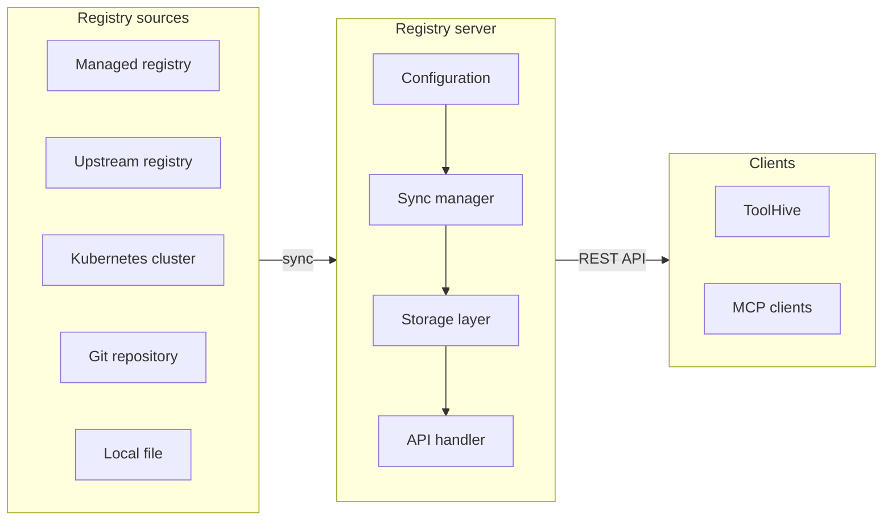

The ToolHive Registry server is a standards-compliant implementation of the MCP
Registry API specification. It provides a REST API for discovering and accessing
MCP servers from multiple backend sources.

## Overview

The Registry server aggregates MCP server metadata from various sources and
exposes it through a standardized API. When you start the server, it:

1. Loads configuration from a YAML file
2. Runs database migrations automatically (if database is configured)
3. Immediately fetches registry data from the configured sources
4. Starts background sync coordinator for automatic updates (for synced
   registries)
5. Serves MCP Registry API endpoints on the configured address

## Features

- **Standards-compliant**: Implements the official MCP Registry API
  specification
- **Multiple registry sources**: Git repositories, API endpoints, local files,
  managed registries, and Kubernetes discovery
- **Automatic synchronization**: Background sync with configurable intervals and
  retry logic for Git, API, and File sources
- **Container-ready**: Designed for deployment in Kubernetes clusters, but can
  be deployed anywhere
- **Flexible deployment**: Works standalone or as part of ToolHive
  infrastructure
- **Production-ready**: Built-in health checks, graceful shutdown, and sync
  status persistence
- **Kubernetes-aware**: Automatic discovery of MCP servers deployed via ToolHive
  Operator

## Registry sources

The server supports five registry source types:

1. **Managed Registry** - A fully-managed MCP Registry
   - Ideal for private repositories
   - Automatically exposes entries following upstream MCP Registry format
   - Supports adding new MCP servers via `/publish` endpoint

2. **Upstream Registry** - Sync from upstream MCP Registry APIs
   - Supports federation and aggregation scenarios
   - Format conversion from upstream to ToolHive format
   - Does not support publishing

3. **Kubernetes Cluster** - Automatically creates registry entries for running
   workloads
   - Ideal to quickly grant access to running MCP servers to knowledge workers
   - Useful for bigger organizations where MCP server developers differ from
     users
   - Supports adding new MCP servers via `/publish` endpoint

4. **Git Repository** - Clone and sync from Git repositories
   - Supports branch, tag, or commit pinning
   - Ideal for version-controlled registries
   - Does not support publishing

5. **Local File** - Read from filesystem
   - Ideal for local development and testing
   - Supports mounted volumes in containers
   - Does not support publishing

## Next steps

- [Configure registry sources](./configuration.mdx) to set up your registry
- [Deploy the server](./deployment.mdx) in your environment
