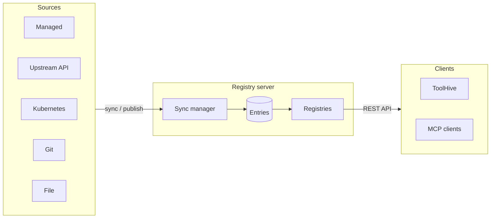

The ToolHive Registry Server is a standards-compliant implementation of the MCP
Registry API specification. It provides a REST API for discovering and accessing
MCP servers from multiple backend sources.

:::note[Registry Server vs. built-in registry]

This section covers the **Registry Server**, a standalone service you deploy
yourself for hosting and curating your own MCP server catalog.

ToolHive also ships with a **built-in registry** for browsing and discovering
MCP servers from the default catalog. That's a different feature: see
[Explore the registry](../guides-cli/registry.mdx) (CLI) or
[Explore the registry](../guides-ui/registry.mdx) (UI).

:::

## Key concepts

The Registry Server is built around three core concepts:

- A **source** is where data comes from: a Git repository, an upstream API, a
  local file, a Kubernetes cluster, or a managed API endpoint. Each source syncs
  or receives MCP servers and skills.
- An **entry** is an individual MCP server or skill stored in the database.
  Sources produce entries; each entry belongs to exactly one source.
- A **registry** is a named API surface that aggregates entries from one or more
  sources. Clients access entries through a registry name in the URL (for
  example, `GET /default/v0.1/servers`). You can create multiple registries from
  the same sources to serve different audiences or apply different access
  controls.

## How the Registry Server works

The Registry server aggregates MCP server metadata from various sources and
exposes it through a standardized API. When you start the server, it:

1. Loads configuration from a YAML file
2. Runs database migrations automatically
3. Immediately fetches registry data from the configured sources
4. Starts a background sync coordinator for automatic updates (for synced
   sources)
5. Serves MCP Registry API endpoints on the configured address

```mermaid
flowchart LR
  subgraph Sources["Sources"]
    direction LR
    Managed["Managed"]
    API["Upstream API"]
    Kubernetes["Kubernetes"]
    Git["Git"]
    File["File"]
  end
  subgraph Server["Registry server"]
    direction TB
    Sync["Sync manager"]
    Entries[("Entries")]
    Registries["Registries"]
  end
  subgraph Clients["Clients"]
    direction LR
    ToolHive["ToolHive"]
    MCPClient["MCP clients"]
  end
  Sources -->|"sync / publish"| Sync
  Sync --> Entries
  Entries --> Registries
  Registries -->|"REST API"| Clients
```

## Features

- **Standards-compliant**: Implements the official MCP Registry API
  specification
- **Multiple registry sources**: Git repositories, API endpoints, local files,
  managed sources, and Kubernetes discovery
- **Automatic synchronization**: Background sync with configurable intervals and
  retry logic for Git, API, and File sources
- **Container-ready**: Designed for deployment in Kubernetes clusters, but can
  be deployed anywhere
- **Flexible deployment**: Works standalone or as part of ToolHive
  infrastructure
- **Production-ready**: Built-in health checks, graceful shutdown, and sync
  status persistence
- **Kubernetes-aware**: Automatic discovery of MCP servers deployed via ToolHive
  Operator
- **Multi-tenant authorization**: Claims-based access control with role-based
  administration, enabling team-scoped registries and entry visibility
- **Skills registry**: Publish and discover reusable
  [skills](../concepts/skills.mdx) via the extensions API and synced sources

## Registry sources

The server supports five source types:

1. **Managed** - A fully-managed MCP source
   - Ideal for hosting private MCP server catalogs
   - Automatically exposes entries following upstream MCP Registry format
   - Supports adding new MCP servers via `/publish` endpoint

2. **Upstream API** - Sync from upstream MCP Registry APIs
   - Supports federation and aggregation scenarios
   - Syncs both MCP servers and skills from upstream sources
   - Does not support publishing

3. **Kubernetes** - Automatically creates registry entries for running workloads
   - Ideal to quickly grant access to running MCP servers to knowledge workers
   - Useful for bigger organizations where MCP server developers differ from
     users
   - Does not support publishing

4. **Git** - Clone and sync from Git repositories
   - Supports branch, tag, or commit pinning
   - Syncs both MCP servers and skills (upstream format)
   - Does not support publishing

5. **File** - Read from filesystem
   - Ideal for local development and testing
   - Syncs both MCP servers and skills (upstream format)
   - Does not support publishing

## Next steps

- [Configure sources and registries](./configuration.mdx) to set up your data
  sources, sync policies, and entry filtering
- [Set up authentication](./authentication.mdx) to secure access to your
  registry
- [Configure authorization](./authorization.mdx) to control access with roles
  and claims
- [Manage skills](./skills.mdx) to publish and discover reusable skills
- [View the API reference](../reference/registry-api.mdx) for endpoint
  documentation
