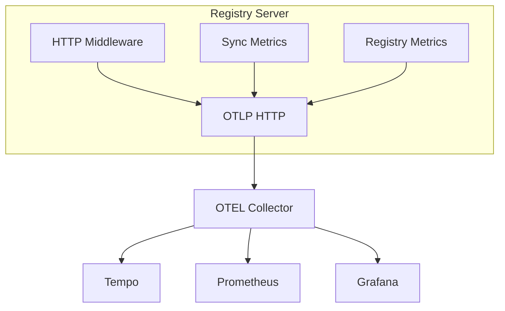

The ToolHive Registry Server provides comprehensive observability through
OpenTelemetry (OTEL), supporting both distributed tracing and metrics collection
via OTLP exporters. This enables you to monitor system behavior, diagnose
issues, and improve performance.

## Architecture overview

The Registry Server exports telemetry data (traces and metrics) via OTLP HTTP to
an OpenTelemetry Collector, which can then forward to various backends:



## Configuration

Add telemetry configuration to your Registry Server configuration file:

```yaml title="config.yaml"
telemetry:
  enabled: true
  serviceName: thv-registry-api
  serviceVersion: '1.0.0'
  endpoint: otel-collector:4318
  insecure: true
  tracing:
    enabled: true
    sampling: 0.05
  metrics:
    enabled: true
```

### Configuration options

| Option             | Type   | Default            | Description                       |
| ------------------ | ------ | ------------------ | --------------------------------- |
| `enabled`          | bool   | `false`            | Enable or disable all telemetry   |
| `serviceName`      | string | `thv-registry-api` | Service name in telemetry data    |
| `serviceVersion`   | string | `"unknown"`        | Service version in telemetry data |
| `endpoint`         | string | `localhost:4318`   | OTLP HTTP endpoint (host:port)    |
| `insecure`         | bool   | `false`            | Use insecure connection (no TLS)  |
| `tracing.enabled`  | bool   | `false`            | Enable distributed tracing        |
| `tracing.sampling` | float  | `0.05`             | Trace sampling ratio (0.0 to 1.0) |
| `metrics.enabled`  | bool   | `false`            | Enable metrics collection         |

:::note

The `endpoint` is provided as a hostname and optional port, without a scheme or
path (e.g., use `api.honeycomb.io` or `api.honeycomb.io:443`, not
`https://api.honeycomb.io`). The server automatically uses HTTPS unless
`insecure: true` is specified.

:::

## Metrics

The Registry Server exposes metrics prefixed with `thv_reg_srv_` for easy
identification.

### Available metrics

| Metric                                      | Type          | Labels                           | Description                    |
| ------------------------------------------- | ------------- | -------------------------------- | ------------------------------ |
| `thv_reg_srv_http_request_duration_seconds` | Histogram     | `method`, `route`, `status_code` | Duration of HTTP requests      |
| `thv_reg_srv_http_requests_total`           | Counter       | `method`, `route`, `status_code` | Total number of HTTP requests  |
| `thv_reg_srv_http_active_requests`          | UpDownCounter | -                                | Number of in-flight requests   |
| `thv_reg_srv_servers_total`                 | Gauge         | `registry`                       | Number of servers per registry |
| `thv_reg_srv_sync_duration_seconds`         | Histogram     | `registry`, `success`            | Duration of sync operations    |

### Histogram buckets

The metrics use the following histogram bucket boundaries:

- **HTTP request duration**: 0.005, 0.01, 0.025, 0.05, 0.1, 0.25, 0.5, 1, 2.5,
  5, 10 seconds
- **Sync duration**: 0.1, 0.5, 1, 2.5, 5, 10, 30, 60, 120, 300 seconds

## Distributed tracing

The Registry Server implements distributed tracing across two layers: HTTP
requests and service operations.

### Trace hierarchy

Traces follow a parent-child hierarchy that shows the complete request flow:

```text
HTTP Request Span (root)
└── Service Span (child)
    └── Database operations with db.system=postgresql
```

:::note

Background sync operations are monitored through metrics (see the
`thv_reg_srv_sync_duration_seconds` metric above) rather than distributed
traces, as they are internal operations without incoming request context.

:::

### HTTP layer spans

All HTTP requests (except health and readiness endpoints) are traced with the
following attributes:

| Attribute                   | Type   | Description                                  |
| --------------------------- | ------ | -------------------------------------------- |
| `http.request.method`       | string | HTTP method (GET, POST, etc.)                |
| `http.route`                | string | Route pattern (e.g., `/v0.1/servers/{name}`) |
| `url.path`                  | string | Actual URL path                              |
| `user_agent.original`       | string | Client user agent (truncated to 256 chars)   |
| `http.response.status_code` | int    | Response status code                         |

### Service layer spans

Database service operations include these attributes:

| Attribute               | Type   | Description                       |
| ----------------------- | ------ | --------------------------------- |
| `registry.name`         | string | Name of the registry              |
| `server.name`           | string | Name of the server                |
| `server.version`        | string | Version of the server             |
| `pagination.limit`      | int    | Page size limit                   |
| `pagination.has_cursor` | bool   | Whether pagination cursor is used |
| `result.count`          | int    | Number of results returned        |

### Context propagation

The Registry Server supports W3C Trace Context propagation. Incoming requests
with `traceparent` headers have their trace context extracted and used as the
parent for all child spans, enabling distributed tracing across multiple
services.

## Example configuration

This example shows a complete Registry Server configuration with telemetry
enabled:

```yaml title="config.yaml"
registryName: my-registry

registries:
  - name: toolhive
    format: upstream
    git:
      repository: https://github.com/stacklok/toolhive.git
      branch: main
      path: pkg/registry/data/registry.json
    syncPolicy:
      interval: '30m'

auth:
  mode: anonymous

telemetry:
  enabled: true
  serviceName: thv-registry-api
  serviceVersion: '1.0.0'
  endpoint: otel-collector:4318
  insecure: true
  tracing:
    enabled: true
    sampling: 0.05
  metrics:
    enabled: true
```

## Sampling strategies

Adjust sampling rates based on your environment and traffic volume:

| Environment | Sampling rate | Use case                                     |
| ----------- | ------------- | -------------------------------------------- |
| Development | `1.0`         | Capture all traces for debugging             |
| Staging     | `0.1`         | 10% sampling for testing                     |
| Production  | `0.01 - 0.05` | 1-5% sampling to balance cost and visibility |

:::tip

Start with a higher sampling rate and reduce it as you understand your traffic
patterns. For high-traffic production environments, even 1% sampling provides
sufficient data for identifying issues.

:::

## Excluded endpoints

Health and readiness endpoints are intentionally excluded from tracing:

| Endpoint     | Reason                                     |
| ------------ | ------------------------------------------ |
| `/health`    | High-frequency, low-diagnostic-value probe |
| `/readiness` | High-frequency, low-diagnostic-value probe |

These endpoints generate a high volume of nearly identical spans that provide
minimal diagnostic value while significantly increasing storage costs. HTTP
metrics still capture latency and error rates for these endpoints.

## Next steps

- [Configure the Registry Server](./configuration.mdx) with your registries
- [Deploy the server](./deployment.mdx) to your environment
- [Configure authentication](./authentication.mdx) for secure access
