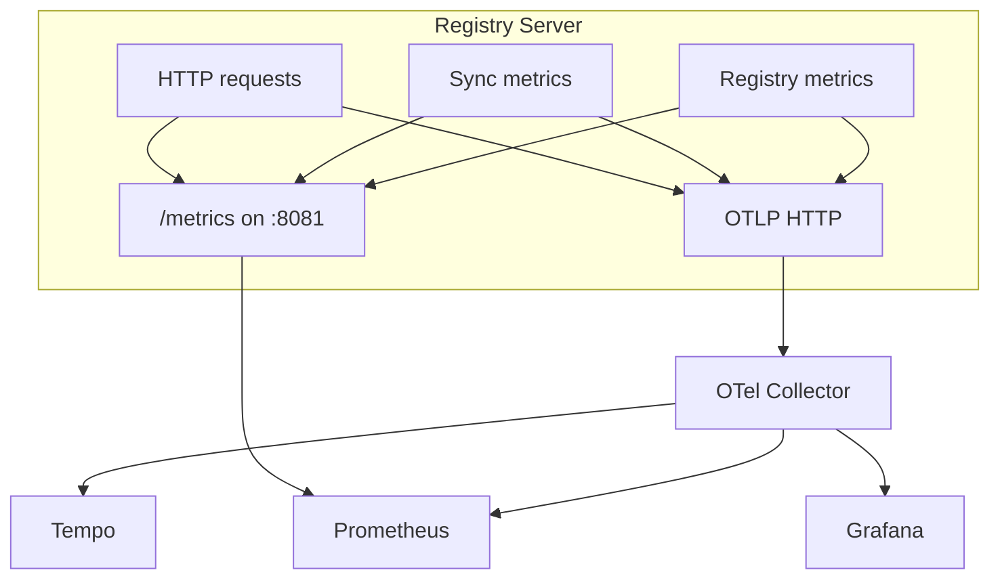

The ToolHive Registry Server provides comprehensive observability through
OpenTelemetry (OTel), supporting both distributed tracing and metrics collection
via OTLP exporters. When metrics are enabled, the same metrics are also directly
scrapable from a Prometheus-format `/metrics` endpoint on the internal server.

## Architecture overview

The Registry Server exports telemetry data (traces and metrics) via OTLP HTTP to
an OpenTelemetry Collector, which can forward to various backends. Metrics are
additionally exposed on the internal server's `/metrics` endpoint for direct
Prometheus scrape:


```mermaid
flowchart TB
    subgraph server["Registry Server"]
        http["HTTP requests"]
        sync["Sync metrics"]
        registry["Registry metrics"]

        http & sync & registry --> otlp["OTLP HTTP"]
        http & sync & registry --> scrape["/metrics on :8081"]
    end

    otlp --> collector["OTel Collector"]
    scrape --> prometheus["Prometheus"]

    collector --> tempo["Tempo"]
    collector --> prometheus
    collector --> grafana["Grafana"]
```

## Configuration

Add telemetry configuration to your Registry Server configuration file:

```yaml title="config.yaml"
telemetry:
  enabled: true
  serviceName: thv-registry-api
  serviceVersion: '1.0.0'
  endpoint: otel-collector:4318
  insecure: true
  tracing:
    enabled: true
    sampling: 0.05
  metrics:
    enabled: true
```

### Configuration options

| Option             | Type   | Default            | Description                       |
| ------------------ | ------ | ------------------ | --------------------------------- |
| `enabled`          | bool   | `false`            | Enable or disable all telemetry   |
| `serviceName`      | string | `thv-registry-api` | Service name in telemetry data    |
| `serviceVersion`   | string | `"unknown"`        | Service version in telemetry data |
| `endpoint`         | string | `localhost:4318`   | OTLP HTTP endpoint (host:port)    |
| `insecure`         | bool   | `false`            | Use insecure connection (no TLS)  |
| `tracing.enabled`  | bool   | `false`            | Enable distributed tracing        |
| `tracing.sampling` | float  | `0.05`             | Trace sampling ratio (0.0 to 1.0) |
| `metrics.enabled`  | bool   | `false`            | Enable metrics collection         |

:::note

The `endpoint` is provided as a hostname and optional port, without a scheme or
path (e.g., use `api.honeycomb.io` or `api.honeycomb.io:443`, not
`https://api.honeycomb.io`). The server automatically uses HTTPS unless
`insecure: true` is specified.

:::

## Metrics

Registry-specific metrics use the `stacklok_registry_` prefix. The two HTTP
server metrics that have a direct OpenTelemetry semantic-convention equivalent
(`http.server.request.duration` and `http.server.active_requests`) keep their
unprefixed spec names instead, so they stay joinable with the same metric
emitted by any other semconv-instrumented service.

Every series carries the constant labels `stacklok_component="registry"` and
`stacklok_product="stacklok-platform"`, promoted from OTel resource attributes
so dashboards can filter by component without relying on Prometheus `job` or
`instance` labels.

### Prometheus scrape endpoint

When `metrics.enabled` is `true`, the same metrics are exposed at `/metrics` on
the internal server (default port `8081`), independent of the OTLP export path.
The Helm chart's Service publishes port `8081` by default, so `/metrics` is
reachable through the Service (set `service.exposeInternalPort: false` to keep
it pod-local).

:::warning

The `/metrics` endpoint has no authentication, consistent with the other
internal-server routes (`/health`, `/readiness`, `/version`). Restrict access at
the network level. In a shared cluster, apply a NetworkPolicy that limits which
pods can reach the Service's internal port. The chart README's
[Internal Port Exposure](https://github.com/stacklok/toolhive-registry-server/blob/main/deploy/charts/toolhive-registry-server/README.md)
section includes a sample policy.

:::

### Available metrics

| Metric                                    | Type          | Labels                                                                         | Description                                                                                                             |
| ----------------------------------------- | ------------- | ------------------------------------------------------------------------------ | ----------------------------------------------------------------------------------------------------------------------- |
| `http_server_request_duration_seconds`    | Histogram     | `http_request_method`, `url_scheme`, `http_route`, `http_response_status_code` | Duration of HTTP requests. Uses the OTel semconv name `http.server.request.duration`.                                   |
| `stacklok_registry_http_requests_total`   | Counter       | `http_request_method`, `url_scheme`, `http_route`, `http_response_status_code` | Total number of HTTP requests.                                                                                          |
| `http_server_active_requests`             | UpDownCounter | `http_request_method`, `url_scheme`                                            | Number of in-flight HTTP requests. Uses the OTel semconv name `http.server.active_requests`.                            |
| `stacklok_registry_servers`               | Gauge         | `source`                                                                       | Number of distinct servers per source.                                                                                  |
| `stacklok_registry_skills`                | Gauge         | `source`                                                                       | Number of distinct skills per source.                                                                                   |
| `stacklok_registry_plugins`               | Gauge         | `source`                                                                       | Number of distinct plugins per source.                                                                                  |
| `stacklok_registry_sync_duration_seconds` | Histogram     | `source`, `outcome`                                                            | Duration of sync operations. `outcome` is `success` or `error`.                                                         |
| `stacklok_registry_errors_total`          | Counter       | `error_type`, `area`                                                           | Error-by-type classification for the sync (`area="sync"`) and HTTP (`area="http"`) paths.                               |
| `stacklok_build_info_ratio`               | Gauge         | `component`, `version`, `commit`                                               | Always `1`; build identity is carried on labels. The OTel Prometheus exporter appends `_ratio` to gauges with unit `1`. |

:::note

The `http_request_method` label is normalized to `_OTHER` for any method outside
the nine standard HTTP methods (`GET`, `HEAD`, `POST`, `PUT`, `DELETE`,
`CONNECT`, `OPTIONS`, `TRACE`, `PATCH`). This prevents unbounded cardinality on
the unauthenticated `/metrics` endpoint. Matching is case-sensitive per the
OpenTelemetry semantic conventions, so a lowercase `get` reports as `_OTHER`
rather than being silently repaired.

:::

### Histogram buckets

- **HTTP request duration**: 0.005, 0.01, 0.025, 0.05, 0.1, 0.25, 0.5, 1, 2.5,
  5, 10 seconds
- **Sync duration**: 0.1, 0.5, 1, 2.5, 5, 10, 30, 60, 120, 180, 300 seconds

## Distributed tracing

The Registry Server implements distributed tracing across two layers: HTTP
requests and service operations.

### Trace hierarchy

Traces follow a parent-child hierarchy that shows the complete request flow:

```text
HTTP Request Span (root)
└── Service Span (child)
    └── Database operations with db.system=postgresql
```

:::note

Background sync operations are monitored through metrics (see the
`stacklok_registry_sync_duration_seconds` metric above) rather than distributed
traces, as they are internal operations without incoming request context.

:::

### HTTP layer spans

All HTTP requests (except health and readiness endpoints) are traced with the
following attributes:

| Attribute                   | Type   | Description                                  |
| --------------------------- | ------ | -------------------------------------------- |
| `http.request.method`       | string | HTTP method (GET, POST, etc.)                |
| `http.route`                | string | Route pattern (e.g., `/v0.1/servers/{name}`) |
| `url.path`                  | string | Actual URL path                              |
| `user_agent.original`       | string | Client user agent (truncated to 256 chars)   |
| `http.response.status_code` | int    | Response status code                         |

### Service layer spans

Database service operations include these attributes:

| Attribute               | Type   | Description                       |
| ----------------------- | ------ | --------------------------------- |
| `registry.name`         | string | Name of the registry              |
| `server.name`           | string | Name of the server                |
| `server.version`        | string | Version of the server             |
| `pagination.limit`      | int    | Page size limit                   |
| `pagination.has_cursor` | bool   | Whether pagination cursor is used |
| `result.count`          | int    | Number of results returned        |

### Context propagation

The Registry Server supports W3C Trace Context propagation. Incoming requests
with `traceparent` headers have their trace context extracted and used as the
parent for all child spans, enabling distributed tracing across multiple
services.

## Sampling strategies

Adjust sampling rates based on your environment and traffic volume:

| Environment | Sampling rate | Use case                                     |
| ----------- | ------------- | -------------------------------------------- |
| Development | `1.0`         | Capture all traces for debugging             |
| Staging     | `0.1`         | 10% sampling for testing                     |
| Production  | `0.01 - 0.05` | 1-5% sampling to balance cost and visibility |

:::tip

Start with a higher sampling rate and reduce it as you understand your traffic
patterns. For high-traffic production environments, even 1% sampling provides
sufficient data for identifying issues.

:::

## Excluded endpoints

The `/health`, `/readiness`, and `/version` endpoints are served on a separate
internal server (default port 8081) and are not included in distributed tracing
or HTTP metrics from the main API server. This separates Kubernetes probe
traffic from application telemetry. The `/metrics` endpoint lives on the same
internal server but is not excluded, so scrapes appear in the `http_server_*`
series with `http_route="/metrics"`.

## Next steps

- [Registry Server API reference](../reference/registry-api.mdx) for the full
  set of endpoints and schemas
