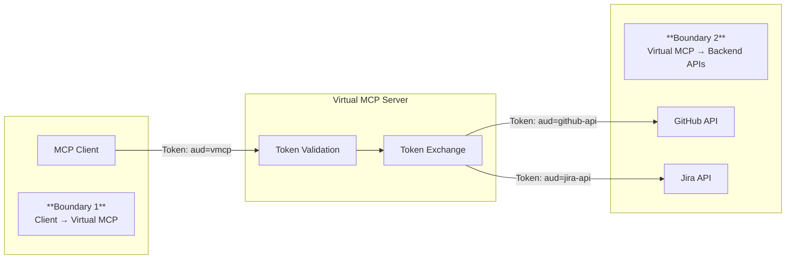

Virtual MCP implements a two-boundary authentication model that separates client
authentication from backend authentication, giving you centralized control over
access while supporting diverse backend requirements.

## Two-boundary authentication model



**Boundary 1 (Incoming):** Clients authenticate to Virtual MCP using a token
with `aud=vmcp`. This is your organization's identity layer.

**Boundary 2 (Outgoing):** Virtual MCP exchanges the client token for
backend-specific tokens. Each backend API receives a token scoped to its
requirements.

## Incoming authentication

Configure how clients authenticate to Virtual MCP.

### Anonymous (development only)

No authentication required. Use only for local development.

```yaml
spec:
  incomingAuth:
    type: anonymous
```

### OIDC authentication

Validate tokens from an external identity provider.

{/* TODO: Add OIDC configuration example */}

### Kubernetes service account tokens

Authenticate using Kubernetes service account tokens for in-cluster clients.

{/* TODO: Add Kubernetes auth configuration example */}

## Outgoing authentication

Configure how Virtual MCP authenticates to backend APIs.

### Discovery mode (recommended)

Automatically discover authentication configuration from each backend's
MCPServer resource:

```yaml
spec:
  outgoingAuth:
    source: discovered
    default:
      type: unauthenticated
```

{/* TODO: Add MCPExternalAuthConfig reference example */}

### Token exchange (RFC 8693)

Exchange the client's token for a backend-specific token:

{/* TODO: Add token exchange configuration example */}

### Header injection (API keys)

Inject a static header value (such as an API key or bearer token) into requests:

```yaml
spec:
  outgoingAuth:
    source: inline
    backends:
      github:
        type: header_injection
        headerInjection:
          headerName: 'Authorization'
          headerValueRef:
            name: github-api-secret
            key: token
```

### Unauthenticated

For backends that require no authentication:

```yaml
spec:
  outgoingAuth:
    source: inline
    backends:
      public-api:
        type: unauthenticated
```

## Authorization with Cedar

Add fine-grained authorization using Cedar policies:

{/* TODO: Add Cedar authorization example */}

See [Cedar policies](../concepts/cedar-policies.mdx) for policy syntax.

## Token caching

Virtual MCP caches exchanged tokens to reduce latency and load on identity
providers:

```yaml
spec:
  tokenCache:
    provider: memory
    memory:
      maxEntries: 1000
      ttlOffset: 5m # Refresh 5 minutes before expiry
```

{/* TODO: Add Redis configuration example */}

## Example: Complete authentication setup

{/* TODO: Add complete authentication example */}

## Related information

- [Authentication framework concepts](../concepts/auth-framework.mdx)
- [Token exchange in Kubernetes](../guides-k8s/token-exchange-k8s.mdx)
- [Cedar policies](../concepts/cedar-policies.mdx)
