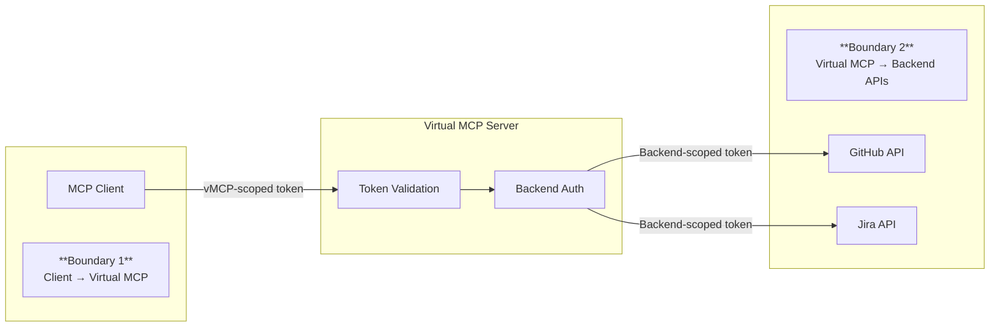

Virtual MCP implements a two-boundary authentication model that separates client
authentication from backend authentication, giving you centralized control over
access while supporting diverse backend requirements.

## Two-boundary authentication model



**Boundary 1 (Incoming):** Clients authenticate to Virtual MCP using the
mechanism defined in the MCP specification. This is your organization's identity
layer.

**Boundary 2 (Outgoing):** Virtual MCP obtains appropriate credentials for each
backend. Each backend API receives a token or credential scoped to its
requirements.

## Incoming authentication

Configure how clients authenticate to Virtual MCP.

### Anonymous (development only)

No authentication required. Use only for local development.

```yaml
spec:
  incomingAuth:
    type: anonymous
```

### OIDC authentication

Validate tokens from an external identity provider:

```yaml
spec:
  incomingAuth:
    type: oidc
    oidcConfig:
      type: inline
      inline:
        issuer: https://auth.example.com
        clientId: your-client-id
        audience: vmcp
        # Reference a Secret for the client secret (recommended)
        clientSecretRef:
          name: oidc-client-secret
          key: clientSecret
```

Create the Secret containing the client secret:

```yaml
apiVersion: v1
kind: Secret
metadata:
  name: oidc-client-secret
  namespace: toolhive-system
type: Opaque
stringData:
  clientSecret: your-client-secret
```

### Kubernetes service account tokens

Authenticate using Kubernetes service account tokens for in-cluster clients:

```yaml
spec:
  incomingAuth:
    type: oidc
    oidcConfig:
      type: kubernetes
      kubernetes:
        audience: toolhive
```

This configuration uses the Kubernetes API server as the OIDC issuer and
validates service account tokens. The defaults work for most clusters:

- **issuer**: `https://kubernetes.default.svc` (auto-detected)
- **audience**: `toolhive` (configurable)

## Outgoing authentication

Configure how Virtual MCP authenticates to backend MCP servers. Outgoing
authentication is configured through `MCPExternalAuthConfig` resources.

### Discovery mode (recommended)

When using discovery mode, Virtual MCP checks each backend MCPServer's
`externalAuthConfigRef` to determine how to authenticate. If a backend has no
auth config, Virtual MCP uses the specified default.

```yaml
spec:
  outgoingAuth:
    source: discovered
    default:
      type: discovered
```

### External auth config reference

Reference an `MCPExternalAuthConfig` resource for specific backends:

```yaml
spec:
  outgoingAuth:
    source: inline
    backends:
      github:
        type: external_auth_config_ref
        externalAuthConfigRef:
          name: github-auth
```

The `MCPExternalAuthConfig` resource defines the actual authentication strategy:

- **Token exchange**: Exchange the client's token for a backend-specific token
  using RFC 8693
- **Header injection**: Inject a static header value (such as an API key)

{/* TODO: Add MCPExternalAuthConfig examples */}

## Example: Complete authentication setup

{/* TODO: Add complete authentication example */}

## Related information

- [Authentication framework concepts](../concepts/auth-framework.mdx)
- [Token exchange in Kubernetes](../guides-k8s/token-exchange-k8s.mdx)
