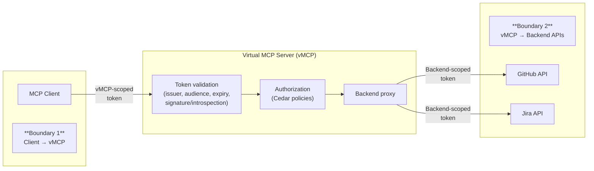
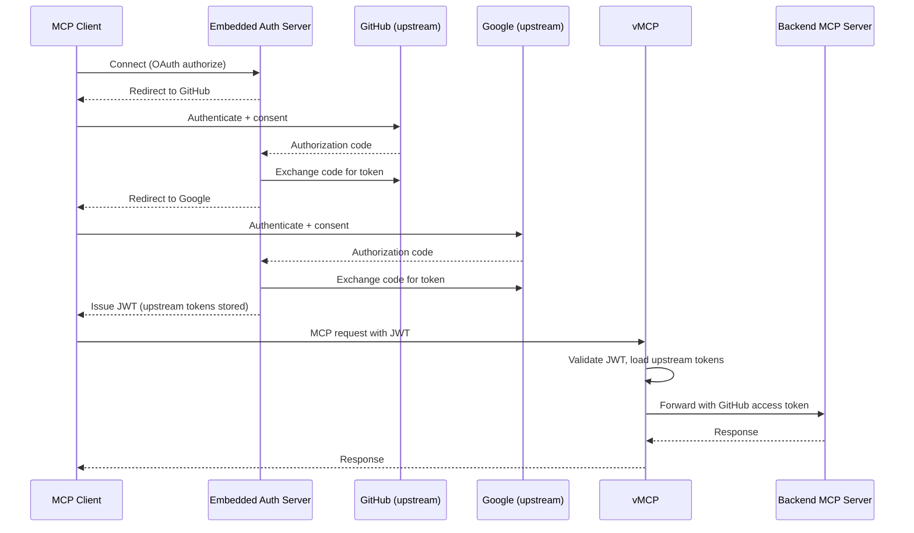

Virtual MCP Server (vMCP) implements a two-boundary authentication model that
separates client and backend authentication, giving you centralized control over
access while supporting diverse backend requirements.

## Two-boundary authentication model


```mermaid
flowchart LR
    subgraph Boundary1[" "]
        direction TB
        Client[MCP Client]
        B1Label["**Boundary 1**<br>Client → vMCP"]
    end

    subgraph vMCP["Virtual MCP Server (vMCP)"]
        direction TB
        Auth["Token validation<br>(issuer, audience, expiry,<br>signature/introspection)"]
        Authz["Authorization<br>(Cedar policies)"]
        Proxy[Backend proxy]
        Auth --> Authz --> Proxy
    end

    subgraph Boundary2[" "]
        direction TB
        B2Label["**Boundary 2**<br>vMCP → Backend APIs"]
        GitHub[GitHub API]
        Jira[Jira API]
    end

    Client -->|"vMCP-scoped<br>token"| Auth
    Proxy -->|"Backend-scoped<br>token"| GitHub
    Proxy -->|"Backend-scoped<br>token"| Jira
```

**Boundary 1 (Incoming):** Clients authenticate to vMCP using OAuth 2.1
authorization as defined in the
[MCP specification](https://modelcontextprotocol.io/specification/2025-11-25/basic/authorization).
The vMCP validates the token by checking issuer, audience, expiry, and signature
for JWTs, or by using token introspection for opaque tokens. It then evaluates
Cedar policies before forwarding the request. This all happens inside the single
`vmcp` process, unlike a plain MCPServer deployment where a separate ToolHive
proxy handles this step. When using shared OIDC configuration via
`oidcConfigRef`, the audience value must be explicitly set. For inline OIDC
configuration, it is optional but recommended. See
[OIDC authentication](#oidc-authentication) below.

**Boundary 2 (Outgoing):** vMCP obtains credentials for each backend API using
the configured outgoing auth strategy. See
[Outgoing authentication](#outgoing-authentication) for the available
strategies.

## Incoming authentication

Configure how clients authenticate to vMCP.

### Anonymous (development only)

No authentication required:

```yaml title="VirtualMCPServer resource"
spec:
  incomingAuth:
    type: anonymous
```

:::warning

Do not use `anonymous` authentication in production environments. This setting
disables all access control, allowing anyone to use the vMCP without
credentials.

:::

### OIDC authentication

Validate tokens from an external identity provider:

```yaml title="VirtualMCPServer resource"
spec:
  incomingAuth:
    type: oidc
    oidcConfig:
      type: inline
      inline:
        issuer: https://auth.example.com
        clientId: <YOUR_CLIENT_ID>
        audience: vmcp
```

When using an identity provider that issues opaque OAuth tokens, add a
`clientSecretRef` referencing a Kubernetes Secret to enable token introspection:

```yaml title="VirtualMCPServer resource"
spec:
  incomingAuth:
    type: oidc
    oidcConfig:
      type: inline
      inline:
        issuer: https://auth.example.com
        clientId: <YOUR_CLIENT_ID>
        audience: vmcp
        clientSecretRef:
          name: oidc-client-secret
          key: clientSecret
```

Create the Secret:

```yaml
apiVersion: v1
kind: Secret
metadata:
  name: oidc-client-secret
  namespace: toolhive-system
type: Opaque
stringData:
  clientSecret: <YOUR_CLIENT_SECRET>
```

:::tip

For step-by-step walkthroughs with Microsoft Entra ID or Okta, including app
registration, group/role configuration, and deployment YAML, see
[Connect vMCP to an enterprise identity provider](../integrations/vmcp-idp-overview.mdx).

:::

### Kubernetes service account tokens

Authenticate using Kubernetes service account tokens for in-cluster clients:

```yaml title="VirtualMCPServer resource"
spec:
  incomingAuth:
    type: oidc
    oidcConfig:
      type: kubernetes
      kubernetes:
        audience: toolhive
```

This configuration uses the Kubernetes API server as the OIDC issuer and
validates service account tokens. The defaults work for most clusters:

- **issuer**: `https://kubernetes.default.svc` (auto-detected)
- **audience**: `toolhive` (configurable)

## Outgoing authentication

Configure how vMCP authenticates to backend MCP servers.

### Discovery mode

When using discovery mode, vMCP checks each backend MCPServer's
`externalAuthConfigRef` to determine how to authenticate. If a backend has no
auth config, vMCP connects without authentication.

```yaml title="VirtualMCPServer resource"
spec:
  outgoingAuth:
    source: discovered
```

This is the recommended approach for most deployments. Backends that don't
require authentication work automatically, while backends with
`externalAuthConfigRef` configured use their specified authentication method.

See
[Configure token exchange for backend authentication](../guides-k8s/token-exchange-k8s.mdx)
for details on using service account token exchange for backend authentication.

### Upstream token injection

The `upstreamInject` outgoing auth strategy injects a user's upstream access
token into outgoing requests to a backend. Unlike other strategies that use
static credentials or token exchange, upstream token injection reads tokens that
the [embedded authorization server](#embedded-authorization-server) acquired
during the user's interactive login.

Create an `MCPExternalAuthConfig` resource with the `upstreamInject` type. The
`providerName` must match an upstream provider configured on the embedded
authorization server:

```yaml title="MCPExternalAuthConfig resource"
apiVersion: toolhive.stacklok.dev/v1alpha1
kind: MCPExternalAuthConfig
metadata:
  name: inject-github
  namespace: toolhive-system
spec:
  type: upstreamInject
  upstreamInject:
    providerName: github
```

Then reference it in the VirtualMCPServer's outgoing auth configuration:

```yaml title="VirtualMCPServer resource"
spec:
  outgoingAuth:
    source: inline
    backends:
      backend-github:
        type: externalAuthConfigRef
        externalAuthConfigRef:
          name: inject-github
```

When a request reaches the `backend-github` MCPServer, vMCP replaces the
`Authorization` header with the upstream access token stored for the `github`
provider during the user's login flow. Backends not listed in the `backends` map
receive unauthenticated requests.

:::note

Upstream token injection requires an
[embedded authorization server](#embedded-authorization-server) configured on
the VirtualMCPServer. The `providerName` must match a provider `name` in the
auth server's `upstreamProviders` list.

:::

### Token exchange with upstream tokens

You can combine the embedded authorization server with
[token exchange](../guides-k8s/token-exchange-k8s.mdx) by adding the
`subjectProviderName` field to a `tokenExchange` config. This tells the token
exchange middleware to use the stored upstream token from the named provider as
the subject token for the
[RFC 8693](https://datatracker.ietf.org/doc/html/rfc8693) exchange, instead of
the vMCP-issued JWT.

This is useful when a backend needs a token exchanged at the same identity
provider that issued the upstream token. For example, if the embedded auth
server acquires an Okta access token during login, you can exchange that token
at a different Okta authorization server for a backend-scoped token:

```yaml title="MCPExternalAuthConfig resource"
apiVersion: toolhive.stacklok.dev/v1alpha1
kind: MCPExternalAuthConfig
metadata:
  name: exchange-okta
  namespace: toolhive-system
spec:
  type: tokenExchange
  tokenExchange:
    tokenUrl: https://<YOUR_OKTA_DOMAIN>/oauth2/<AUTH_SERVER_ID>/v1/token
    clientId: <YOUR_CLIENT_ID>
    clientSecretRef:
      name: okta-exchange-client-secret
      key: client-secret
    audience: backend
    scopes:
      - backend-api:read
    # highlight-next-line
    subjectProviderName: okta
```

Without `subjectProviderName`, token exchange uses the vMCP-issued JWT as the
subject token. With it, the exchange uses the raw upstream provider's access
token, which the exchange endpoint can validate directly.

You can mix both strategies in the same vMCP deployment. For example, some
backends can use `upstreamInject` for direct token forwarding while others use
`tokenExchange` with `subjectProviderName` for exchanged tokens:

```yaml title="VirtualMCPServer resource"
spec:
  outgoingAuth:
    source: inline
    backends:
      backend-github:
        type: externalAuthConfigRef
        externalAuthConfigRef:
          name: inject-github
      backend-okta-app:
        type: externalAuthConfigRef
        externalAuthConfigRef:
          name: exchange-okta
```

## Embedded authorization server

The embedded authorization server runs an OAuth authorization server within the
vMCP process. It redirects users to one or more upstream identity providers
(such as GitHub, Google, or Okta) for interactive authentication, stores the
upstream tokens, and issues its own JWTs that the vMCP validates on subsequent
requests. Combined with [upstream token injection](#upstream-token-injection) or
[token exchange with upstream tokens](#token-exchange-with-upstream-tokens),
this bridges both authentication boundaries: the auth server handles incoming
auth by issuing JWTs, while the outgoing strategies forward or exchange the
stored upstream tokens for backends.

Use the embedded authorization server when your backend MCP servers call
external APIs on behalf of individual users and no federation relationship
exists between your identity provider and those services. It also provides OAuth
2.0 Dynamic Client Registration
([RFC 7591](https://datatracker.ietf.org/doc/html/rfc7591)), so MCP clients can
register automatically without manual client configuration in ToolHive.

:::info

For conceptual background on the embedded authorization server—including the
OAuth flow, token storage and forwarding, and when to use it—see
[Embedded authorization server](../concepts/embedded-auth-server.mdx). For
configuring the embedded auth server on individual MCPServer resources (single
upstream provider), see
[Set up embedded authorization server authentication](../guides-k8s/auth-k8s.mdx#set-up-embedded-authorization-server-authentication).

:::

### How it works


```mermaid
sequenceDiagram
    participant Client as MCP Client
    participant AS as Embedded Auth Server
    participant GitHub as GitHub (upstream)
    participant Google as Google (upstream)
    participant vMCP as vMCP
    participant Backend as Backend MCP Server

    Client->>AS: Connect (OAuth authorize)
    AS-->>Client: Redirect to GitHub
    Client->>GitHub: Authenticate + consent
    GitHub-->>AS: Authorization code
    AS->>GitHub: Exchange code for token
    AS-->>Client: Redirect to Google
    Client->>Google: Authenticate + consent
    Google-->>AS: Authorization code
    AS->>Google: Exchange code for token
    AS-->>Client: Issue JWT (upstream tokens stored)

    Client->>vMCP: MCP request with JWT
    vMCP->>vMCP: Validate JWT, load upstream tokens
    vMCP->>Backend: Forward with GitHub access token
    Backend-->>vMCP: Response
    vMCP-->>Client: Response
```

When multiple upstream providers are configured, the auth server chains
authorization flows sequentially. The user is redirected to each provider in
order, and the auth server stores each provider's tokens before moving to the
next. After the final provider completes, the auth server issues a single JWT to
the client.

### Differences from MCPServer embedded auth server

The embedded auth server uses the same configuration structure whether on a
VirtualMCPServer or an MCPServer. The key differences for vMCP are:

- **Inline configuration:** The auth server config lives directly on the
  VirtualMCPServer resource under `authServerConfig`, rather than in a separate
  `MCPExternalAuthConfig` resource.
- **Multiple upstream providers:** vMCP supports multiple upstream providers
  with sequential authorization chaining. MCPServer is limited to a single
  upstream provider.
- **Flexible outgoing strategies:** vMCP uses `upstreamInject` or
  `tokenExchange` with `subjectProviderName` to route stored tokens to the
  correct backends. MCPServer swaps the token automatically because it has a
  single upstream provider.

### Configure the embedded auth server

Add an `authServerConfig` block to your VirtualMCPServer. The configuration
fields are the same as for the
[MCPServer embedded auth server](../guides-k8s/auth-k8s.mdx#set-up-embedded-authorization-server-authentication)
-- see that guide for generating keys and creating Secrets.

```yaml title="VirtualMCPServer resource"
spec:
  authServerConfig:
    issuer: https://auth.example.com
    signingKeySecretRefs:
      - name: auth-signing-key
        key: private-key
    hmacSecretRefs:
      - name: auth-hmac-key
        key: hmac-key
    tokenLifespans:
      accessTokenLifespan: 1h
      refreshTokenLifespan: 168h
      authCodeLifespan: 10m
    upstreamProviders:
      - name: github
        type: oauth2
        oauth2Config: { ... }
      - name: google
        type: oidc
        oidcConfig: { ... }
```

:::warning[Signing keys and HMAC secrets]

`signingKeySecretRefs` and `hmacSecretRefs` are technically optional. When
omitted, the auth server auto-generates ephemeral keys on startup. This is
convenient for development, but **tokens become invalid after pod restart** —
JWTs can no longer be verified (signing keys) and authorization codes and
refresh tokens can no longer be decoded (HMAC secrets), forcing all users to
re-authenticate. Always configure persistent keys for production. See
[Set up embedded authorization server authentication](../guides-k8s/auth-k8s.mdx#set-up-embedded-authorization-server-authentication)
for key generation steps.

:::

If the browser-facing authorization endpoint needs to be on a different host
than the issuer (for example, behind an ingress that rewrites paths), set
`authorizationEndpointBaseUrl` to override the `authorization_endpoint` in the
OAuth discovery document. All other endpoints remain derived from `issuer`:

```yaml
spec:
  authServerConfig:
    issuer: https://auth.internal.example.com
    authorizationEndpointBaseUrl: https://auth.example.com
```

Each upstream provider `name` must be a valid DNS label (lowercase alphanumeric
and hyphens, max 63 characters). This name is what
[upstream token injection](#upstream-token-injection) and
[token exchange](#token-exchange-with-upstream-tokens) configs reference to map
backends to providers. For details on configuring OIDC vs OAuth 2.0 upstream
providers, see
[Using an OAuth 2.0 upstream provider](../guides-k8s/auth-k8s.mdx#using-an-oauth-20-upstream-provider).
The [complete example](#complete-example) below shows full provider
configurations.

:::tip[Non-standard token responses]

Some OAuth 2.0 providers nest tokens under non-standard paths instead of
returning them at the top level (for example, GovSlack returns the access token
at `authed_user.access_token`). Add a `tokenResponseMapping` block to the
`oauth2Config` with dot-notation paths for `accessTokenPath`, `scopePath`,
`refreshTokenPath`, and `expiresInPath`. See the
[CRD reference](../reference/crd-spec.md) for field details.

:::

### Incoming auth with the embedded auth server

When using the embedded auth server, configure `incomingAuth` to validate the
JWTs it issues. Create an `MCPOIDCConfig` resource whose `issuer` matches
`authServerConfig.issuer`, then reference it with `oidcConfigRef`. Note that
`jwksAllowPrivateIP: true` is no longer needed when using the embedded auth
server because JWKS retrieval is done in-process.

```yaml title="VirtualMCPServer resource"
spec:
  incomingAuth:
    type: oidc
    # highlight-start
    oidcConfigRef:
      name: my-oidc-config
      audience: https://mcp.example.com/mcp
    # highlight-end
```

### Session storage

By default, upstream tokens are stored in memory and lost on pod restart. For
production, configure Redis Sentinel by adding a `storage` block to
`authServerConfig`. The configuration is the same as for the MCPServer embedded
auth server. See
[Redis Sentinel session storage](../guides-k8s/redis-session-storage.mdx) for a
complete walkthrough.

### Complete example

This example deploys a vMCP with an embedded auth server that authenticates
users through GitHub and Google, then injects the GitHub access token into
requests to a GitHub MCP server backend.

**Prerequisites:** Create Secrets for signing keys, HMAC keys, and upstream
provider credentials following the steps in
[Set up embedded authorization server authentication](../guides-k8s/auth-k8s.mdx#set-up-embedded-authorization-server-authentication).
You need: `auth-signing-key`, `auth-hmac-key`, `github-client-secret`, and
`google-client-secret`.

**Step 1:** Create an MCPGroup, OIDC config, and deploy the backend MCP server:

```yaml title="backends.yaml"
apiVersion: toolhive.stacklok.dev/v1alpha1
kind: MCPGroup
metadata:
  name: my-backends
  namespace: toolhive-system
---
# highlight-start
apiVersion: toolhive.stacklok.dev/v1alpha1
kind: MCPOIDCConfig
metadata:
  name: my-oidc-config
  namespace: toolhive-system
spec:
  type: inline
  inline:
    issuer: https://auth.example.com
# highlight-end
---
apiVersion: toolhive.stacklok.dev/v1alpha1
kind: MCPServer
metadata:
  name: backend-github
  namespace: toolhive-system
spec:
  image: ghcr.io/github/github-mcp-server
  transport: streamable-http
  # highlight-start
  groupRef:
    name: my-backends
  # highlight-end
```

**Step 2:** Create the upstream token injection config:

```yaml title="auth-configs.yaml"
apiVersion: toolhive.stacklok.dev/v1alpha1
kind: MCPExternalAuthConfig
metadata:
  name: inject-github
  namespace: toolhive-system
spec:
  type: upstreamInject
  upstreamInject:
    providerName: github
```

**Step 3:** Deploy the VirtualMCPServer:

```yaml title="virtualmcpserver.yaml"
apiVersion: toolhive.stacklok.dev/v1alpha1
kind: VirtualMCPServer
metadata:
  name: my-vmcp
  namespace: toolhive-system
spec:
  groupRef:
    name: my-backends
  # highlight-start
  authServerConfig:
    issuer: https://auth.example.com
    signingKeySecretRefs:
      - name: auth-signing-key
        key: private-key
    hmacSecretRefs:
      - name: auth-hmac-key
        key: hmac-key
    tokenLifespans:
      accessTokenLifespan: 1h
      refreshTokenLifespan: 168h
      authCodeLifespan: 10m
    upstreamProviders:
      - name: github
        type: oauth2
        oauth2Config:
          authorizationEndpoint: https://github.com/login/oauth/authorize
          tokenEndpoint: https://github.com/login/oauth/access_token
          clientId: <YOUR_GITHUB_CLIENT_ID>
          clientSecretRef:
            name: github-client-secret
            key: client-secret
          scopes:
            - repo
            - read:user
          userInfo:
            endpointUrl: https://api.github.com/user
            httpMethod: GET
            additionalHeaders:
              Accept: application/vnd.github+json
            fieldMapping:
              subjectFields:
                - id
                - login
              nameFields:
                - name
                - login
              emailFields:
                - email
      - name: google
        type: oidc
        oidcConfig:
          issuerUrl: https://accounts.google.com
          clientId: <YOUR_GOOGLE_CLIENT_ID>
          clientSecretRef:
            name: google-client-secret
            key: client-secret
          scopes:
            - openid
            - email
  # highlight-end
  incomingAuth:
    type: oidc
    # highlight-start
    oidcConfigRef:
      name: my-oidc-config
      audience: https://mcp.example.com/mcp
    # highlight-end
  outgoingAuth:
    source: inline
    backends:
      backend-github:
        type: externalAuthConfigRef
        externalAuthConfigRef:
          name: inject-github
```

**Step 4:** Verify the deployment:

```bash
# Check the VirtualMCPServer status
kubectl get virtualmcpserver -n toolhive-system my-vmcp

# Verify OAuth discovery is available
curl https://auth.example.com/.well-known/oauth-authorization-server
```

Connect with an MCP client that supports the
[MCP authorization specification](https://modelcontextprotocol.io/specification/2025-11-25/basic/authorization).
The client discovers the authorization server through protected resource
metadata, then redirects you through each upstream provider for authentication.
After completing the login flow, MCP tool calls to the GitHub backend
automatically include your GitHub access token.

## Next steps

- [Configure tool aggregation](./tool-aggregation.mdx) to manage how tools from
  multiple backends are presented to clients
- [Set up audit logging](./audit-logging.mdx) to track authentication decisions
  and request activity
- [Connect vMCP to an enterprise identity provider](../integrations/vmcp-idp-overview.mdx)
  for IdP-specific setup guides covering Entra ID and Okta

## Related information

- [Authentication and authorization](../concepts/auth-framework.mdx)
- [Backend authentication](../concepts/backend-auth.mdx)
- [Embedded authorization server](../concepts/embedded-auth-server.mdx) for
  conceptual background on the embedded auth server
- [Cedar policies](../concepts/cedar-policies.mdx) for detailed policy syntax
- [VirtualMCPServer configuration](./configuration.mdx)
- [Token exchange in Kubernetes](../guides-k8s/token-exchange-k8s.mdx)
- [Embedded auth server for MCPServer](../guides-k8s/auth-k8s.mdx#set-up-embedded-authorization-server-authentication)
- [Redis Sentinel session storage](../guides-k8s/redis-session-storage.mdx)
