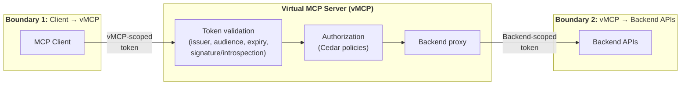
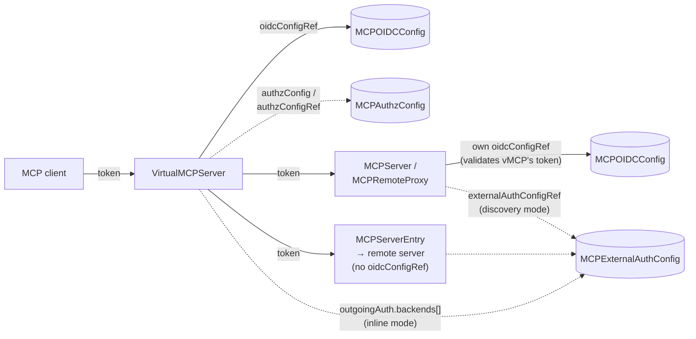

Virtual MCP Server (vMCP) implements a two-boundary authentication model that
separates client and backend authentication, giving you centralized control over
access while supporting diverse backend requirements. This page covers incoming
authentication (how clients reach vMCP), authorization (which requests are
allowed), and backend authentication (how vMCP reaches each backend).

## Two-boundary authentication model


```mermaid
flowchart LR
    subgraph Boundary1["<strong>Boundary 1:</strong> Client → vMCP"]
        direction TB
        Client[MCP Client]
    end

    subgraph vMCP["<strong>Virtual MCP Server (vMCP)</strong>"]
        direction TB
        Auth["Token validation<br>(issuer, audience, expiry,<br>signature/introspection)"]
        Authz["Authorization<br>(Cedar policies)"]
        Proxy[Backend proxy]
        Auth --> Authz --> Proxy
    end

    subgraph Boundary2["<strong>Boundary 2:</strong> vMCP → Backend APIs"]
        direction TB
        Backends[Backend APIs]
    end

    Client -->|"vMCP-scoped<br>token"| Auth
    Proxy -->|"Backend-scoped<br>token"| Backends
```

**Boundary 1 (incoming):** Clients authenticate to vMCP using OAuth 2.1
authorization as defined in the
[MCP specification](https://modelcontextprotocol.io/specification/2025-11-25/basic/authorization).
The vMCP validates the token by checking issuer, audience, expiry, and signature
for JWTs, or by using token introspection for opaque tokens. It then evaluates
Cedar policies before forwarding the request. This all happens inside the single
`vmcp` process, unlike a plain MCPServer deployment where a separate ToolHive
proxy handles this step. See [Incoming authentication](#incoming-authentication)
and [Authorize requests](#authorize-requests).

**Boundary 2 (outgoing):** vMCP obtains credentials for each backend API using
the configured backend authentication strategy. See
[Backend authentication](#backend-authentication) for how to choose one.

## How the resources connect

The VirtualMCPServer references other resources for both boundaries: an
`MCPOIDCConfig` (and optionally an `MCPAuthzConfig`) for incoming requests, and
an `MCPExternalAuthConfig` for outgoing credentials.

The piece that's easy to miss is that each backend has its own authentication
surface, and it differs by
[backend type](./configuration.mdx#add-backends-to-a-group):

- A **ToolHive-managed backend** (MCPServer or MCPRemoteProxy) validates its
  inbound requests against its own `oidcConfigRef`, exactly as a standalone
  server would. vMCP's outgoing boundary meets that backend's incoming boundary
  at the hop: the credential vMCP presents must satisfy the backend's own
  `oidcConfigRef`.
- An **MCPServerEntry** is a zero-infrastructure pointer to a remote MCP server
  that ToolHive doesn't run, so it has no `oidcConfigRef` of its own. The remote
  service validates the request, and vMCP simply presents whatever credential
  the outgoing strategy produces (commonly the user's upstream OAuth token).
  This is the usual shape for remote SaaS backends.


```mermaid
flowchart LR
    Client[MCP client] -->|token| VMCP[VirtualMCPServer]

    VMCP -->|oidcConfigRef| OIDC[("MCPOIDCConfig")]
    VMCP -.->|"authzConfig /<br/>authzConfigRef"| Authz[("MCPAuthzConfig")]

    VMCP -->|token| Backend["MCPServer /<br/>MCPRemoteProxy"]
    Backend -->|"own oidcConfigRef<br/>(validates vMCP's token)"| BOIDC[("MCPOIDCConfig")]

    VMCP -->|token| Entry["MCPServerEntry<br/>→ remote server<br/>(no oidcConfigRef)"]

    VMCP -.->|"outgoingAuth.backends[]<br/>(inline mode)"| Ext[("MCPExternalAuthConfig")]
    Backend -.->|"externalAuthConfigRef<br/>(discovery mode)"| Ext
    Entry -.-> Ext
```

The `MCPExternalAuthConfig` is the shared resource, and which side references it
depends on the [backend discovery mode](./backend-discovery.mdx):

- **Inline** (`outgoingAuth.source: inline`): vMCP owns the reference under
  `outgoingAuth.backends.<name>.externalAuthConfigRef`, and each key must match
  a backend name in the `MCPGroup`.
- **Discovery** (`outgoingAuth.source: discovered`): vMCP reads the backend's
  own `externalAuthConfigRef`, the same field the backend would use standalone.
  One `MCPExternalAuthConfig` can be shared across several backends.

When vMCP runs the
[embedded authorization server](./embedded-auth-server-vmcp.mdx), some
references also link by name (issuer and upstream provider); that wiring is
shown on the embedded auth server page.

## Incoming authentication

Configure how clients authenticate to vMCP with the `incomingAuth` block. The
`type` is either `anonymous` or `oidc`. To have vMCP itself broker interactive
user login (redirecting to GitHub, Google, Okta, and similar), use the
[embedded authorization server](./embedded-auth-server-vmcp.mdx) instead of an
external IdP.

### Anonymous (development only)

No authentication required:

```yaml title="VirtualMCPServer resource"
spec:
  incomingAuth:
    type: anonymous
```

:::warning[Authentication is not enabled by default]

Anonymous authentication disables all access control, allowing anyone who can
reach the vMCP to use it without credentials. The same applies if you omit
`incomingAuth` entirely. This is intended for local development or deployments
already isolated behind a trusted network boundary (such as a NetworkPolicy or
service mesh); do not use it in production. To enforce client authentication,
configure an incoming authentication source:
[OIDC authentication](#oidc-authentication) with an `MCPOIDCConfig`, or the
[embedded authorization server](./embedded-auth-server-vmcp.mdx).

:::

### OIDC authentication

Validate tokens from an external identity provider. Create an `MCPOIDCConfig`
resource, then reference it from `incomingAuth`:

```yaml title="MCPOIDCConfig resource"
apiVersion: toolhive.stacklok.dev/v1beta1
kind: MCPOIDCConfig
metadata:
  name: vmcp-oidc
  namespace: toolhive-system
spec:
  type: inline
  inline:
    issuer: https://auth.example.com
    clientId: <YOUR_CLIENT_ID>
```

```yaml title="VirtualMCPServer resource"
spec:
  incomingAuth:
    type: oidc
    oidcConfigRef:
      name: vmcp-oidc
      audience: https://mcp.example.com/mcp
```

The `oidcConfigRef` carries per-server overrides on top of the shared
`MCPOIDCConfig`:

- **`audience`** is the expected token audience. It must be unique per server to
  prevent token replay across vMCP instances. When using shared OIDC
  configuration via `oidcConfigRef`, set it explicitly.
- **`resourceUrl`** is the public URL advertised in OAuth protected resource
  metadata ([RFC 9728](https://datatracker.ietf.org/doc/html/rfc9728)). Set it
  to the vMCP's externally reachable `/mcp` URL so spec-compliant clients can
  discover the authorization server.
- **`scopes`** lists the OAuth scopes advertised in the well-known endpoint.

```yaml title="VirtualMCPServer resource"
spec:
  incomingAuth:
    type: oidc
    oidcConfigRef:
      name: vmcp-oidc
      audience: https://mcp.example.com/mcp
      resourceUrl: https://mcp.example.com/mcp
```

When an identity provider issues opaque OAuth tokens, add a `clientSecretRef` to
the `MCPOIDCConfig` to enable token introspection:

```yaml title="MCPOIDCConfig resource"
apiVersion: toolhive.stacklok.dev/v1beta1
kind: MCPOIDCConfig
metadata:
  name: vmcp-oidc
  namespace: toolhive-system
spec:
  type: inline
  inline:
    issuer: https://auth.example.com
    clientId: <YOUR_CLIENT_ID>
    clientSecretRef:
      name: oidc-client-secret
      key: clientSecret
```

Create the Secret:

```yaml
apiVersion: v1
kind: Secret
metadata:
  name: oidc-client-secret
  namespace: toolhive-system
type: Opaque
stringData:
  clientSecret: <YOUR_CLIENT_SECRET>
```

:::tip

For step-by-step walkthroughs with Microsoft Entra ID or Okta, including app
registration, group/role configuration, and deployment YAML, see
[Connect ToolHive to an enterprise identity provider](../integrations/vmcp-idp-overview.mdx).

:::

### Kubernetes service account tokens

Authenticate using Kubernetes service account tokens for in-cluster clients:

```yaml title="MCPOIDCConfig resource"
apiVersion: toolhive.stacklok.dev/v1beta1
kind: MCPOIDCConfig
metadata:
  name: vmcp-k8s-oidc
  namespace: toolhive-system
spec:
  type: kubernetesServiceAccount
  kubernetesServiceAccount: {}
```

```yaml title="VirtualMCPServer resource"
spec:
  incomingAuth:
    type: oidc
    oidcConfigRef:
      name: vmcp-k8s-oidc
      audience: toolhive
```

This configuration uses the Kubernetes API server as the OIDC issuer and
validates service account tokens. The defaults work for most clusters:

- **issuer**: `https://kubernetes.default.svc` (auto-detected)
- **audience**: `toolhive` (configurable)

## Authorize requests

After validating the client token, vMCP evaluates
[Cedar policies](../concepts/cedar-policies.mdx) to decide whether to forward
the request. Authorization is configured under `incomingAuth`. Provide policies
inline with `authzConfig`, or reference a shared `MCPAuthzConfig` resource with
`authzConfigRef`. The two are mutually exclusive.

```yaml title="VirtualMCPServer resource (inline policies)"
spec:
  incomingAuth:
    type: oidc
    oidcConfigRef:
      name: vmcp-oidc
      audience: https://mcp.example.com/mcp
    authzConfig:
      type: inline
      inline:
        policies:
          # Allow any authenticated client to call the search tool
          - |
            permit(
              principal,
              action == Action::"call_tool",
              resource == Tool::"search"
            );
```

To share one policy set across multiple vMCP servers, reference an
`MCPAuthzConfig` instead. Only `cedarv1` `MCPAuthzConfig` resources are
supported for VirtualMCPServer:

```yaml title="VirtualMCPServer resource (shared policies)"
spec:
  incomingAuth:
    type: oidc
    oidcConfigRef:
      name: vmcp-oidc
      audience: https://mcp.example.com/mcp
    authzConfigRef:
      name: shared-vmcp-policies
```

vMCP reads group and role claims from the validated token. With the
[embedded authorization server](./embedded-auth-server-vmcp.mdx), claims come
from the
[primary upstream provider](./embedded-auth-server-vmcp.mdx#select-the-primary-upstream-provider).
For Cedar policy syntax, entity types, and worked examples, see
[Cedar policies](../concepts/cedar-policies.mdx). The Kubernetes how-to at
[Authorization in Kubernetes](../guides-k8s/authorization-k8s.mdx) covers the
`MCPAuthzConfig` resource in more depth.

## Backend authentication

vMCP obtains credentials for each backend independently, on the hop from vMCP to
the backend MCP server. The right strategy depends on what credential that
backend expects, and specifically whether it's the same credential the client
already presented or a different one vMCP must mint.

Choosing to mint a fresh credential is also an opportunity to apply least
privilege on purpose. A user might hold broad permissions at a service, but that
doesn't mean an agent acting on their behalf should wield all of it. Minting a
narrower, backend-scoped token with
[token exchange](#federate-identity-with-token-exchange), instead of forwarding
the user's original token verbatim, lets you scope the agent's reach to the
workflow at hand rather than the user's full entitlements.

### Choose a backend authentication pattern

Most strategies are configured per backend, keyed by name under
`outgoingAuth.backends`:

| If the backend...                                             | Use                                                                                                                | Embedded auth server |
| ------------------------------------------------------------- | ------------------------------------------------------------------------------------------------------------------ | -------------------- |
| Needs no authentication                                       | [Discovery mode](#discovery-mode) (no per-backend config)                                                          | No                   |
| Uses a static API key or shared secret                        | [Static header injection](#inject-a-static-credential-header-injection)                                            | No                   |
| Trusts your IdP but wants a user-scoped token                 | [Token exchange](#federate-identity-with-token-exchange)                                                           | No                   |
| Is an AWS API and you want per-user IAM identity              | [AWS STS](#federate-to-aws-apis-aws-sts)                                                                           | No                   |
| Requires a user-delegated OAuth login (GitHub, Google, Slack) | [Upstream token injection](./embedded-auth-server-vmcp.mdx#forward-a-stored-upstream-token-upstream-injection)     | Yes                  |
| Trusts a different authorization server, with no federation   | [Cross-application access](./embedded-auth-server-vmcp.mdx#bridge-separate-trust-domains-cross-application-access) | Yes                  |

The last two strategies read tokens acquired during an interactive user login,
so they require the
[embedded authorization server](./embedded-auth-server-vmcp.mdx). The rest are
covered below.

To forward a header the client already holds (its own token in the same trust
domain, or an API key the backend resolves to a user itself) to all backends,
use the top-level [`passthroughHeaders`](#pass-through-client-headers) allowlist
instead.

### Discovery mode

When using discovery mode, vMCP checks each backend MCPServer's
`externalAuthConfigRef` to determine how to authenticate. If a backend has no
auth config, vMCP connects without authentication.

```yaml title="VirtualMCPServer resource"
spec:
  outgoingAuth:
    source: discovered
```

This is the recommended approach for most deployments. Backends that don't
require authentication work automatically, while backends with
`externalAuthConfigRef` configured use their specified authentication method.

To apply the same fallback strategy to every backend that lacks its own config,
set `outgoingAuth.default`:

```yaml title="VirtualMCPServer resource"
spec:
  outgoingAuth:
    source: discovered
    default:
      type: externalAuthConfigRef
      externalAuthConfigRef:
        name: shared-backend-auth
```

To connect to a specific backend without authentication (for example, to opt it
out of a default), reference an `MCPExternalAuthConfig` with
`type: unauthenticated`, which takes no further configuration.

### Pass through client headers

To forward specific incoming client request headers verbatim, set the top-level
`passthroughHeaders` allowlist. Use this when a backend accepts the client's
token unchanged (same trust domain) or resolves a forwarded header, such as an
API key, to a user itself.

```yaml title="VirtualMCPServer resource"
spec:
  passthroughHeaders:
    - Authorization
    - X-API-Key
```

Unlike the per-backend strategies above, `passthroughHeaders` applies to every
backend and sits at the lowest precedence: for a given backend, an
`externalAuthConfigRef` strategy that sets the same header (for example,
`Authorization`) overrides the forwarded value. Use it as a fallback for
backends without their own config, not as a per-backend override.

:::warning[Forwarding a token hands over its full privileges]

Passing the client's token through unchanged gives the backend, and anything it
calls downstream, the caller's full entitlements at that service. When you want
the agent to act with less than the user's full reach, mint a scoped credential
with [token exchange](#federate-identity-with-token-exchange) instead of
forwarding the original token.

Restricted headers (`Host`, hop-by-hop headers, `X-Forwarded-*`) are rejected.
Forwarded values are also attacker-influenceable unless a trusted upstream sets
them, so only allowlist headers your backends are prepared to trust.

:::

### Inject a static credential (header injection)

The `headerInjection` strategy injects a fixed HTTP header into every request to
a backend. Use it when the backend authenticates with a pre-issued API key or
static bearer token rather than per-user OAuth, for example an MCP server that
wraps a SaaS API behind a single shared credential.

Store the header value in a Secret, then create an `MCPExternalAuthConfig` of
type `headerInjection` that references it:

```yaml title="Secret"
apiVersion: v1
kind: Secret
metadata:
  name: backend-api-key
  namespace: toolhive-system
type: Opaque
stringData:
  value: <YOUR_API_KEY>
```

```yaml title="MCPExternalAuthConfig resource"
apiVersion: toolhive.stacklok.dev/v1beta1
kind: MCPExternalAuthConfig
metadata:
  name: backend-api-key-header
  namespace: toolhive-system
spec:
  type: headerInjection
  headerInjection:
    headerName: X-API-Key
    valueSecretRef:
      name: backend-api-key
      key: value
```

Reference the config from the VirtualMCPServer's outgoing auth:

```yaml title="VirtualMCPServer resource"
spec:
  outgoingAuth:
    source: inline
    backends:
      backend-private-api:
        type: externalAuthConfigRef
        externalAuthConfigRef:
          name: backend-api-key-header
```

Alternatively, attach the `MCPExternalAuthConfig` to a backend `MCPServer` via
its `externalAuthConfigRef` and use `outgoingAuth.source: discovered` to pick it
up automatically. In that case, the reference is metadata that vMCP reads; the
`MCPServer` does not inject the header itself.

For an `Authorization: Bearer <token>` header, set `headerName: Authorization`
and store the full `Bearer <token>` string (including the `Bearer` prefix) in
the Secret value.

:::note

The header value must come from a Kubernetes Secret; plaintext inline values are
not accepted at the CRD layer. Rotating the credential is a matter of updating
the Secret, then restarting the vMCP deployment/pods to pick up the new value.

:::

### Federate identity with token exchange

The `tokenExchange` strategy performs an
[RFC 8693](https://datatracker.ietf.org/doc/html/rfc8693) token exchange,
minting a backend-scoped token from the vMCP-issued JWT. Use it when the backend
trusts your identity provider but wants a token scoped to itself, carrying the
real user's identity.

Configuration mirrors the MCPServer setup. See
[Configure token exchange for backend authentication](../guides-k8s/token-exchange-k8s.mdx)
for the full walkthrough. On vMCP, reference the resulting
`MCPExternalAuthConfig` the same way as other strategies:

```yaml title="VirtualMCPServer resource"
spec:
  outgoingAuth:
    source: inline
    backends:
      backend-jira:
        type: externalAuthConfigRef
        externalAuthConfigRef:
          name: exchange-jira
```

When vMCP runs the embedded auth server, you can exchange a stored upstream
token instead of the vMCP JWT by adding `subjectProviderName`. See
[Exchange a stored upstream token](./embedded-auth-server-vmcp.mdx#exchange-a-stored-upstream-token-token-exchange).

:::enterprise

Microsoft Entra ID doesn't implement RFC 8693 token exchange. It has its own
On-Behalf-Of (OBO) flow, based on the RFC 7523 JWT bearer grant, that solves the
same backend-federation problem in a non-standard way. Stacklok Enterprise adds
a dedicated `obo` backend authentication type for this flow.

[Learn more about Stacklok Enterprise](../../platform/index.mdx).

:::

### Federate to AWS APIs (AWS STS)

The `awsSts` strategy exchanges the user's identity for temporary AWS
credentials via STS with SigV4 request signing, so an AWS-backed MCP server acts
with per-user IAM identity. For the full walkthrough, including creating the IAM
OIDC identity provider, roles, and trust policies, see
[AWS STS authentication for the AWS MCP Server](../integrations/aws-sts.mdx).
Map JWT claims to IAM roles with `roleMappings`, and provide a `fallbackRoleArn`
for requests that match no rule:

```yaml title="MCPExternalAuthConfig resource"
apiVersion: toolhive.stacklok.dev/v1beta1
kind: MCPExternalAuthConfig
metadata:
  name: aws-mcp-sts
  namespace: toolhive-system
spec:
  type: awsSts
  awsSts:
    region: us-east-1
    roleClaim: groups
    roleMappings:
      - claim: platform-admins
        roleArn: arn:aws:iam::123456789012:role/mcp-admin
        priority: 1
    fallbackRoleArn: arn:aws:iam::123456789012:role/mcp-readonly
```

Reference it from a backend the same way as other strategies. When vMCP runs the
embedded auth server, set `subjectProviderName` to exchange a stored upstream
token instead of the vMCP JWT. For the field reference, see the
[MCPExternalAuthConfig reference](../reference/crds/mcpexternalauthconfig.mdx).

## Embedded authorization server

When your backends call external APIs on behalf of individual users and no
federation relationship exists between your identity provider and those
services, run the
[embedded authorization server](./embedded-auth-server-vmcp.mdx). It brokers
interactive login to one or more upstream providers, stores each user's tokens,
and issues the JWTs that vMCP validates on incoming requests. Paired with
[upstream token injection](./embedded-auth-server-vmcp.mdx#forward-a-stored-upstream-token-upstream-injection)
or
[token exchange with a stored token](./embedded-auth-server-vmcp.mdx#exchange-a-stored-upstream-token-token-exchange),
it bridges both authentication boundaries in one deployment.

## Next steps

- [Set up the embedded authorization server](./embedded-auth-server-vmcp.mdx) to
  broker user login and forward per-user tokens to backends
- [Configure tool aggregation](./tool-aggregation.mdx) to manage how tools from
  multiple backends are presented to clients
- [Set up audit logging](./audit-logging.mdx) to track authentication decisions
  and request activity

## Related information

- [Authentication and authorization](../concepts/auth-framework.mdx)
- [Backend authentication](../concepts/backend-auth.mdx)
- [Embedded authorization server](../concepts/embedded-auth-server.mdx) for
  conceptual background
- [Cedar policies](../concepts/cedar-policies.mdx) for detailed policy syntax
- [VirtualMCPServer configuration](./configuration.mdx)
- [Backend discovery modes](./backend-discovery.mdx)
- [Token exchange in Kubernetes](../guides-k8s/token-exchange-k8s.mdx)
- [AWS STS authentication for the AWS MCP Server](../integrations/aws-sts.mdx)
