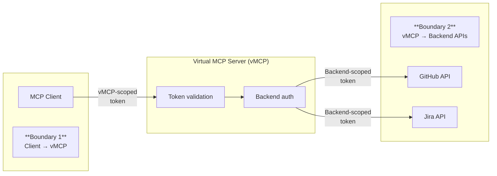

Virtual MCP Server (vMCP) implements a two-boundary authentication model that
separates client and backend authentication, giving you centralized control over
access while supporting diverse backend requirements.

## Two-boundary authentication model



**Boundary 1 (Incoming):** Clients authenticate to vMCP using OAuth 2.1
authorization as defined in the
[MCP specification](https://modelcontextprotocol.io/specification/2025-11-25/basic/authorization).
This is your organization's identity layer.

**Boundary 2 (Outgoing):** vMCP obtains appropriate credentials for each
backend. Each backend API receives a token or credential scoped to its
requirements.

## Incoming authentication

Configure how clients authenticate to vMCP.

### Anonymous (development only)

No authentication required:

```yaml title="VirtualMCPServer resource"
spec:
  incomingAuth:
    type: anonymous
```

:::warning

Do not use `anonymous` authentication in production environments. This setting
disables all access control, allowing anyone to use the vMCP without
credentials.

:::

### OIDC authentication

Validate tokens from an external identity provider:

```yaml title="VirtualMCPServer resource"
spec:
  incomingAuth:
    type: oidc
    oidcConfig:
      type: inline
      inline:
        issuer: https://auth.example.com
        clientId: <YOUR_CLIENT_ID>
        audience: vmcp
```

When using an identity provider that issues opaque OAuth tokens, add a
`clientSecretRef` referencing a Kubernetes Secret to enable token introspection:

```yaml title="VirtualMCPServer resource"
spec:
  incomingAuth:
    type: oidc
    oidcConfig:
      type: inline
      inline:
        issuer: https://auth.example.com
        clientId: <YOUR_CLIENT_ID>
        audience: vmcp
        clientSecretRef:
          name: oidc-client-secret
          key: clientSecret
```

Create the Secret:

```yaml
apiVersion: v1
kind: Secret
metadata:
  name: oidc-client-secret
  namespace: toolhive-system
type: Opaque
stringData:
  clientSecret: <YOUR_CLIENT_SECRET>
```

### Kubernetes service account tokens

Authenticate using Kubernetes service account tokens for in-cluster clients:

```yaml title="VirtualMCPServer resource"
spec:
  incomingAuth:
    type: oidc
    oidcConfig:
      type: kubernetes
      kubernetes:
        audience: toolhive
```

This configuration uses the Kubernetes API server as the OIDC issuer and
validates service account tokens. The defaults work for most clusters:

- **issuer**: `https://kubernetes.default.svc` (auto-detected)
- **audience**: `toolhive` (configurable)

## Outgoing authentication

Configure how vMCP authenticates to backend MCP servers.

### Discovery mode

When using discovery mode, vMCP checks each backend MCPServer's
`externalAuthConfigRef` to determine how to authenticate. If a backend has no
auth config, vMCP connects without authentication.

```yaml title="VirtualMCPServer resource"
spec:
  outgoingAuth:
    source: discovered
```

This is the recommended approach for most deployments. Backends that don't
require authentication work automatically, while backends with
`externalAuthConfigRef` configured use their specified authentication method.

See
[Configure token exchange for backend authentication](../guides-k8s/token-exchange-k8s.mdx)
for details on using service account token exchange for backend authentication.

## Related information

- [Authentication framework concepts](../concepts/auth-framework.mdx)
- [VirtualMCPServer configuration](./configuration.mdx)
- [Token exchange in Kubernetes](../guides-k8s/token-exchange-k8s.mdx)
