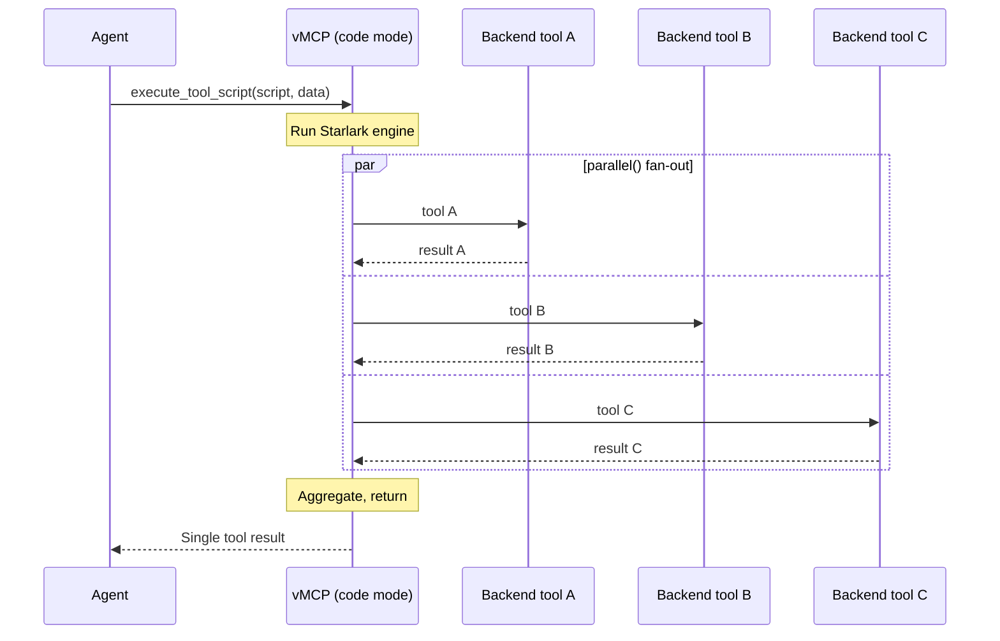

When an agent needs to combine results from several backend tools, the default
flow is one `tools/call` per tool with model inference between each call. For
workflows that touch five or ten backends, that adds up to many round-trips and
significant token usage on the intermediate reasoning.

Code mode replaces that pattern with a single virtual tool,
`execute_tool_script`. The agent submits a Starlark script that calls multiple
backend tools, runs loops and conditionals, fans calls out with `parallel()`,
and returns one aggregated result. The script executes server-side inside the
Virtual MCP Server (vMCP) process, so the agent only pays for one round-trip and
one model turn no matter how many tools the script calls.

Code mode is opt-in and disabled by default.

## When to use code mode

Code mode is a good fit when:

- You have multi-tool workflows that today require many sequential `tools/call`
  round-trips (incident triage across logging, monitoring, and paging; CVE
  checks across multiple package indexes; cross-system status aggregations).
- The intermediate model reasoning between calls is not load-bearing, and the
  agent just needs the combined result.
- You want to reduce token usage on tool-heavy workflows without changing the
  backend MCP servers.

Code mode is **not** a substitute for [composite tools](./composite-tools.mdx)
or the [optimizer](./optimizer.mdx):

| If you want to...                                                    | Use             |
| -------------------------------------------------------------------- | --------------- |
| Let agents script ad-hoc multi-tool calls at request time            | Code mode       |
| Define a fixed, reusable workflow with parameters and approval gates | Composite tools |
| Filter the advertised tool set per request to save context tokens    | Optimizer       |

Composite tools are operator-authored and ship with a fixed structure. Code mode
is agent-authored: the agent decides at request time which tools to call and how
to combine them. Both can coexist on the same vMCP.

## How it works

When code mode is enabled, vMCP advertises one additional tool alongside the
aggregated backend tools:

- `execute_tool_script` accepts a Starlark `script` string and an optional
  `data` object whose keys become top-level variables in the script.

The script can:

- Call any advertised backend tool as a function:
  `github_create_issue(title=...)`.
- Call by tool name: `call_tool("github_create_issue", title=...)`.
- Fan out concurrent calls with
  `parallel([lambda: tool_a(), lambda: tool_b()])`, which returns results in
  order once every callable completes.
- Use Python-like syntax for loops, conditionals, list/dict comprehensions, and
  filtering.
- Return any value with `return`; that value becomes the script's result.

vMCP runs the script, executes the inner tool calls through the same routing and
authorization path as a normal `tools/call`, and returns the script's return
value to the agent as a single tool result.



The `execute_tool_script` tool description is generated dynamically and lists
the backend tools available to the script for the current caller, so the agent
sees exactly what it can call.

## Enable code mode on Kubernetes

Add a `codeMode` block under `spec.config` on the VirtualMCPServer resource:

```yaml title="VirtualMCPServer resource"
apiVersion: toolhive.stacklok.dev/v1beta1
kind: VirtualMCPServer
metadata:
  name: my-vmcp
  namespace: toolhive-system
spec:
  groupRef:
    name: my-tools
  incomingAuth:
    type: anonymous
  config:
    # highlight-start
    codeMode:
      enabled: true
    # highlight-end
```

When the VirtualMCPServer reaches the `Ready` phase, clients connecting to its
endpoint see `execute_tool_script` in `tools/list` alongside the backend tools.

## Enable code mode locally

Code mode is configured under the top-level `codeMode` block in the vMCP config
file:

```yaml title="vmcp.yaml"
groupRef: my-group

incomingAuth:
  type: anonymous

outgoingAuth:
  source: inline

# highlight-start
codeMode:
  enabled: true
# highlight-end

backends:
  - name: fetch
    url: http://127.0.0.1:12345/sse
    transport: sse
```

Then start the server with:

```bash
thv vmcp serve --config vmcp.yaml
```

## Example script

Given a vMCP that aggregates an OSV-vulnerability MCP server alongside other
backends, an agent might submit this script to check several packages in
parallel:

```python title="agent-submitted script"
results = parallel([
    lambda d=d: osv_query_vulnerability(package=d["name"], version=d["version"])
    for d in deps
])
vulnerable = [r for r in results if r.get("vulns")]
return {"checked": len(results), "vulnerable": vulnerable}
```

The agent passes the package list as the `data` argument:

```json
{
  "script": "results = parallel([...]) ...",
  "data": {
    "deps": [
      { "name": "lodash", "version": "4.17.20" },
      { "name": "express", "version": "4.17.1" }
    ]
  }
}
```

vMCP runs the script, calls `osv_query_vulnerability` once per dependency
concurrently, and returns the aggregated `{checked, vulnerable}` object as a
single tool result.

:::tip[Lambda capture in loops]

When building a list of lambdas in a `for` loop, bind the loop variable with a
default argument (`d=d`) so each lambda captures its own value. Otherwise every
lambda would close over the same final value of `d`.

:::

## Tune execution limits

Add the `codeMode` parameters under `spec.config` to bound script execution:

```yaml title="VirtualMCPServer resource"
spec:
  config:
    codeMode:
      enabled: true
      stepLimit: 100000
      parallelMaxConcurrency: 10
      toolCallTimeout: 30s
```

### Parameter reference

<CRDFields kind='VirtualMCPServer' path='spec.config.codeMode' />

Every script execution is also bounded by a fixed one-minute wall-clock timeout
that caps the total time spent on a single `execute_tool_script` call. This
bound is not configurable; it protects against scripts that make many sequential
inner calls each within `toolCallTimeout` but that, combined, would otherwise
hold a connection open indefinitely.

:::tip[Tuning guidance]

The defaults work for most workloads. Adjust them when:

- A specific workflow legitimately needs more Starlark steps (large `for` loops,
  complex aggregation). Raise `stepLimit`.
- A backend tool is slow and scripts time out at the inner call. Raise
  `toolCallTimeout` for that vMCP.
- Scripts overwhelm a fragile backend. Lower `parallelMaxConcurrency` so
  `parallel()` runs fewer tool calls at once.

:::

## Security and authorization

Code mode never widens reachability. A script can only call tools the caller is
already permitted to use:

- The bound tool set comes from the inner `ListTools` for the caller's identity,
  which is already filtered by the configured admission policy.
- Every inner `tools/call` re-enters the same authorization path as a direct
  client call. Cedar policies, scope checks, and per-tool authz all apply.
- Inner calls do not carry the client's `_meta`; the script originates them.

This means code mode is safe to enable alongside
[Cedar policies](../concepts/cedar-policies.mdx): the policy decides which
backend tools each principal can reach, and code mode lets a script combine
those tools in one request. The script itself cannot grant additional reach.

The `execute_tool_script` tool itself is gated by the `codeMode.enabled` flag on
the VirtualMCPServer, not by per-principal Cedar policy. Disable code mode on
the server to prevent any caller from running scripts.

## Compose with the optimizer

Code mode and the [optimizer](./optimizer.mdx) are independent and compose
cleanly. When both are enabled:

- The optimizer indexes `execute_tool_script` along with backend tools, so
  agents can discover it via `find_tool`.
- Inside a script, calls route through vMCP's normal tool routing, which still
  reaches all backend tools regardless of optimizer filtering.

Enabling both is a useful combination for very large tool catalogs: the
optimizer narrows the advertised set per request, and code mode lets the agent
combine the surfaced tools into a single round-trip.

## Limitations

- Scripts are Starlark, not Python. Most Python syntax works (lists, dicts,
  comprehensions, lambdas, control flow) but Python standard library modules are
  not available. See the
  [Starlark language specification](https://github.com/bazelbuild/starlark/blob/master/spec.md)
  for the supported subset.
- Scripts cannot recurse into `execute_tool_script`; the virtual tool is not in
  the bound tool set.
- A script that errors at runtime returns the error as a tool-call result with
  `isError: true`, so the agent can adjust its script and retry. Errors do not
  surface as transport-level failures.

## Next steps

- [Optimize tool discovery](./optimizer.mdx) to filter advertised tools per
  request and compose with code mode for large tool catalogs.
- [Define composite tools](./composite-tools.mdx) for operator-authored,
  fixed-structure workflows that complement agent-authored scripts.
- [Configure failure handling](./failure-handling.mdx) so individual backend
  failures inside a script don't take the whole vMCP down.

## Related information

- [VirtualMCPServer CRD specification](../reference/crds/virtualmcpserver.mdx)
- [Understanding Virtual MCP Server](../concepts/vmcp.mdx)
- [Configure vMCP servers](./configuration.mdx)
