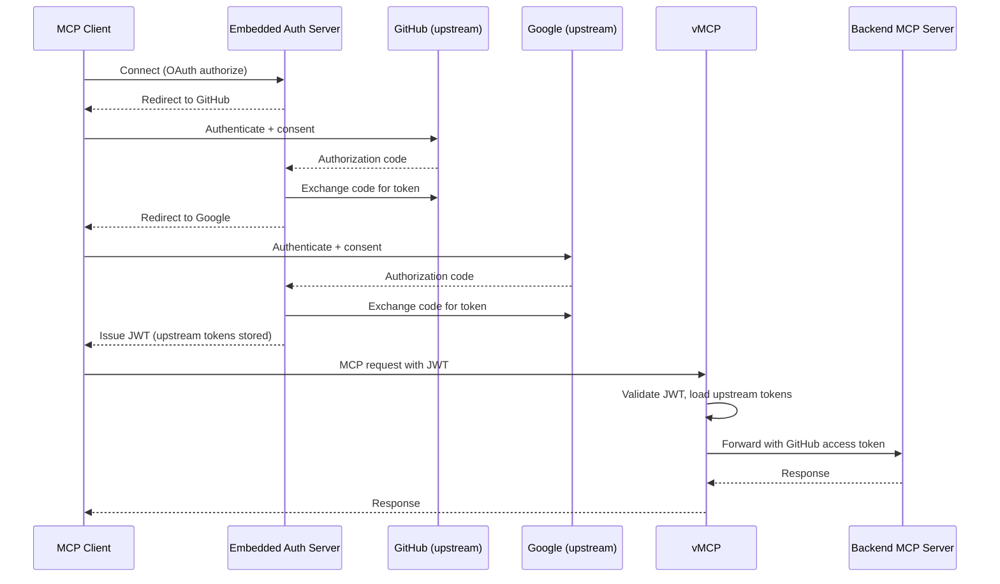

The embedded authorization server runs an OAuth authorization server within the
vMCP process. It redirects users to one or more upstream identity providers
(such as GitHub, Google, or Okta) for interactive authentication, stores the
upstream tokens, and issues its own JWTs that the vMCP validates on subsequent
requests. Combined with an outgoing strategy that forwards or exchanges those
stored tokens, this bridges both authentication boundaries: the auth server
handles incoming auth by issuing JWTs, while the outgoing strategy sends the
stored upstream tokens to backends.

Use the embedded authorization server when your backend MCP servers call
external APIs on behalf of individual users and no federation relationship
exists between your identity provider and those services. It also supports OAuth
2.0 Client ID Metadata Documents (CIMD) and Dynamic Client Registration
([RFC 7591](https://datatracker.ietf.org/doc/html/rfc7591)), so MCP clients can
identify themselves or register automatically without manual client
configuration in ToolHive.

:::info

This page covers the embedded auth server on a VirtualMCPServer. For conceptual
background (the OAuth flow, token storage and forwarding, and when to use it),
see [Embedded authorization server](../concepts/embedded-auth-server.mdx). For
the equivalent on individual MCPServer resources (single upstream provider), see
[Set up the embedded authorization server in Kubernetes](../guides-k8s/embedded-auth-server-k8s.mdx).
For incoming and standalone backend authentication on vMCP, see
[Authentication](./authentication.mdx).

:::

## How it works



When multiple upstream providers are configured, the auth server chains
authorization flows sequentially. The user is redirected to each provider in
order, and the auth server stores each provider's tokens before moving to the
next. After the final provider completes, the auth server issues a single JWT to
the client.

## Differences from the MCPServer embedded auth server

The embedded auth server uses the same configuration structure whether on a
VirtualMCPServer or an MCPServer. The key differences for vMCP are:

- **Inline configuration:** The auth server config lives directly on the
  VirtualMCPServer resource under `authServerConfig`, rather than in a separate
  `MCPExternalAuthConfig` resource.
- **Multiple upstream providers:** vMCP supports multiple upstream providers
  with sequential authorization chaining. MCPServer is limited to a single
  upstream provider.
- **Flexible outgoing strategies:** vMCP uses `upstreamInject` or
  `tokenExchange` with `subjectProviderName` to route stored tokens to the
  correct backends. MCPServer swaps the token automatically because it has a
  single upstream provider.

## Configure the embedded auth server

Add an `authServerConfig` block to your VirtualMCPServer. The configuration
fields are the same as for the
[MCPServer embedded auth server](../guides-k8s/embedded-auth-server-k8s.mdx) --
see that guide for generating keys and creating Secrets.

```yaml title="VirtualMCPServer resource"
spec:
  authServerConfig:
    issuer: https://auth.example.com
    signingKeySecretRefs:
      - name: auth-signing-key
        key: private-key
    hmacSecretRefs:
      - name: auth-hmac-key
        key: hmac-key
    tokenLifespans:
      accessTokenLifespan: 1h
      refreshTokenLifespan: 168h
      authCodeLifespan: 10m
    upstreamProviders:
      - name: github
        type: oauth2
        oauth2Config: { ... }
      - name: google
        type: oidc
        oidcConfig: { ... }
```

:::warning[Signing keys and HMAC secrets]

`signingKeySecretRefs` and `hmacSecretRefs` are technically optional. When
omitted, the auth server auto-generates ephemeral keys on startup. This is
convenient for development, but **tokens become invalid after pod restart**.
JWTs can no longer be verified (signing keys) and authorization codes and
refresh tokens can no longer be decoded (HMAC secrets), forcing all users to
re-authenticate. Always configure persistent keys for production. See
[Set up the embedded authorization server in Kubernetes](../guides-k8s/embedded-auth-server-k8s.mdx)
for key generation steps.

:::

The issuer URL must use the `https://` scheme. The single exception is
`localhost`, which can use `http://` for local development. For in-cluster
deployments where traffic between the embedded auth server and other pods stays
on a trusted network (for example, an in-cluster service mesh), you can opt in
to an `http://` issuer on a non-localhost host by setting
`insecureAllowHTTP: true`. The VirtualMCPServer controller rejects this
combination at reconcile time with `AuthServerConfigValidated=False` if the flag
is unset, so misconfiguration surfaces on the resource rather than crashing the
pod at startup. Never set this for issuers reachable outside the cluster.

If the browser-facing authorization endpoint needs to be on a different host
than the issuer (for example, behind an ingress that rewrites paths), set
`authorizationEndpointBaseUrl` to override the `authorization_endpoint` in the
OAuth discovery document. All other endpoints remain derived from `issuer`:

```yaml
spec:
  authServerConfig:
    issuer: https://auth.internal.example.com
    authorizationEndpointBaseUrl: https://auth.example.com
```

If your MCP clients register via DCR with a narrowed `scope` value and then
request additional scopes at `/oauth/authorize` (a pattern used by Claude Code,
among others), set `baselineClientScopes` so the embedded auth server merges
those scopes into every registered client's scope set. If `scopesSupported` is
set explicitly, all baseline values must appear in it; otherwise the server
validates against its default scope set (`openid`, `profile`, `email`,
`offline_access`). See
[Baseline scopes for DCR clients](../concepts/embedded-auth-server.mdx#baseline-scopes-for-dcr-clients)
for guidance on which scopes to include.

```yaml
spec:
  authServerConfig:
    issuer: https://auth.example.com
    baselineClientScopes:
      - openid
      - offline_access
```

Each upstream provider `name` must be a valid DNS label (lowercase alphanumeric
and hyphens, max 63 characters). This name is what the
[upstream token injection](#forward-a-stored-upstream-token-upstream-injection)
and [token exchange](#exchange-a-stored-upstream-token-token-exchange) outgoing
strategies reference to map backends to providers. For details on configuring
OIDC vs OAuth 2.0 upstream providers, see
[Using an OAuth 2.0 upstream provider](../guides-k8s/embedded-auth-server-k8s.mdx#using-an-oauth-20-upstream-provider).
The [complete example](#complete-example) below shows full provider
configurations.

### Select the primary upstream provider

When multiple upstream providers are configured, Cedar reads JWT claims from the
first upstream's access token by default. Pin a specific provider with
`spec.authServerConfig.primaryUpstreamProvider`. The value must match one of the
names in `upstreamProviders`; unresolvable values are rejected at admission with
`AuthServerConfigValidated=False`:

```yaml
spec:
  authServerConfig:
    issuer: https://auth.example.com
    primaryUpstreamProvider: okta
    upstreamProviders:
      - name: okta
        type: oidc
        # ...
      - name: github
        type: oauth2
        # ...
```

:::note[Deprecated location]

`primaryUpstreamProvider` previously lived under
`spec.incomingAuth.authzConfig.inline.primaryUpstreamProvider`. The old location
is still read for backward compatibility, but the VirtualMCPServer controller
emits a Warning event with reason `AuthzPrimaryUpstreamProviderDeprecated`
whenever it reads the value. Move the field to
`spec.authServerConfig.primaryUpstreamProvider` to clear the warning. Removal of
the deprecated location is planned for the release after the deprecation cycle.

:::

### Handle non-standard provider responses

Not every provider returns tokens and identity in the standard shape. Three
optional fields adapt the embedded auth server to providers that don't.

#### Tokens under non-standard paths

Some OAuth 2.0 providers nest tokens instead of returning them at the top level
(for example, GovSlack returns the access token at `authed_user.access_token`).
Add a `tokenResponseMapping` block to the `oauth2Config` with dot-notation paths
for `accessTokenPath`, `scopePath`, `refreshTokenPath`, and `expiresInPath`. See
the [CRD reference](../reference/crds/index.mdx) for field details.

#### Identity in the token response

When an upstream returns user identity in the token response itself (Slack
returns it at `authed_user.id`; Snowflake embeds it in the access-token JWT),
set `identityFromToken` on the `oauth2Config` with gjson dot-notation paths for
`subjectPath` (required), `namePath`, and `emailPath`. See
[Extract identity from the token response](../guides-k8s/embedded-auth-server-k8s.mdx#extract-identity-from-the-token-response)
for the full pattern and trust-model caveats.

#### Stable subject for OIDC upstreams

By default the embedded auth server keys users on the upstream ID token's `sub`
claim. Some identity providers rotate `sub` per application, so the same user
appears as a different principal across apps; the stable identifier lives in
another claim (Entra/Azure AD uses `oid`, some Okta custom auth servers expose a
custom `uid` claim). Set `subjectClaim` on an upstream's `oidcConfig` to pin
ToolHive to the stable claim:

```yaml
upstreamProviders:
  - name: entra
    type: oidc
    oidcConfig:
      issuerUrl: 'https://login.microsoftonline.com/<TENANT_ID>/v2.0'
      clientId: '<CLIENT_ID>'
      # ...
      subjectClaim: oid
```

The value must be a single top-level claim name (letters, digits, underscores;
must start with a letter or underscore). Changing it on a live deployment
re-keys existing users, so treat it as immutable once users exist. The Entra
walkthrough at
[Connect ToolHive to Microsoft Entra ID](../integrations/vmcp-entra-id.mdx)
includes this setting.

## Validate the issued JWTs

When using the embedded auth server, configure `incomingAuth` to validate the
JWTs it issues. Create an `MCPOIDCConfig` resource whose `issuer` matches
`authServerConfig.issuer`, then reference it with `oidcConfigRef`. Note that
`jwksAllowPrivateIP: true` is no longer needed when using the embedded auth
server because JWKS retrieval is done in-process.

```yaml title="VirtualMCPServer resource"
spec:
  incomingAuth:
    type: oidc
    # highlight-start
    oidcConfigRef:
      name: my-oidc-config
      audience: https://mcp.example.com/mcp
    # highlight-end
```

## Configure session storage

By default, upstream tokens are stored in memory and lost on pod restart. For
production, configure Redis Sentinel by adding a `storage` block to
`authServerConfig`. The configuration is the same as for the MCPServer embedded
auth server. See
[Redis Sentinel session storage](../guides-k8s/redis-session-storage.mdx) for a
complete walkthrough.

## Forward user tokens to backends

The embedded auth server stores each user's upstream tokens after login. Three
outgoing strategies send those stored tokens to backends. All three require the
embedded auth server, because they read tokens it acquired during the user's
interactive login. For backend strategies that do not depend on the embedded
auth server (static credentials, plain token exchange, AWS STS, pass-through),
see [Authentication](./authentication.mdx#backend-authentication).

### Forward a stored upstream token (upstream injection)

The `upstreamInject` strategy injects a user's stored upstream access token into
outgoing requests to a backend. Use it when the backend accepts the same token
the upstream provider issued (for example, a GitHub MCP server that accepts a
GitHub access token).

Create an `MCPExternalAuthConfig` resource with the `upstreamInject` type. The
`providerName` must match an upstream provider configured on the embedded
authorization server:

```yaml title="MCPExternalAuthConfig resource"
apiVersion: toolhive.stacklok.dev/v1beta1
kind: MCPExternalAuthConfig
metadata:
  name: inject-github
  namespace: toolhive-system
spec:
  type: upstreamInject
  upstreamInject:
    providerName: github
```

Then reference it in the VirtualMCPServer's outgoing auth configuration:

```yaml title="VirtualMCPServer resource"
spec:
  outgoingAuth:
    source: inline
    backends:
      backend-github:
        type: externalAuthConfigRef
        externalAuthConfigRef:
          name: inject-github
```

When a request reaches the `backend-github` MCPServer, vMCP replaces the
`Authorization` header with the upstream access token stored for the `github`
provider during the user's login flow. Backends not listed in the `backends` map
receive unauthenticated requests.

:::note

The `providerName` must match a provider `name` in the auth server's
`upstreamProviders` list.

:::

### Exchange a stored upstream token (token exchange)

You can combine the embedded authorization server with
[token exchange](../guides-k8s/token-exchange-k8s.mdx) by adding the
`subjectProviderName` field to a `tokenExchange` config. This tells the token
exchange middleware to use the stored upstream token from the named provider as
the subject token for the
[RFC 8693](https://datatracker.ietf.org/doc/html/rfc8693) exchange, instead of
the vMCP-issued JWT.

This is useful when a backend needs a token exchanged at the same identity
provider that issued the upstream token. For example, if the embedded auth
server acquires an Okta access token during login, you can exchange that token
at a different Okta authorization server for a backend-scoped token:

```yaml title="MCPExternalAuthConfig resource"
apiVersion: toolhive.stacklok.dev/v1beta1
kind: MCPExternalAuthConfig
metadata:
  name: exchange-okta
  namespace: toolhive-system
spec:
  type: tokenExchange
  tokenExchange:
    tokenUrl: https://<YOUR_OKTA_DOMAIN>/oauth2/<AUTH_SERVER_ID>/v1/token
    clientId: <YOUR_CLIENT_ID>
    clientSecretRef:
      name: okta-exchange-client-secret
      key: client-secret
    audience: backend
    scopes:
      - backend-api:read
    # highlight-next-line
    subjectProviderName: okta
```

Without `subjectProviderName`, token exchange uses the vMCP-issued JWT as the
subject token (the standalone
[token exchange](./authentication.mdx#federate-identity-with-token-exchange)
pattern). With it, the exchange uses the raw upstream provider's access token,
which the exchange endpoint can validate directly.

You can mix both strategies in the same vMCP deployment. For example, some
backends can use `upstreamInject` for direct token forwarding while others use
`tokenExchange` with `subjectProviderName` for exchanged tokens:

```yaml title="VirtualMCPServer resource"
spec:
  outgoingAuth:
    source: inline
    backends:
      backend-github:
        type: externalAuthConfigRef
        externalAuthConfigRef:
          name: inject-github
      backend-okta-app:
        type: externalAuthConfigRef
        externalAuthConfigRef:
          name: exchange-okta
```

### Bridge separate trust domains (cross-application access)

:::warning[Experimental]

Cross-application access (XAA) implements the IETF draft
[`draft-ietf-oauth-identity-assertion-authz-grant`](https://datatracker.ietf.org/doc/html/draft-ietf-oauth-identity-assertion-authz-grant)
(ID-JAG), which is not yet a ratified standard. The CRD surface and runtime
behavior may change in backward-incompatible ways as the draft evolves.

:::

The `xaa` strategy handles the cross-domain case, where a backend trusts a
different authorization server than the one that issued the client's token, and
no federation is configured between them. XAA performs a two-step exchange on
each backend call:

- **Step A ([RFC 8693](https://datatracker.ietf.org/doc/html/rfc8693))**: vMCP
  exchanges the user's upstream ID token at their IdP for an ID-JAG assertion
  addressed to the target authorization server.
- **Step B ([RFC 7523](https://datatracker.ietf.org/doc/html/rfc7523))**: vMCP
  presents the ID-JAG at the target authorization server, which returns an
  access token for the backend.

Use `xaa` when `tokenExchange` doesn't apply (the backend doesn't trust the
client's IdP) and `upstreamInject` doesn't apply (the user has not previously
authenticated to the backend's provider).

Create an `MCPExternalAuthConfig` with `type: xaa`. Store the IdP and target
authorization server client secrets in Kubernetes Secrets:

```yaml title="MCPExternalAuthConfig resource"
apiVersion: toolhive.stacklok.dev/v1beta1
kind: MCPExternalAuthConfig
metadata:
  name: xaa-backend
  namespace: toolhive-system
spec:
  type: xaa
  xaa:
    # Step A: RFC 8693 token exchange at the user's IdP
    idpTokenUrl: https://idp.example.com/oauth2/v1/token
    # Optional in the schema, but strongly recommended: conformant IdPs
    # reject unauthenticated RFC 8693 token exchange requests
    idpClientId: <IDP_CLIENT_ID>
    idpClientSecretRef:
      name: xaa-idp-client-secret
      key: client-secret

    # Step B: RFC 7523 JWT Bearer grant at the target AS
    targetTokenUrl: https://target-as.example.com/oauth2/v1/token
    targetClientId: <TARGET_CLIENT_ID>
    targetClientSecretRef:
      name: xaa-target-client-secret
      key: client-secret

    # Required: URL of the target authorization server, used as the
    # ID-JAG audience claim
    targetAudience: https://target-as.example.com

    # Optional: RFC 8707 resource indicator sent in Step A. Some IdPs
    # (e.g. Okta's early ID-JAG implementation) require this even though
    # the draft marks it optional. Set it to the backend MCP server URL.
    targetResource: https://backend.example.com/mcp

    # Optional: scopes requested at both steps
    scopes:
      - backend-api:read

    # Required when the VirtualMCPServer has more than one upstream provider:
    # with multiple upstreams and this field unset, admission rejects the
    # backend with an AmbiguousSubjectProvider condition (the rest of the
    # server keeps reconciling). With a single upstream provider, the
    # controller auto-populates this field. Must match the name of an entry
    # under authServerConfig.upstreamProviders.
    subjectProviderName: my-idp
```

Attach the `MCPExternalAuthConfig` to the backend `MCPServer`, then use
discovery mode on the VirtualMCPServer to pick it up automatically:

```yaml title="MCPServer resource"
spec:
  externalAuthConfigRef:
    name: xaa-backend
```

```yaml title="VirtualMCPServer resource"
spec:
  outgoingAuth:
    source: discovered
```

Inlining the reference directly in the VirtualMCPServer's
`outgoingAuth.backends` block (the `source: inline` pattern used by other
strategies) is structurally valid in the CRD, but XAA's secret mounting and
`subjectProviderName` auto-population haven't been verified to behave the same
way under `inline`. Use `discovered` until that's confirmed.

See the
[MCPExternalAuthConfig reference](../reference/crds/mcpexternalauthconfig.mdx)
for the full `xaa` field list, including which fields are required.

:::note[Target client credentials are strongly recommended]

The ID-JAG draft (§9.1) recommends confidential clients for Step B, and most
target authorization servers reject unauthenticated JWT-bearer grants. Omitting
`targetClientId` and `targetClientSecretRef` causes vMCP to log a warning at
startup, and Step B typically fails at runtime.

:::

## Skip token injection for public backends

By default, the embedded auth server swaps the client's ToolHive JWT for the
matching upstream token before forwarding the request to a backend, using
[upstream token injection](#forward-a-stored-upstream-token-upstream-injection)
or [token exchange](#exchange-a-stored-upstream-token-token-exchange). That
assumes the backend itself requires authentication.

If the backend MCP server is public (for example, a documentation server with no
auth of its own) but you still want clients to authenticate to vMCP, set
`disableUpstreamTokenInjection: true` on `authServerConfig`. The embedded auth
server still runs the OAuth flow for clients, but the proxy then **strips** the
client's credential headers (`Authorization`, `Cookie`, and
`Proxy-Authorization`) after the JWT is validated, so the backend receives an
unauthenticated request.

```yaml title="VirtualMCPServer resource"
spec:
  authServerConfig:
    issuer: https://auth.example.com
    # highlight-next-line
    disableUpstreamTokenInjection: true
    upstreamProviders:
      - name: github
        # ...
```

Use `outgoingAuth` with `headerInjection` (see
[Static header injection](./authentication.mdx#inject-a-static-credential-header-injection))
if the backend still needs a static credential such as an API key.

:::warning[Incompatible with token exchange and AWS STS]

The strip happens after JWT validation but before token-exchange and AWS STS
middlewares would normally attach a new credential. Combining
`disableUpstreamTokenInjection: true` with `tokenExchange` or `awsSts` on the
same vMCP causes the embedded auth server to fail validation at startup. Use
this flag only when the backend should remain unauthenticated.

:::

## Complete example

This example deploys a vMCP with an embedded auth server that authenticates
users through GitHub and Google, then injects the GitHub access token into
requests to a GitHub MCP server backend.

**Prerequisites:** Create Secrets for signing keys, HMAC keys, and upstream
provider credentials following the steps in
[Set up the embedded authorization server in Kubernetes](../guides-k8s/embedded-auth-server-k8s.mdx).
You need: `auth-signing-key`, `auth-hmac-key`, `github-client-secret`, and
`google-client-secret`.

**Step 1:** Create an MCPGroup, OIDC config, and deploy the backend MCP server:

```yaml title="backends.yaml"
apiVersion: toolhive.stacklok.dev/v1beta1
kind: MCPGroup
metadata:
  name: my-backends
  namespace: toolhive-system
---
# highlight-start
apiVersion: toolhive.stacklok.dev/v1beta1
kind: MCPOIDCConfig
metadata:
  name: my-oidc-config
  namespace: toolhive-system
spec:
  type: inline
  inline:
    issuer: https://auth.example.com
# highlight-end
---
apiVersion: toolhive.stacklok.dev/v1beta1
kind: MCPServer
metadata:
  name: backend-github
  namespace: toolhive-system
spec:
  image: ghcr.io/github/github-mcp-server
  transport: streamable-http
  # highlight-start
  groupRef:
    name: my-backends
  # highlight-end
```

**Step 2:** Create the upstream token injection config:

```yaml title="auth-configs.yaml"
apiVersion: toolhive.stacklok.dev/v1beta1
kind: MCPExternalAuthConfig
metadata:
  name: inject-github
  namespace: toolhive-system
spec:
  type: upstreamInject
  upstreamInject:
    providerName: github
```

**Step 3:** Deploy the VirtualMCPServer:

```yaml title="virtualmcpserver.yaml"
apiVersion: toolhive.stacklok.dev/v1beta1
kind: VirtualMCPServer
metadata:
  name: my-vmcp
  namespace: toolhive-system
spec:
  groupRef:
    name: my-backends
  # highlight-start
  authServerConfig:
    issuer: https://auth.example.com
    signingKeySecretRefs:
      - name: auth-signing-key
        key: private-key
    hmacSecretRefs:
      - name: auth-hmac-key
        key: hmac-key
    tokenLifespans:
      accessTokenLifespan: 1h
      refreshTokenLifespan: 168h
      authCodeLifespan: 10m
    upstreamProviders:
      - name: github
        type: oauth2
        oauth2Config:
          authorizationEndpoint: https://github.com/login/oauth/authorize
          tokenEndpoint: https://github.com/login/oauth/access_token
          clientId: <YOUR_GITHUB_CLIENT_ID>
          clientSecretRef:
            name: github-client-secret
            key: client-secret
          scopes:
            - repo
            - read:user
          userInfo:
            endpointUrl: https://api.github.com/user
            httpMethod: GET
            additionalHeaders:
              Accept: application/vnd.github+json
            fieldMapping:
              subjectFields:
                - id
                - login
              nameFields:
                - name
                - login
              emailFields:
                - email
      - name: google
        type: oidc
        oidcConfig:
          issuerUrl: https://accounts.google.com
          clientId: <YOUR_GOOGLE_CLIENT_ID>
          clientSecretRef:
            name: google-client-secret
            key: client-secret
          scopes:
            - openid
            - email
  # highlight-end
  incomingAuth:
    type: oidc
    # highlight-start
    oidcConfigRef:
      name: my-oidc-config
      audience: https://mcp.example.com/mcp
    # highlight-end
  outgoingAuth:
    source: inline
    backends:
      backend-github:
        type: externalAuthConfigRef
        externalAuthConfigRef:
          name: inject-github
```

**Step 4:** Verify the deployment:

```bash
# Check the VirtualMCPServer status
kubectl get virtualmcpserver -n toolhive-system my-vmcp

# Verify OAuth discovery is available
curl https://auth.example.com/.well-known/oauth-authorization-server
```

Connect with an MCP client that supports the
[MCP authorization specification](https://modelcontextprotocol.io/specification/2025-11-25/basic/authorization).
The client discovers the authorization server through protected resource
metadata, then redirects you through each upstream provider for authentication.
After completing the login flow, MCP tool calls to the GitHub backend
automatically include your GitHub access token.

## Next steps

- [Connect ToolHive to an enterprise identity provider](../integrations/vmcp-idp-overview.mdx)
  for IdP-specific walkthroughs (Entra ID, Okta) that use the embedded auth
  server
- [Set up audit logging](./audit-logging.mdx) to track authentication decisions
  and request activity
- [Configure Redis Sentinel session storage](../guides-k8s/redis-session-storage.mdx)
  so upstream tokens survive pod restarts

## Related information

- [Authentication](./authentication.mdx) for incoming and standalone backend
  authentication on vMCP
- [Embedded authorization server](../concepts/embedded-auth-server.mdx) for
  conceptual background
- [Embedded auth server for MCPServer](../guides-k8s/embedded-auth-server-k8s.mdx)
- [Token exchange in Kubernetes](../guides-k8s/token-exchange-k8s.mdx)
- [MCPExternalAuthConfig reference](../reference/crds/mcpexternalauthconfig.mdx)
