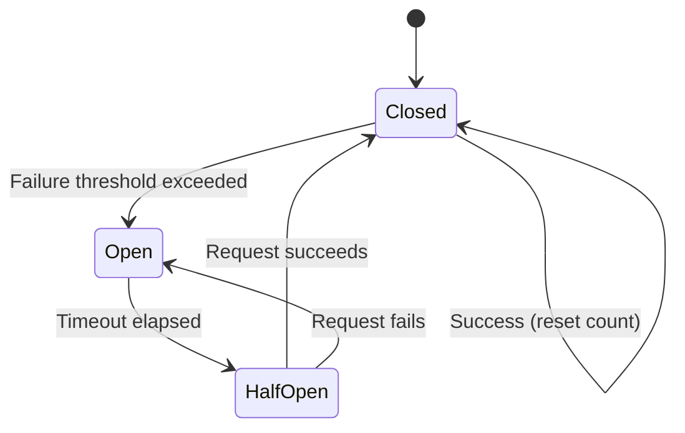

Virtual MCP Server (vMCP) implements failure handling patterns to prevent
cascading failures and provide graceful degradation when backends become
unavailable. This guide covers circuit breaker configuration and partial failure
modes.

:::tip

For backend health status monitoring and the `/status` endpoint, see
[Backend discovery modes](./backend-discovery.mdx#verify-backend-status).

:::

## Overview

When backends fail due to crashes, network issues, or rate limiting, vMCP
provides circuit breaker and partial failure modes to handle failures
gracefully:

- **Circuit breaker**: Prevents cascading failures by immediately rejecting
  requests to failing backends instead of waiting for timeouts
- **Partial failure modes**: Choose whether to fail entire requests or continue
  with available backends
- **Automatic recovery**: Backends are automatically restored when they recover

:::tip

Enable circuit breaker for production environments where backends may experience
temporary failures (deployments, restarts, rate limits). For highly stable
backends, health checks alone may be sufficient.

:::

## Circuit breaker

The circuit breaker tracks backend failures and transitions through three
states:

1. **Closed** (normal operation): Requests pass through to the backend. Failures
   are counted.
2. **Open** (failing state): After exceeding the failure threshold, the circuit
   opens. Requests fail immediately without contacting the backend.
3. **Half-open** (recovery testing): After a timeout period, the circuit allows
   exactly one test request through. While this request is in progress, all
   other requests are rejected (circuit remains half-open). If the test
   succeeds, the circuit closes immediately and normal operation resumes. If it
   fails, the circuit reopens for another timeout period.



### Enable circuit breaker

Configure circuit breaker in the VirtualMCPServer resource:

```yaml
apiVersion: toolhive.stacklok.dev/v1alpha1
kind: VirtualMCPServer
metadata:
  name: my-vmcp
  namespace: toolhive-system
spec:
  config:
    groupRef: my-group
    # highlight-start
    operational:
      failureHandling:
        healthCheckInterval: 30s
        unhealthyThreshold: 3
        circuitBreaker:
          enabled: true
          failureThreshold: 5
          timeout: 60s
    # highlight-end
  incomingAuth:
    type: anonymous
```

### Configuration options

| Field                     | Description                                           | Default |
| ------------------------- | ----------------------------------------------------- | ------- |
| `healthCheckInterval`     | Time between health checks for each backend           | `30s`   |
| `unhealthyThreshold`      | Consecutive failures before marking backend unhealthy | `3`     |
| `healthCheckTimeout`      | Maximum duration for a single health check            | `10s`   |
| `statusReportingInterval` | Interval for reporting status to Kubernetes           | `30s`   |
| **Circuit breaker**       |                                                       |         |
| `enabled`                 | Enable circuit breaker                                | `false` |
| `failureThreshold`        | Number of failures before opening the circuit         | `5`     |
| `timeout`                 | Duration to wait before testing recovery              | `60s`   |

:::note

Circuit breaker is disabled by default. Health checks run independently of the
circuit breaker and mark backends as healthy/unhealthy based on
`unhealthyThreshold`.

:::

:::note[Two failure thresholds]

vMCP uses two thresholds:

- **`unhealthyThreshold`** (default: 3): Consecutive health check failures
  before marking backend unhealthy
- **`failureThreshold`** (default: 5): Consecutive request failures before
  opening circuit breaker

Health checks detect failures during idle periods (max detection time:
`healthCheckInterval × unhealthyThreshold`). Circuit breaker provides fast
failure protection during active traffic.

:::

## Partial failure modes

Configure how vMCP behaves when some backends are unavailable:

```yaml
apiVersion: toolhive.stacklok.dev/v1alpha1
kind: VirtualMCPServer
metadata:
  name: my-vmcp
  namespace: toolhive-system
spec:
  config:
    groupRef: my-group
    operational:
      failureHandling:
        # highlight-next-line
        partialFailureMode: best_effort
  incomingAuth:
    type: anonymous
```

### Modes

- **`fail`** (default): Entire request fails if any required backend is
  unavailable. Use when all backends must be operational.
- **`best_effort`**: Return results from healthy backends even if some fail.
  Tools from failed backends are omitted from responses. Use for graceful
  degradation.

### Example: Best effort mode

With `partialFailureMode: best_effort`, if the GitHub backend is down but Fetch
is healthy, the `tools/list` response only includes tools from healthy backends:

```json
{
  "jsonrpc": "2.0",
  "result": {
    "tools": [{ "name": "fetch_url", "description": "Fetch URL content" }]
  },
  "id": 1
}
```

GitHub tools are omitted from the response because the circuit breaker is open.
The client doesn't see unavailable backend tools, preventing timeout errors when
attempting to call them.

## Monitor circuit breaker status

Check backend health and circuit state:

```bash
kubectl get virtualmcpserver my-vmcp -n toolhive-system -o yaml
```

Status includes health information and circuit breaker state:

```yaml
status:
  phase: Degraded # Ready|Degraded if some backends unhealthy
  backendCount: 2 # Only counts ready backends (fetch-mcp, jira-mcp)
  discoveredBackends:
    - name: github-mcp
      status: unavailable
      lastHealthCheck: '2025-02-09T10:29:45Z'
      message: 'connection timeout'
      circuitBreakerState: open # Circuit breaker state: closed|open|half-open
      circuitLastChanged: '2025-02-09T10:28:30Z' # When circuit opened
      consecutiveFailures: 8 # Current failure count
    - name: fetch-mcp
      status: ready
      lastHealthCheck: '2025-02-09T10:30:05Z'
      circuitBreakerState: closed
      consecutiveFailures: 0
    - name: jira-mcp
      status: ready
      lastHealthCheck: '2025-02-09T10:30:03Z'
      circuitBreakerState: half-open # Testing recovery
      circuitLastChanged: '2025-02-09T10:30:00Z'
      consecutiveFailures: 2 # Reduced after partial recovery
```

**Status fields:**

- `status`: Backend health (ready, degraded, unavailable, unknown)
- `circuitBreakerState`: Circuit state (closed, open, half-open) - empty if
  circuit breaker disabled
- `circuitLastChanged`: When the circuit breaker state last changed
- `consecutiveFailures`: Count of consecutive health check failures
- `message`: Additional information about backend status or errors

The `/status` HTTP endpoint provides a simplified view:

```bash
curl http://localhost:4483/status
```

```json
{
  "backends": [
    {
      "name": "github-mcp",
      "health": "unhealthy",
      "transport": "sse",
      "auth_type": "token_exchange"
    },
    {
      "name": "fetch-mcp",
      "health": "healthy",
      "transport": "streamable-http",
      "auth_type": "unauthenticated"
    }
  ],
  "healthy": false,
  "version": "v1.2.3",
  "group_ref": "my-group"
}
```

:::info

The `/status` endpoint provides basic health information but does not include
circuit breaker state. For detailed circuit breaker information
(`circuitBreakerState`, `consecutiveFailures`, `circuitLastChanged`), use the
Kubernetes status shown above. See
[Backend discovery modes](./backend-discovery.mdx#verify-backend-status) for
more details on the `/status` endpoint.

:::

## Example configurations

### Production with aggressive failure detection

Detect failures quickly and fail fast:

```yaml
apiVersion: toolhive.stacklok.dev/v1alpha1
kind: VirtualMCPServer
metadata:
  name: production-vmcp
  namespace: toolhive-system
spec:
  config:
    groupRef: production-backends
    operational:
      failureHandling:
        # Check every 10 seconds
        healthCheckInterval: 10s
        # Mark unhealthy after 2 failures (20 seconds)
        unhealthyThreshold: 2
        healthCheckTimeout: 5s
        # Open circuit after 3 failures
        circuitBreaker:
          enabled: true
          failureThreshold: 3
          timeout: 30s
        # Fail requests if any backend down
        partialFailureMode: fail
  incomingAuth:
    type: oidc
    oidc:
      issuerRef:
        name: my-issuer
```

### Development with best effort

Continue with available backends:

```yaml
apiVersion: toolhive.stacklok.dev/v1alpha1
kind: VirtualMCPServer
metadata:
  name: dev-vmcp
  namespace: toolhive-system
spec:
  config:
    groupRef: dev-backends
    operational:
      failureHandling:
        healthCheckInterval: 30s
        unhealthyThreshold: 3
        circuitBreaker:
          enabled: true
          failureThreshold: 5
          timeout: 60s
        # Continue with healthy backends
        partialFailureMode: best_effort
  incomingAuth:
    type: anonymous
```

## Troubleshooting

<details>
<summary>Circuit breaker opens too frequently</summary>

If the circuit breaker is too sensitive:

**Increase failure threshold:**

```yaml
operational:
  failureHandling:
    circuitBreaker:
      failureThreshold: 10 # Require more failures before opening
```

**Increase timeout:**

```yaml
operational:
  failureHandling:
    circuitBreaker:
      timeout: 120s # Give backends more time to recover
```

</details>

<details>
<summary>Backends not recovering automatically</summary>

If backends stay unhealthy after recovering:

1. **Test backend connectivity**

   Verify the backend MCP server is accessible from vMCP:

   ```bash
   kubectl exec -n toolhive-system deployment/vmcp-my-vmcp -- \
     curl -v http://my-backend:8080/mcp
   ```

   The backend should respond with MCP protocol headers.

2. **Increase circuit breaker timeout**

   ```yaml
   operational:
     failureHandling:
       circuitBreaker:
         timeout: 90s # Allow more time for full recovery
   ```

3. **Review vMCP logs**

   ```bash
   kubectl logs -n toolhive-system deployment/vmcp-my-vmcp
   ```

   Look for circuit breaker state transitions:

   ```
   WARN Circuit breaker for backend github-mcp OPENED (threshold exceeded)
   INFO Circuit breaker for backend github-mcp CLOSED (recovery successful)
   ```

</details>

<details>
<summary>Healthy backends marked unhealthy</summary>

If backends are incorrectly marked unhealthy:

**Increase health check timeout:**

```yaml
operational:
  failureHandling:
    healthCheckTimeout: 20s # Allow slower responses
```

**Increase unhealthy threshold:**

```yaml
operational:
  failureHandling:
    unhealthyThreshold: 5 # Allow more failures before marking unhealthy
```

</details>

## Related information

- [Backend discovery modes](./backend-discovery.mdx) - Backend health status and
  `/status` endpoint
- [Configuration guide](./configuration.mdx)
- [VirtualMCPServer CRD specification](../reference/crd-spec.md#apiv1alpha1virtualmcpserver)
