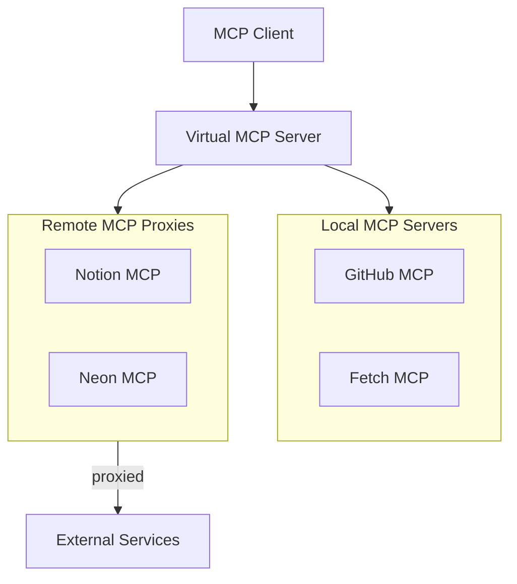

## Overview

Virtual MCP Server (vMCP) is a feature of the ToolHive Kubernetes Operator that
acts as an aggregation proxy, consolidating multiple backend MCP servers into a
single unified interface. Instead of configuring clients to connect to each MCP
server individually, you connect once to vMCP and access all backend tools
through a single endpoint.

vMCP supports two types of backends:

- **MCPServer**: Container-based MCP servers running in your cluster
- **MCPRemoteProxy**: Proxies to external remote MCP servers (such as Notion,
  analytics platforms, or other SaaS MCP endpoints)

:::note[MCPRemoteProxy support]

vMCP can discover MCPRemoteProxy backends in a group, but authentication between
vMCP and MCPRemoteProxy is not yet fully implemented. MCPServer backends work
fully with vMCP. See
[Proxy remote MCP servers](../guides-k8s/remote-mcp-proxy.mdx#use-with-virtual-mcp-server)
for details on the current limitations.

:::

## Core capabilities

- **Multi-server aggregation**: Connect to one endpoint instead of many,
  including both local container-based servers and remote MCP proxies
- **Tool conflict resolution**: Automatic namespacing when backend MCP servers
  have overlapping tool names
- **Centralized authentication**: Single sign-on with per-backend token exchange
- **Composite workflows**: Multi-step operations across backend MCP servers with
  parallel execution, approval gates, and error handling

## When to use vMCP

### Good fit

- You manage 5+ MCP servers (local or remote)
- You need cross-system workflows requiring coordination
- You have centralized authentication and authorization requirements
- You need reusable workflow definitions
- You want to aggregate external SaaS MCP servers with internal tools

### Not needed

- You use a single MCP server
- You have simple, one-step operations
- You have no orchestration requirements

## Architecture overview

## How it works

1. You define an MCPGroup (a resource that organizes related MCP servers)
2. Backend resources reference the group using `groupRef`:
   - **MCPServer** resources for container-based MCP servers
   - **MCPRemoteProxy** resources for external remote MCP servers
3. You create a VirtualMCPServer that references the group
4. The operator discovers all MCPServer and MCPRemoteProxy backends in the group
   and aggregates their capabilities
5. Clients connect to the VirtualMCPServer endpoint and see a unified view of
   all tools from both local and remote backends

## Related information

- [Quickstart: Virtual MCP Server](../tutorials/quickstart-vmcp.mdx)
- [Understanding Virtual MCP Server](../concepts/vmcp.mdx)
- [Performance and sizing](./performance.mdx)
- [Proxy remote MCP servers](../guides-k8s/remote-mcp-proxy.mdx)
