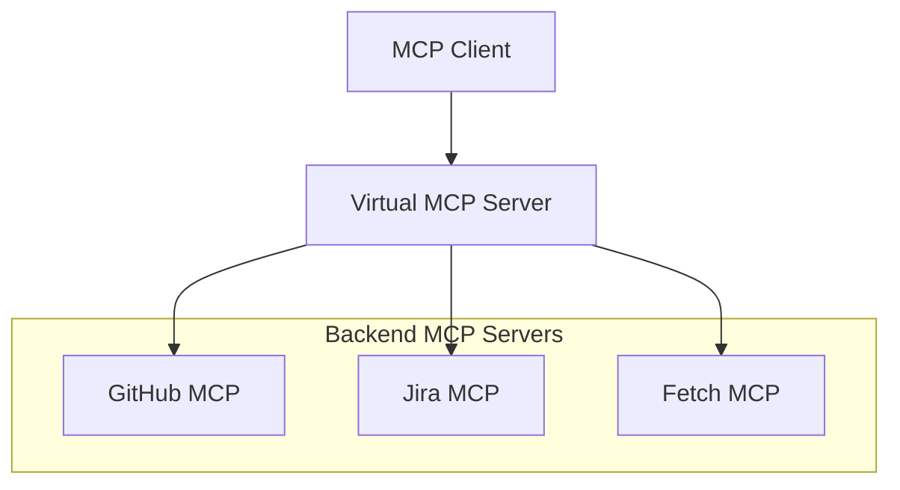

## Overview

Virtual MCP Server acts as an aggregation proxy that consolidates multiple
backend MCP servers into a single unified interface. Instead of configuring
clients to connect to each MCP server individually, you connect once to Virtual
MCP and access all backend tools through a single endpoint.

## Core capabilities

- **Multi-server aggregation**: Connect to one endpoint instead of many
- **Tool conflict resolution**: Automatic namespacing when backends have
  overlapping tool names
- **Centralized authentication**: Single sign-on with per-backend token exchange
- **Composite workflows**: Multi-step operations across backends with parallel
  execution, approval gates, and error handling

## When to use Virtual MCP

### Good fit

- Teams managing 5+ MCP servers
- Cross-system workflows requiring coordination
- Centralized authentication and authorization requirements
- Reusable workflow definitions needed

### Not needed

- Single MCP server usage
- Simple, one-step operations
- No orchestration requirements

## Architecture overview

## How it works

1. You define an MCPGroup containing your backend MCPServer resources
2. You create a VirtualMCPServer that references the group
3. The operator discovers all backends and aggregates their capabilities
4. Clients connect to the VirtualMCPServer endpoint and see all tools unified

## Related information

- [Understanding Virtual MCP Server](../concepts/vmcp-architecture.mdx)
- [Quickstart: Virtual MCP](../tutorials/quickstart-vmcp.mdx)
