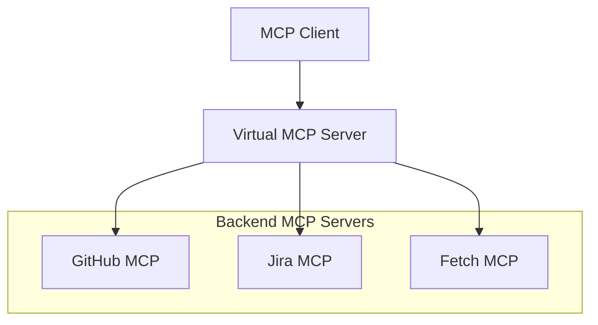

## Overview

Virtual MCP Server (vMCP) is a feature of the ToolHive Kubernetes Operator that
acts as an aggregation proxy, consolidating multiple backend MCP servers into a
single unified interface. Instead of configuring clients to connect to each MCP
server individually, you connect once to vMCP and access all backend tools
through a single endpoint.

## Core capabilities

- **Multi-server aggregation**: Connect to one endpoint instead of many
- **Tool conflict resolution**: Automatic namespacing when backend MCP servers
  have overlapping tool names
- **Centralized authentication**: Single sign-on with per-backend token exchange
- **Composite workflows**: Multi-step operations across backend MCP servers with
  parallel execution, approval gates, and error handling

## When to use vMCP

### Good fit

- You manage 5+ MCP servers
- You need cross-system workflows requiring coordination
- You have centralized authentication and authorization requirements
- You need reusable workflow definitions

### Not needed

- You use a single MCP server
- You have simple, one-step operations
- You have no orchestration requirements

## Architecture overview

## How it works

1. You define an MCPGroup (a resource that organizes related MCP servers)
   containing your backend MCPServer resources
2. You create a VirtualMCPServer that references the group
3. The operator discovers all backend MCP servers in the group and aggregates
   their capabilities
4. Clients connect to the VirtualMCPServer endpoint and see a unified view of
   all tools

## Related information

- [Understanding Virtual MCP Server](../concepts/vmcp.mdx)
- [Quickstart: Virtual MCP Server](../tutorials/quickstart-vmcp.mdx)
