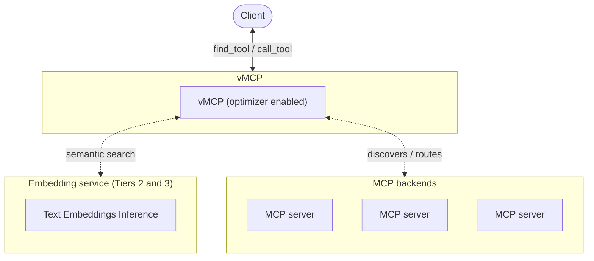

When Virtual MCP Server (vMCP) aggregates many backend MCP servers, the total
number of tools exposed to clients can grow quickly. The optimizer addresses
this by filtering tools per request, reducing token usage and improving tool
selection accuracy.

This guide covers configuration for Kubernetes deployments and local CLI use.
For a step-by-step Kubernetes tutorial, see the
[MCP Optimizer tutorial](../tutorials/mcp-optimizer.mdx).

## Quick start (Kubernetes)

### Step 1: Create an EmbeddingServer

Create an EmbeddingServer with default settings. This deploys a text embeddings
inference (TEI) server using the `BAAI/bge-small-en-v1.5` model:

```yaml title="embedding-server.yaml"
apiVersion: toolhive.stacklok.dev/v1beta1
kind: EmbeddingServer
metadata:
  name: my-embedding
  namespace: toolhive-system
spec: {}
```

:::tip

Wait for the EmbeddingServer to reach the `Ready` phase before proceeding. The
first startup may take a few minutes while the model downloads.

```bash
kubectl get embeddingserver my-embedding -n toolhive-system -w
```

:::

### Step 2: Add the embedding reference to VirtualMCPServer

Update your existing VirtualMCPServer to include `embeddingServerRef`. **This is
the only change needed to enable the optimizer.** When you set
`embeddingServerRef`, the operator automatically enables the optimizer with
sensible defaults. You only need to add an explicit `optimizer` block if you
want to [tune the parameters](#tune-the-optimizer).

```yaml title="VirtualMCPServer resource"
apiVersion: toolhive.stacklok.dev/v1beta1
kind: VirtualMCPServer
metadata:
  name: my-vmcp
  namespace: toolhive-system
spec:
  # highlight-start
  embeddingServerRef:
    name: my-embedding
  # highlight-end
  groupRef:
    name: my-group
  incomingAuth:
    type: anonymous
```

### Step 3: Verify

Check that the VirtualMCPServer is ready:

```bash
kubectl get virtualmcpserver my-vmcp -n toolhive-system
```

Look for `READY: True` in the output. Once ready, clients connecting to the vMCP
endpoint see only `find_tool` and `call_tool` instead of the full backend
toolset.

## EmbeddingServer resource

The EmbeddingServer CRD manages the lifecycle of a managed TEI server, which is
the default embedding backend. If you'd rather point the optimizer at an
external OpenAI-compatible embedding service instead, see
[Use an OpenAI-compatible embedding service](#use-an-openai-compatible-embedding-service)
below.

An empty `spec: {}` uses all defaults. The two most important fields you can
customize are:

- **`model`**: The Hugging Face embedding model to use. The default
  (`BAAI/bge-small-en-v1.5`) is the tested and recommended model. You can
  substitute any embedding model available on Hugging Face. See the
  [MTEB leaderboard](https://huggingface.co/spaces/mteb/leaderboard) to compare
  options.
- **`image`**: The container image for
  [text-embeddings-inference](https://github.com/huggingface/text-embeddings-inference)
  (TEI). The default is the CPU-only image
  (`ghcr.io/huggingface/text-embeddings-inference:cpu-latest`). Swap this for a
  CUDA-enabled image if you have GPU nodes available.

For the complete field reference, see the
[EmbeddingServer CRD specification](../reference/crds/embeddingserver.mdx).

:::tip[ARM64 support]

The default TEI image (`cpu-latest`) is x86_64-only. If you are running on ARM64
nodes (for example, Apple Silicon), override the image in your EmbeddingServer:

```yaml title="embedding-server.yaml"
apiVersion: toolhive.stacklok.dev/v1beta1
kind: EmbeddingServer
metadata:
  name: my-embedding
  namespace: toolhive-system
spec:
  image: ghcr.io/huggingface/text-embeddings-inference:cpu-arm64-latest
```

:::

## Use an OpenAI-compatible embedding service

Instead of running a managed TEI EmbeddingServer, you can point the optimizer at
an external service that speaks the OpenAI `/embeddings` API, such as OpenAI
itself, Azure OpenAI, or another OpenAI-compatible gateway. Use this when you
already operate a centralized embedding service and don't want a second copy
running per vMCP, or when you need a hosted model.

Set `embeddingProvider: openai` under `spec.config.optimizer` and configure
`embeddingService` and `embeddingModel` directly. Do **not** set
`embeddingServerRef`; the operator rejects combining the two at admission.

```yaml title="VirtualMCPServer resource"
apiVersion: toolhive.stacklok.dev/v1beta1
kind: VirtualMCPServer
metadata:
  name: optimizer-vmcp
  namespace: toolhive-system
spec:
  groupRef:
    name: my-group
  config:
    optimizer:
      # highlight-start
      embeddingProvider: openai
      embeddingService: http://llm-gateway.default.svc.cluster.local:8080/v1
      embeddingModel: text-embedding-3-small
      # highlight-end
      embeddingServiceTimeout: 15s
  incomingAuth:
    type: anonymous
```

`embeddingService` is the base URL of the OpenAI-compatible endpoint;
`/embeddings` is appended automatically. `embeddingModel` is the model name
passed in each request and is required for the `openai` provider (the `tei`
provider ignores it, because the model is fixed by the TEI container).

The API key for the embedding service is read from the `OPENAI_API_KEY`
environment variable on the vmcp container, never from the CRD spec or
ConfigMap. Inject it from a Secret via `podTemplateSpec`:

```yaml title="VirtualMCPServer resource (excerpt)"
spec:
  podTemplateSpec:
    spec:
      containers:
        - name: vmcp
          env:
            - name: OPENAI_API_KEY
              valueFrom:
                secretKeyRef:
                  name: embedding-api-key
                  key: apiKey
```

Omit the env var entirely if your gateway is keyless (for example, an in-cluster
LLM gateway that authenticates by network position). An empty key omits the
`Authorization` header.

If your embedding gateway needs additional HTTP headers on every request (for
routing, tenant scoping, or caching), add them under
`optimizer.embeddingHeaders`. Header values are stored in plain text on the
resource and generated ConfigMap, so use this only for non-secret values:

```yaml title="VirtualMCPServer resource"
spec:
  config:
    optimizer:
      embeddingProvider: openai
      embeddingService: http://llm-gateway.default.svc.cluster.local:8080/v1
      embeddingModel: text-embedding-3-small
      # highlight-start
      embeddingHeaders:
        X-Tenant-Id: acme
        X-Cache-Scope: embeddings-prod
      # highlight-end
```

`embeddingHeaders` is only accepted when `embeddingProvider` is `openai` (the
managed TEI path ignores it). Header names must be valid RFC 7230 tokens, and
`Authorization` and `Content-Type` are reserved - the client sets those itself
from `OPENAI_API_KEY` and cannot be overridden.

:::warning[Inputs are not truncated]

Unlike the TEI backend, the OpenAI API does not silently truncate over-long
inputs. A tool description that exceeds the model's context window causes the
request to fail with an error rather than being truncated.

:::

When `embeddingProvider` is omitted, the optimizer defaults to `tei` and your
existing TEI-based configuration continues to work unchanged.

## Local mode (CLI)

You can enable the optimizer directly from the `thv vmcp` CLI without a
Kubernetes cluster.

### Tier 1 — keyword search

Tier 1 uses FTS5 full-text search running in-process. No external service or
container is required:

```bash
thv vmcp serve --group my-group --optimizer
```

Or add it to an existing config file:

```yaml title="vmcp.yaml"
optimizer: {}
```

Then start the server with:

```bash
thv vmcp serve --config vmcp.yaml
```

### Tier 2 — managed TEI container

Tier 2 adds vector similarity search on top of keyword search. ToolHive
automatically starts and stops a
[HuggingFace Text Embeddings Inference](https://github.com/huggingface/text-embeddings-inference)
(TEI) container. A container runtime (Docker, Podman, or OrbStack) must be
available:

```bash
thv vmcp serve --group my-group --optimizer-embedding
```

To customize the model or image used for the auto-managed container:

```bash
thv vmcp serve --group my-group --optimizer-embedding \
  --embedding-model BAAI/bge-small-en-v1.5 \
  --embedding-image ghcr.io/huggingface/text-embeddings-inference:cpu-latest
```

### Tier 3 — external embedding service

Tier 3 uses an embedding server you already manage. No container runtime is
required. Set `embeddingService` in your existing config file to point at the
server:

```yaml title="vmcp.yaml"
optimizer:
  embeddingService: http://127.0.0.1:8090
```

Then start the server with:

```bash
thv vmcp serve --config vmcp.yaml
```

For the full optimizer tier comparison, see the
[local CLI guide](./local-cli.mdx#optimizer-tiers).

## Benefits

- **Reduced token usage**: Only relevant tools are included in context, not the
  entire toolset
- **Improved tool selection**: The right tools surface for each query. With
  fewer tools to reason over, agents are more likely to choose correctly

## How it works

1. You send a prompt that requires tool assistance
2. The AI calls `find_tool` with keywords extracted from the prompt
3. vMCP performs hybrid semantic and keyword search across all backend tools
4. Only the most relevant tools (up to 8 by default) are returned
5. The AI calls `call_tool` to execute the selected tool, and vMCP routes the
   request to the appropriate backend



:::info[How search works internally]

The optimizer uses an internal SQLite database for both keyword search (using
full-text search) and storing semantic vectors. Keyword search runs locally
against this database; semantic search uses vectors generated by an embedding
server. To control how results from these two sources are blended, see the
[parameter reference](#parameter-reference).

:::

## Tune the optimizer

To customize optimizer behavior, add the `optimizer` block under `spec.config`
in your VirtualMCPServer resource:

```yaml title="VirtualMCPServer resource"
spec:
  groupRef:
    name: my-group
  config:
    # highlight-start
    optimizer:
      embeddingServiceTimeout: 30s
      maxToolsToReturn: 8
      hybridSearchSemanticRatio: '0.5'
      semanticDistanceThreshold: '1.0'
    # highlight-end
```

### Parameter reference

<CRDFields
  kind='VirtualMCPServer'
  path='spec.config.optimizer'
  exclude={['embeddingService']}
/>

:::info[Kubernetes: EmbeddingServer is required for the default TEI provider]

When using the Kubernetes operator with the default `tei` embedding provider,
even if you set `hybridSearchSemanticRatio` to `"0.0"` (all keyword search), the
optimizer still requires a configured `EmbeddingServer`. The EmbeddingServer
won't be used at runtime when the semantic ratio is `0.0`, but the configuration
must be present due to how the operator wires the resources internally.

This restriction doesn't apply when you set `optimizer.embeddingService`
directly, such as with the
[OpenAI-compatible provider](#use-an-openai-compatible-embedding-service); the
operator only requires `embeddingServerRef` when no manual embedding service is
configured.

This restriction also does not apply to local CLI mode.
`thv vmcp serve --optimizer` runs keyword-only search with no EmbeddingServer
and no container.

:::

:::tip[Tuning guidance]

The defaults are well-tested and work for most use cases. If you do need to
adjust them:

- **Lower `semanticDistanceThreshold`** (for example, `"0.6"`) for higher
  precision: only very close matches are returned
- **Raise `semanticDistanceThreshold`** (for example, `"1.4"`) for higher
  recall: broader matches are included
- **Increase `maxToolsToReturn`** if the AI frequently cannot find the right
  tool; decrease it to save tokens
- **Adjust `hybridSearchSemanticRatio`** toward `"1.0"` if tool names are not
  descriptive, or toward `"0.0"` if exact keyword matching is more useful
- `semanticDistanceThreshold` filtering is applied before the `maxToolsToReturn`
  cap. A low threshold can filter out candidates before the cap takes effect, so
  you may need to raise the threshold if too few results are returned

:::

## Complete example

This example shows a full configuration with all available options, including
high availability for the embedding server, persistent model caching, and tuned
optimizer parameters.

The EmbeddingServer runs two replicas with resource limits and a persistent
volume for model caching, so restarts don't re-download the model:

```yaml title="embedding-server-full.yaml"
apiVersion: toolhive.stacklok.dev/v1beta1
kind: EmbeddingServer
metadata:
  name: full-embedding
  namespace: toolhive-system
spec:
  replicas: 2
  resources:
    requests:
      cpu: '500m'
      memory: '512Mi'
    limits:
      cpu: '2'
      memory: '1Gi'
  modelCache:
    enabled: true
    size: 5Gi
```

The VirtualMCPServer uses a shorter embedding timeout (15s) because the
EmbeddingServer is co-located with low-latency access. Increase this value if
the embedding service is remote or under high load:

```yaml title="vmcp-with-optimizer.yaml"
apiVersion: toolhive.stacklok.dev/v1beta1
kind: VirtualMCPServer
metadata:
  name: full-vmcp
  namespace: toolhive-system
spec:
  groupRef:
    name: my-tools
  embeddingServerRef:
    name: full-embedding
  groupRef:
    name: my-tools
  config:
    optimizer:
      embeddingServiceTimeout: 15s
      maxToolsToReturn: 10
      hybridSearchSemanticRatio: '0.6'
      semanticDistanceThreshold: '0.8'
  incomingAuth:
    type: oidc
    oidcConfigRef:
      name: my-oidc
      audience: vmcp-example
```

## Next steps

- [Run tool calls server-side with code mode](./code-mode.mdx) to collapse
  multi-tool workflows into one round-trip; code mode composes with the
  optimizer
- [Configure failure handling](./failure-handling.mdx) for circuit breakers and
  partial failure modes
- [Monitor vMCP activity](./telemetry-and-metrics.mdx) with OpenTelemetry
  tracing and metrics

## Related information

- [MCP Optimizer tutorial](../tutorials/mcp-optimizer.mdx) - end-to-end
  Kubernetes setup
- [Optimizing LLM context](../concepts/tool-optimization.mdx) - background on
  tool filtering and context pollution
- [Configure vMCP servers](./configuration.mdx)
- [Run tool calls server-side with code mode](./code-mode.mdx)
- [EmbeddingServer CRD specification](../reference/crds/embeddingserver.mdx)
- [Virtual MCP Server overview](../concepts/vmcp.mdx) - conceptual overview of
  vMCP
- [VirtualMCPServer CRD specification](../reference/crds/virtualmcpserver.mdx)
