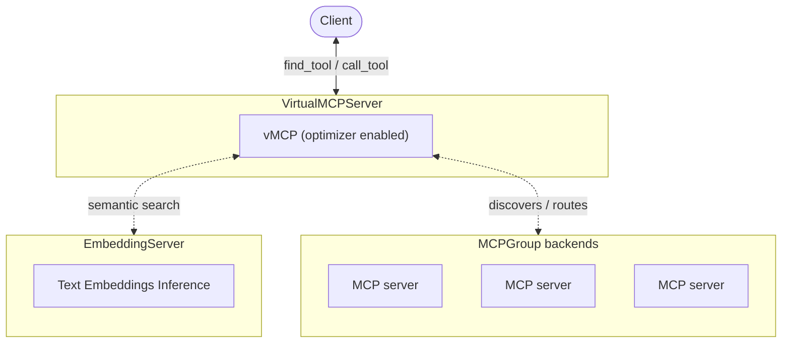

When Virtual MCP Server (vMCP) aggregates many backend MCP servers, the total
number of tools exposed to clients can grow quickly. The optimizer addresses
this by filtering tools per request, reducing token usage and improving tool
selection accuracy.

For a step-by-step tutorial that walks through the full setup, see the
[MCP Optimizer tutorial](../tutorials/mcp-optimizer.mdx). This guide covers the
configuration details for the VirtualMCPServer and EmbeddingServer CRDs.

## Benefits

- **Reduced token usage**: Only relevant tools are included in context, not the
  entire toolset
- **Improved tool selection**: The right tools surface for each query. With
  fewer tools to reason over, agents are more likely to choose correctly

## How it works

1. You send a prompt that requires tool assistance
2. The AI calls `find_tool` with keywords extracted from the prompt
3. vMCP performs hybrid semantic and keyword search across all backend tools
4. Only the most relevant tools (up to 8 by default) are returned
5. The AI calls `call_tool` to execute the selected tool, and vMCP routes the
   request to the appropriate backend



:::info[How search works internally]

The optimizer uses an internal SQLite database for both keyword search (using
full-text search) and storing semantic vectors. Keyword search runs locally
against this database; semantic search uses vectors generated by an embedding
server. To control how results from these two sources are blended, see the
[parameter reference](#parameter-reference).

:::

## Quick start

### Step 1: Create an EmbeddingServer

Create an EmbeddingServer with default settings. This deploys a text embeddings
inference (TEI) server using the `BAAI/bge-small-en-v1.5` model:

```yaml title="embedding-server.yaml"
apiVersion: toolhive.stacklok.dev/v1alpha1
kind: EmbeddingServer
metadata:
  name: my-embedding
  namespace: toolhive-system
spec: {}
```

:::tip

Wait for the EmbeddingServer to reach the `Ready` phase before proceeding. The
first startup may take a few minutes while the model downloads.

```bash
kubectl get embeddingserver my-embedding -n toolhive-system -w
```

:::

### Step 2: Add the embedding reference to VirtualMCPServer

Update your existing VirtualMCPServer to include `embeddingServerRef`. **This is
the only change needed to enable the optimizer.** When you set
`embeddingServerRef`, the operator automatically enables the optimizer with
sensible defaults. You only need to add an explicit `optimizer` block if you
want to [tune the parameters](#tune-the-optimizer).

```yaml title="VirtualMCPServer resource"
apiVersion: toolhive.stacklok.dev/v1alpha1
kind: VirtualMCPServer
metadata:
  name: my-vmcp
  namespace: toolhive-system
spec:
  # highlight-start
  embeddingServerRef:
    name: my-embedding
  # highlight-end
  groupRef:
    name: my-group
  incomingAuth:
    type: anonymous
```

### Step 3: Verify

Check that the VirtualMCPServer is ready:

```bash
kubectl get virtualmcpserver my-vmcp -n toolhive-system
```

Look for `READY: True` in the output. Once ready, clients connecting to the vMCP
endpoint see only `find_tool` and `call_tool` instead of the full backend
toolset.

## EmbeddingServer resource

The EmbeddingServer CRD manages the lifecycle of a TEI server. An empty
`spec: {}` uses all defaults. The two most important fields you can customize
are:

- **`model`**: The Hugging Face embedding model to use. The default
  (`BAAI/bge-small-en-v1.5`) is the tested and recommended model. You can
  substitute any embedding model available on Hugging Face. See the
  [MTEB leaderboard](https://huggingface.co/spaces/mteb/leaderboard) to compare
  options.
- **`image`**: The container image for
  [text-embeddings-inference](https://github.com/huggingface/text-embeddings-inference)
  (TEI). The default is the CPU-only image
  (`ghcr.io/huggingface/text-embeddings-inference:cpu-latest`). Swap this for a
  CUDA-enabled image if you have GPU nodes available.

For the complete field reference, see the
[EmbeddingServer CRD specification](../reference/crds/embeddingserver.mdx).

:::tip[ARM64 support]

The default TEI image (`cpu-latest`) is x86_64-only. If you are running on ARM64
nodes (for example, Apple Silicon), override the image in your EmbeddingServer:

```yaml title="embedding-server.yaml"
apiVersion: toolhive.stacklok.dev/v1alpha1
kind: EmbeddingServer
metadata:
  name: my-embedding
  namespace: toolhive-system
spec:
  image: ghcr.io/huggingface/text-embeddings-inference:cpu-arm64-latest
```

:::

## Tune the optimizer

To customize optimizer behavior, add the `optimizer` block under `spec.config`
in your VirtualMCPServer resource:

```yaml title="VirtualMCPServer resource"
spec:
  groupRef:
    name: my-group
  config:
    # highlight-start
    optimizer:
      embeddingServiceTimeout: 30s
      maxToolsToReturn: 8
      hybridSearchSemanticRatio: '0.5'
      semanticDistanceThreshold: '1.0'
    # highlight-end
```

### Parameter reference

| Parameter                   | Description                                                                                                                                              | Default |
| --------------------------- | -------------------------------------------------------------------------------------------------------------------------------------------------------- | ------- |
| `embeddingServiceTimeout`   | HTTP request timeout for calls to the embedding service                                                                                                  | `30s`   |
| `maxToolsToReturn`          | Maximum number of tools returned per search (1-50)                                                                                                       | `8`     |
| `hybridSearchSemanticRatio` | Balance between semantic and keyword search. `0.0` = all keyword, `1.0` = all semantic. Default gives equal weight to both.                              | `"0.5"` |
| `semanticDistanceThreshold` | Maximum distance from the search term for semantic results. `0` = identical, `2` = completely unrelated. Results beyond this threshold are filtered out. | `"1.0"` |

:::note

`hybridSearchSemanticRatio` and `semanticDistanceThreshold` are string-encoded
floats (for example, `"0.5"` not `0.5`). This is a Kubernetes CRD limitation, as
CRDs do not support float types portably.

:::

:::info[EmbeddingServer is always required]

Even if you set `hybridSearchSemanticRatio` to `"0.0"` (all keyword search), the
optimizer still requires a configured EmbeddingServer. The EmbeddingServer won't
be used at runtime when the semantic ratio is `0.0`, but the configuration must
be present due to how the optimizer is wired internally.

:::

:::tip[Tuning guidance]

The defaults are well-tested and work for most use cases. If you do need to
adjust them:

- **Lower `semanticDistanceThreshold`** (for example, `"0.6"`) for higher
  precision: only very close matches are returned
- **Raise `semanticDistanceThreshold`** (for example, `"1.4"`) for higher
  recall: broader matches are included
- **Increase `maxToolsToReturn`** if the AI frequently cannot find the right
  tool; decrease it to save tokens
- **Adjust `hybridSearchSemanticRatio`** toward `"1.0"` if tool names are not
  descriptive, or toward `"0.0"` if exact keyword matching is more useful
- `semanticDistanceThreshold` filtering is applied before the `maxToolsToReturn`
  cap. A low threshold can filter out candidates before the cap takes effect, so
  you may need to raise the threshold if too few results are returned

:::

## Complete example

This example shows a full configuration with all available options, including
high availability for the embedding server, persistent model caching, and tuned
optimizer parameters.

The EmbeddingServer runs two replicas with resource limits and a persistent
volume for model caching, so restarts don't re-download the model:

```yaml title="embedding-server-full.yaml"
apiVersion: toolhive.stacklok.dev/v1alpha1
kind: EmbeddingServer
metadata:
  name: full-embedding
  namespace: toolhive-system
spec:
  replicas: 2
  resources:
    requests:
      cpu: '500m'
      memory: '512Mi'
    limits:
      cpu: '2'
      memory: '1Gi'
  modelCache:
    enabled: true
    size: 5Gi
```

The VirtualMCPServer uses a shorter embedding timeout (15s) because the
EmbeddingServer is co-located with low-latency access. Increase this value if
the embedding service is remote or under high load:

```yaml title="vmcp-with-optimizer.yaml"
apiVersion: toolhive.stacklok.dev/v1alpha1
kind: VirtualMCPServer
metadata:
  name: full-vmcp
  namespace: toolhive-system
spec:
  groupRef:
    name: my-tools
  embeddingServerRef:
    name: full-embedding
  groupRef:
    name: my-tools
  config:
    optimizer:
      embeddingServiceTimeout: 15s
      maxToolsToReturn: 10
      hybridSearchSemanticRatio: '0.6'
      semanticDistanceThreshold: '0.8'
  incomingAuth:
    type: oidc
    oidcConfigRef:
      name: my-oidc
      audience: vmcp-example
```

## Next steps

- [Configure failure handling](./failure-handling.mdx) for circuit breakers and
  partial failure modes
- [Monitor vMCP activity](./telemetry-and-metrics.mdx) with OpenTelemetry
  tracing and metrics

## Related information

- [MCP Optimizer tutorial](../tutorials/mcp-optimizer.mdx) - end-to-end
  Kubernetes setup
- [Optimizing LLM context](../concepts/tool-optimization.mdx) - background on
  tool filtering and context pollution
- [Configure vMCP servers](./configuration.mdx)
- [EmbeddingServer CRD specification](../reference/crds/embeddingserver.mdx)
- [Virtual MCP Server overview](../concepts/vmcp.mdx) - conceptual overview of
  vMCP
- [VirtualMCPServer CRD specification](../reference/crds/virtualmcpserver.mdx)
