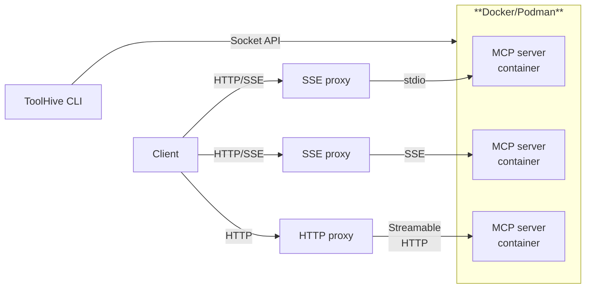

import useBaseUrl from '@docusaurus/useBaseUrl';
import ThemedImage from '@theme/ThemedImage';

<ThemedImage
  alt='ToolHive logo'
  sources={{
    light: useBaseUrl('/img/toolhive-wordmark-black.svg'),
    dark: useBaseUrl('/img/toolhive-wordmark-white.svg'),
  }}
  title='ToolHive logo'
  height={'80'}
/>
 

## What is ToolHive?

ToolHive simplifies the deployment and management of Model Context Protocol
(MCP) servers. It ensures ease of use, consistency, and security by running
containers in a locked-down environment with minimal permissions.

Follow the [getting started guide](./tutorials/quickstart.mdx) to install
ToolHive and run your first MCP server.

To learn more about the Model Context Protocol, see our
[MCP primer](./concepts/mcp-primer.md).

## Why ToolHive?

We want to help you get real value from MCP servers. While there are plenty of
tools to help you quickly build MCP servers, the obstacles to using those
servers effectively are largely operational. ToolHive addresses the runtime,
security, and other considerations necessary to use MCP servers with confidence
and in production.

We address those considerations with proven, familiar technologies like
containers and Kubernetes.

ToolHive lets you run any MCP server, regardless of its underlying technology
stack, even when the original authors didn't provide container images. We
containerize the MCP server and let you use a simple CLI or Kubernetes to manage
MCP deployments at any scale. Coordinate all your MCP servers from one place
with sensible security controls and container-native simplicity.

## Architecture overview

ToolHive exposes an HTTP proxy to forward requests to MCP servers running in
containers. The proxy communicates with MCP servers via standard input/output
(stdio), server-sent events (SSE), or Streamable HTTP. The ToolHive CLI
interacts with Docker or Podman via the Docker socket API, letting it manage
containers and their configurations.

ToolHive is packaged as a [standalone CLI tool](./guides-cli/) for individual
developers and as a [Kubernetes operator](./guides-k8s/) for teams and
enterprises. The CLI provides a simple command line interface to deploy and
manage MCP servers, while the Kubernetes operator enables teams to run and
manage MCP servers centrally.

## Key features

ToolHive offers the following features to simplify MCP deployment:

- **Streamlined deployment**: Deploy MCP servers instantly with a single command
  using Docker containers or directly from package managers via protocol schemes
  (`uvx://`, `npx://`, `go://`). Access a curated registry of verified MCP
  servers that you can discover and run effortlessly.

- **Comprehensive security**: Run MCP servers in isolated containers with
  customizable, fine-grained permissions and network access filtering using JSON
  profiles. Securely manage secrets and configurations using built-in encrypted
  storage or 1Password integration, eliminating plaintext secrets in
  configuration files.

- **Enterprise readiness**: Implement robust OAuth-based authorization controls
  for enterprise environments that integrate seamlessly with existing
  infrastructure.

- **Kubernetes deployment**: Deploy and manage MCP servers in Kubernetes
  clusters using the ToolHive operator.

- **Seamless integration**: Configure popular development tools automatically,
  including GitHub Copilot and Cursor, to streamline your workflow with minimal
  setup.

## Additional resources

- [GitHub repository](https://github.com/stacklok/toolhive)
- [Issue tracker](https://github.com/stacklok/toolhive/issues)
- [Discord community](https://discord.gg/stacklok)
