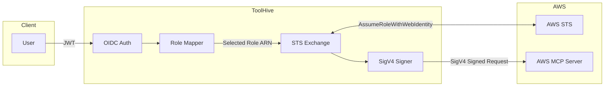

This tutorial shows you how to use ToolHive as an authentication proxy for the
[AWS MCP Server](https://docs.aws.amazon.com/aws-mcp/). Developers sign in
through their company identity provider, and ToolHive exchanges their OIDC token
for temporary AWS credentials via
[`AssumeRoleWithWebIdentity`](https://docs.aws.amazon.com/STS/latest/APIReference/API_AssumeRoleWithWebIdentity.html).

:::info[Prerequisites]

Before starting this tutorial, ensure you have:

- A Kubernetes cluster with the ToolHive Operator installed (see the
  [Kubernetes quickstart guide](./quickstart-k8s.mdx))
- `kubectl` configured to access your cluster
- An AWS account with permissions to create IAM roles, policies, and OIDC
  identity providers
- An OIDC identity provider (such as Okta, Auth0, Microsoft Entra ID, or
  Keycloak) that your users authenticate with
- Basic familiarity with AWS IAM concepts and OIDC

:::

## Overview

The following diagram shows how ToolHive processes each request:



1. The client sends a request with an OIDC token from your identity provider.
2. ToolHive validates the token against your OIDC provider's JWKS endpoint.
3. The **role mapper** inspects JWT claims (such as `groups`) and selects an IAM
   role based on your configured mappings.
4. ToolHive calls AWS STS `AssumeRoleWithWebIdentity` to exchange the OIDC token
   for temporary AWS credentials.
5. The **SigV4 signer** signs the outgoing request with the temporary
   credentials.
6. The signed request is forwarded to the AWS MCP Server.

The AWS MCP Server acts as the access point that allows AI assistants to connect
to different AWS services. Compared to configuring AWS credentials directly,
ToolHive adds:

- **Company IdP integration:** Developers authenticate using company SSO.
  ToolHive acquires short-lived, properly scoped credentials on their behalf. No
  AWS CLI configuration is required, and AWS credentials are never stored on
  developers' machines.
- **Fine-grained authorization:** Control which MCP tools a user can invoke.
  Cedar policies are evaluated on every request, using claims from the incoming
  token to make access decisions.
- **Observability, metrics, and auditing:** ToolHive provides OpenTelemetry
  tracing, Prometheus metrics, and audit logs that correlate user identity
  across the request flow.

## Step 1: Register your identity provider with AWS IAM

Create an OIDC identity provider in AWS IAM so that AWS STS trusts tokens from
your identity provider.

```bash
aws iam create-open-id-connect-provider \
  --url https://<YOUR_OIDC_ISSUER> \
  --client-id-list <YOUR_OIDC_AUDIENCE>
```

Replace the placeholders:

- `<YOUR_OIDC_ISSUER>` - your identity provider's issuer URL (for example,
  `https://dev-123456.okta.com/oauth2/default`)
- `<YOUR_OIDC_AUDIENCE>` - the audience claim in your OIDC tokens that
  identifies this proxy (for example, `toolhive-aws-proxy`)

:::info[What's happening?]

This step establishes a trust relationship between AWS and your identity
provider. When ToolHive later calls `AssumeRoleWithWebIdentity`, AWS STS
verifies the OIDC token signature against keys published by your identity
provider. Without this trust relationship, AWS rejects the token exchange.

:::

## Step 2: Create IAM roles and policies

Create IAM roles that ToolHive assumes on behalf of your users. Each role
defines what AWS permissions a user gets when their JWT claims match a role
mapping.

### Understanding the AWS MCP Server permission model

AWS MCP Server authorization works in two layers:

1. **MCP layer** (`aws-mcp:*` actions) - controls which categories of MCP tools
   the user can invoke
2. **AWS service layer** (e.g., `s3:*`, `ec2:*`) - controls what the
   `aws___call_aws` tool can actually do when it makes AWS API calls

The `aws-mcp` namespace defines three actions:

- `InvokeMcp` - required to connect and discover available tools
- `CallReadOnlyTool` - search documentation, list regions, get CLI suggestions
  (7 of 9 tools)
- `CallReadWriteTool` - execute real AWS API calls via the `aws___call_aws` tool
  (requires additional service permissions)

### Default role

Create a role with minimal permissions. This is the fallback when no specific
role mapping matches. It needs two policy documents.

The trust policy allows AWS STS to accept tokens from your OIDC provider. The
`Federated` principal identifies your registered provider, and the `aud`
condition rejects tokens meant for other services:

```json title="default-mcp-trust-policy.json"
{
  "Version": "2012-10-17",
  "Statement": [
    {
      "Effect": "Allow",
      "Principal": {
        "Federated": "arn:aws:iam::<YOUR_AWS_ACCOUNT_ID>:oidc-provider/<YOUR_OIDC_ISSUER_HOST>"
      },
      "Action": "sts:AssumeRoleWithWebIdentity",
      "Condition": {
        "StringEquals": {
          "<YOUR_OIDC_ISSUER_HOST>:aud": "<YOUR_OIDC_AUDIENCE>"
        }
      }
    }
  ]
}
```

The permission policy grants read-only MCP access. Users can search AWS
documentation and get suggestions, but cannot execute AWS API calls:

```json title="default-mcp-permissions.json"
{
  "Version": "2012-10-17",
  "Statement": [
    {
      "Effect": "Allow",
      "Action": ["aws-mcp:InvokeMcp", "aws-mcp:CallReadOnlyTool"],
      "Resource": "*"
    }
  ]
}
```

Create the role with the trust policy and attach the permission policy:

```bash
aws iam create-role \
  --role-name DefaultMCPRole \
  --assume-role-policy-document file://default-mcp-trust-policy.json

aws iam put-role-policy \
  --role-name DefaultMCPRole \
  --policy-name DefaultMCPPolicy \
  --policy-document file://default-mcp-permissions.json
```

:::warning[Production: use permission boundaries]

For production deployments, attach
[permission boundaries](https://docs.aws.amazon.com/IAM/latest/UserGuide/access_policies_boundaries.html)
to your IAM roles to limit the maximum permissions a role can grant. A good
boundary policy restricts allowed AWS regions, denies IAM and Organizations API
access, and denies `sts:AssumeRole` to prevent role chaining. This limits the
blast radius even if a role's identity policy is overly permissive.

:::

### Optional: additional roles for specific teams

You can create additional roles with different permissions and map them to
specific groups using ToolHive's role mappings. This example creates a role that
grants `CallReadWriteTool` (so the `aws___call_aws` tool can execute API calls)
and scopes the underlying AWS permissions to S3 read-only access:

```json title="s3-readonly-permissions.json"
{
  "Version": "2012-10-17",
  "Statement": [
    {
      "Effect": "Allow",
      "Action": [
        "aws-mcp:InvokeMcp",
        "aws-mcp:CallReadOnlyTool",
        "aws-mcp:CallReadWriteTool"
      ],
      "Resource": "*"
    },
    {
      "Effect": "Allow",
      "Action": ["s3:GetObject", "s3:ListBucket"],
      "Resource": "*"
    }
  ]
}
```

The first statement unlocks the `aws___call_aws` tool. The second statement
limits what that tool can actually do - in this case, only S3 read operations.
Without the S3 permissions, API calls to other services would be denied by IAM.

```bash
aws iam create-role \
  --role-name S3ReadOnlyMCPRole \
  --assume-role-policy-document file://default-mcp-trust-policy.json

aws iam put-role-policy \
  --role-name S3ReadOnlyMCPRole \
  --policy-name S3ReadOnlyMCPPolicy \
  --policy-document file://s3-readonly-permissions.json
```

:::info[How role selection works]

When a request arrives, ToolHive evaluates your role mappings in priority order
(lower number = higher priority). The first matching rule determines which IAM
role to assume. If no mapping matches, the fallback role is used.

For example, if a user belongs to both `s3-readers` and `developers` groups, and
`s3-readers` has a lower priority number, ToolHive selects the S3 read-only
role.

:::

## Step 3: Create the MCPExternalAuthConfig

Create an `MCPExternalAuthConfig` resource that defines how ToolHive exchanges
OIDC tokens for AWS credentials.

```yaml {4,7,10,13-17} title="aws-sts-auth-config.yaml"
apiVersion: toolhive.stacklok.dev/v1alpha1
kind: MCPExternalAuthConfig
metadata:
  name: aws-mcp-sts-auth
  namespace: toolhive-system
spec:
  type: awsSts
  awsSts:
    region: <YOUR_AWS_REGION>

    # Default role when no role mapping matches
    fallbackRoleArn: >-
      arn:aws:iam::<YOUR_AWS_ACCOUNT_ID>:role/DefaultMCPRole

    # Map JWT claims to IAM roles (lower priority = evaluated first)
    roleMappings:
      - claim: s3-readers
        roleArn: >-
          arn:aws:iam::<YOUR_AWS_ACCOUNT_ID>:role/S3ReadOnlyMCPRole
        priority: 10
```

Replace the placeholders:

- `<YOUR_AWS_REGION>` - the AWS region (for example, `us-east-1`)
- `<YOUR_AWS_ACCOUNT_ID>` - your 12-digit AWS account ID

Apply the configuration:

```bash
kubectl apply -f aws-sts-auth-config.yaml
```

:::info[What's happening?]

The `roleMappings` field uses simple claim matching by default: if the value in
the `roleClaim` JWT claim (here, `groups`) contains `s3-readers`, ToolHive
assumes the S3 read-only role. For more complex matching logic, you can use CEL
expressions in the `matcher` field instead of `claim`:

```yaml
roleMappings:
  - matcher: '"admins" in claims["groups"] && claims["org"] == "engineering"'
    roleArn: arn:aws:iam::123456789012:role/AdminMCPRole
    priority: 1
```

:::

## Step 4: Deploy the MCPRemoteProxy

Create an `MCPRemoteProxy` resource that points to the AWS MCP Server endpoint
and references the authentication configuration from the previous step.

```yaml {7,10-11,14-19} title="aws-mcp-remote-proxy.yaml"
apiVersion: toolhive.stacklok.dev/v1alpha1
kind: MCPRemoteProxy
metadata:
  name: aws-mcp-proxy
  namespace: toolhive-system
spec:
  remoteURL: https://aws-mcp.us-east-1.api.aws/mcp

  # Reference the AWS STS auth config from Step 3
  externalAuthConfigRef:
    name: aws-mcp-sts-auth

  # OIDC configuration for validating incoming client tokens
  oidcConfig:
    type: inline
    inline:
      issuer: https://<YOUR_OIDC_ISSUER>
      audience: <YOUR_OIDC_AUDIENCE>
      clientId: <YOUR_OIDC_CLIENT_ID>

  port: 8080
  transport: streamable-http

  audit:
    enabled: true

  resources:
    limits:
      cpu: '500m'
      memory: 512Mi
    requests:
      cpu: 100m
      memory: 128Mi
```

Replace the placeholders with your OIDC provider's configuration. Update the
region in `remoteURL` if you're not using `us-east-1`.

Apply the proxy:

```bash
kubectl apply -f aws-mcp-remote-proxy.yaml
```

:::info[What's happening?]

When you apply this resource, the ToolHive Operator:

1. Creates a Deployment running the ToolHive proxy
2. Creates a Service to expose the proxy within the cluster
3. Configures the proxy to validate incoming OIDC tokens, exchange them for AWS
   credentials via STS, and forward SigV4-signed requests to the AWS MCP Server

:::

## Step 5: Expose the proxy

To make the proxy accessible to clients outside the cluster, create Gateway and
HTTPRoute resources:

```yaml title="aws-mcp-gateway.yaml"
apiVersion: gateway.networking.k8s.io/v1
kind: Gateway
metadata:
  name: aws-mcp-gateway
  namespace: toolhive-system
spec:
  gatewayClassName: <YOUR_GATEWAY_CLASS>
  listeners:
    - name: https
      protocol: HTTPS
      port: 443
      hostname: <YOUR_DOMAIN>
      allowedRoutes:
        namespaces:
          from: All
---
apiVersion: gateway.networking.k8s.io/v1
kind: HTTPRoute
metadata:
  name: aws-mcp-route
  namespace: toolhive-system
spec:
  parentRefs:
    - group: gateway.networking.k8s.io
      kind: Gateway
      name: aws-mcp-gateway
      namespace: toolhive-system
  hostnames:
    - <YOUR_DOMAIN>
  rules:
    - matches:
        - path:
            type: PathPrefix
            value: /
      backendRefs:
        - name: mcp-aws-mcp-proxy-remote-proxy
          port: 8080
```

Replace `<YOUR_GATEWAY_CLASS>` and `<YOUR_DOMAIN>` with your gateway
configuration.

```bash
kubectl apply -f aws-mcp-gateway.yaml
```

For detailed guidance on setting up ingress, including ngrok for development,
see
[Configure secure ingress for MCP servers on Kubernetes](./k8s-ingress-ngrok.mdx).

## Step 6: Verify the integration

Check that all resources are running:

```bash
# Verify the MCPExternalAuthConfig
kubectl get mcpexternalauthconfig -n toolhive-system

# Verify the MCPRemoteProxy
kubectl get mcpremoteproxy -n toolhive-system

# Check the proxy pods are running
kubectl get pods -n toolhive-system -l app.kubernetes.io/instance=aws-mcp-proxy
```

Test that unauthenticated requests are rejected:

```bash
# Port-forward for local testing
kubectl port-forward -n toolhive-system \
  svc/mcp-aws-mcp-proxy-remote-proxy 8080:8080 &

# This should return 401 Unauthorized
curl -s -o /dev/null -w "%{http_code}" \
  -X POST http://localhost:8080/mcp \
  -H "Content-Type: application/json" \
  -d '{"jsonrpc":"2.0","method":"tools/list","id":1}'
```

Now test with a valid OIDC token. This example uses
[oauth2c](https://github.com/cloudentity/oauth2c) to obtain a token via the
authorization code flow, but any method that produces a valid access token from
your identity provider will work:

```bash
TOKEN=$(oauth2c https://<YOUR_OIDC_ISSUER> \
  --client-id <YOUR_OIDC_CLIENT_ID> \
  --client-secret $OIDC_CLIENT_SECRET \
  --scopes openid \
  --grant-type authorization_code \
  --auth-method client_secret_basic \
  --response-mode form_post \
  --response-types code \
  --pkce | jq -r '.access_token')

# This should return a list of tools
curl -X POST http://localhost:8080/mcp \
  -H "Authorization: Bearer $TOKEN" \
  -H "Content-Type: application/json" \
  -d '{"jsonrpc":"2.0","method":"tools/list","id":1}'
```

Check the proxy logs to confirm role selection is working:

```bash
kubectl logs -n toolhive-system \
  -l app.kubernetes.io/instance=aws-mcp-proxy --tail=50
```

Look for log entries showing role selection and STS exchange results.

## Observability and audit

ToolHive sets the STS session name to the user's `sub` claim from their JWT.
This means you can correlate ToolHive proxy logs with AWS CloudTrail entries for
the same user - look for CloudTrail events with
`eventName: AssumeRoleWithWebIdentity` and check
`requestParameters.roleSessionName` to identify who triggered each action.

On the ToolHive side, the proxy logs role selection and STS exchange events
(user identity, matched claim, selected role, success or failure). You can also
enable Prometheus metrics and OpenTelemetry tracing on the MCPRemoteProxy - see
[Telemetry and metrics](../guides-k8s/telemetry-and-metrics.mdx) and the
[OpenTelemetry tutorial](./opentelemetry.mdx) for setup instructions.

## Clean up

Remove the Kubernetes resources:

```bash
kubectl delete mcpremoteproxy aws-mcp-proxy -n toolhive-system
kubectl delete mcpexternalauthconfig aws-mcp-sts-auth -n toolhive-system
kubectl delete gateway aws-mcp-gateway -n toolhive-system
kubectl delete httproute aws-mcp-route -n toolhive-system
```

Optionally, remove the AWS IAM resources:

```bash
aws iam delete-role-policy \
  --role-name DefaultMCPRole --policy-name DefaultMCPPolicy
aws iam delete-role --role-name DefaultMCPRole

# If you created the optional S3 read-only role
aws iam delete-role-policy \
  --role-name S3ReadOnlyMCPRole --policy-name S3ReadOnlyMCPPolicy
aws iam delete-role --role-name S3ReadOnlyMCPRole

aws iam delete-open-id-connect-provider \
  --open-id-connect-provider-arn \
  arn:aws:iam::<YOUR_AWS_ACCOUNT_ID>:oidc-provider/<YOUR_OIDC_ISSUER_HOST>
```

## What's next?

- Learn about the concepts behind
  [backend authentication](../concepts/backend-auth.mdx) and
  [token exchange](../guides-cli/token-exchange.mdx).
- Explore the
  [authentication and authorization framework](../concepts/auth-framework.mdx)
  for securing client-to-MCP-server connections.
- Read the AWS documentation on
  [AssumeRoleWithWebIdentity](https://docs.aws.amazon.com/STS/latest/APIReference/API_AssumeRoleWithWebIdentity.html)
  and
  [IAM OIDC identity providers](https://docs.aws.amazon.com/IAM/latest/UserGuide/id_roles_providers_create_oidc.html).

## Troubleshooting

<details>
<summary>STS access denied: "Not authorized to perform
sts:AssumeRoleWithWebIdentity"</summary>

This error means the IAM role's trust policy doesn't allow your OIDC provider to
assume it. Verify:

- The OIDC provider ARN in the trust policy's `Federated` field matches the
  provider you registered in Step 1.
- The `aud` condition matches the audience in your OIDC tokens.
- The OIDC provider's issuer URL in AWS IAM exactly matches the `iss` claim in
  your tokens (including any path like `/oauth2/default`).

Check the trust policy:

```bash
aws iam get-role --role-name DefaultMCPRole \
  --query 'Role.AssumeRolePolicyDocument'
```

</details>

<details>
<summary>Service access denied: "User is not authorized to perform
aws-mcp:InvokeMcp"</summary>

This error means the assumed role doesn't have the required permissions. Verify
the permission policy attached to the role includes the necessary actions:

```bash
aws iam get-role-policy \
  --role-name DefaultMCPRole \
  --policy-name DefaultMCPPolicy
```

Ensure the policy includes `aws-mcp:InvokeMcp` and any other actions your MCP
tools require.

</details>

<details>
<summary>Debugging token claims and role selection</summary>

Obtain a token and inspect the output to verify your claims:

```bash
oauth2c https://<YOUR_OIDC_ISSUER> \
  --client-id <YOUR_OIDC_CLIENT_ID> \
  --client-secret $OIDC_CLIENT_SECRET \
  --scopes openid \
  --grant-type authorization_code \
  --auth-method client_secret_basic \
  --response-mode form_post \
  --response-types code \
  --pkce
```

Check that the claim specified by `roleClaim` (default: `groups`) contains the
expected values. For example, if your role mapping uses `claim: s3-readers`, the
decoded token should include:

```json
{
  "groups": ["s3-readers", "developers"]
}
```

If role mappings aren't matching as expected, check the proxy logs for role
selection details:

```bash
kubectl logs -n toolhive-system \
  -l app.kubernetes.io/instance=aws-mcp-proxy | grep -i "role"
```

</details>

<details>
<summary>Proxy returns 401 Unauthorized</summary>

If clients receive 401 errors, the OIDC token validation is failing. Verify:

- The `issuer` in `oidcConfig` matches the `iss` claim in your token.
- The `audience` matches the `aud` claim.
- The token hasn't expired (check the `exp` claim).
- The proxy can reach your OIDC provider's JWKS endpoint from within the
  cluster.

Check proxy logs for authentication errors:

```bash
kubectl logs -n toolhive-system \
  -l app.kubernetes.io/instance=aws-mcp-proxy | grep -i "auth"
```

</details>
