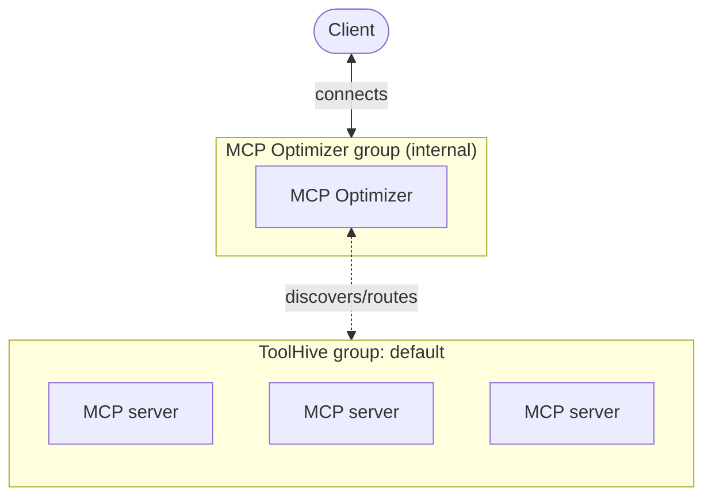
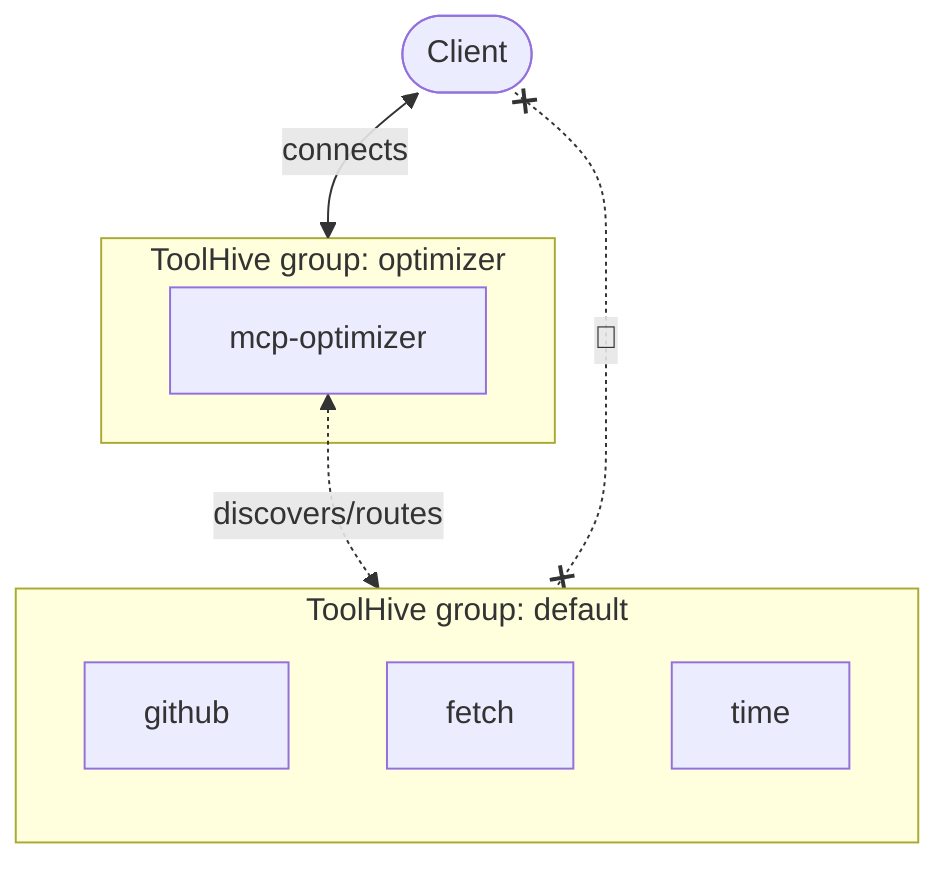

## Overview

The ToolHive MCP Optimizer acts as an intelligent intermediary between AI
clients and MCP servers. It provides tool discovery, unified access to multiple
MCP servers through a single endpoint, and intelligent routing of requests to
appropriate MCP tools.

:::note[Moving to vMCP]

The optimizer is now integrated into
[Virtual MCP Server (vMCP)](../guides-vmcp/optimizer.mdx), which provides the
same tool filtering and token reduction at the team level. You can deploy it in
Kubernetes today, and a local experience is coming soon. This tutorial covers
the standalone CLI approach in the meantime.

:::

## About MCP Optimizer

### Benefits

- **Reduced token usage**: Narrow down the toolset to only relevant tools for a
  given task, minimizing context overload and token consumption
- **Improved tool selection**: Find the most appropriate tools across all
  connected MCP servers
- **Simplified client configuration**: Connect to a single MCP Optimizer
  endpoint instead of managing multiple MCP server connections

### How it works

Instead of flooding the model with all available tools, MCP Optimizer introduces
two lightweight primitives:

1. `find_tool`: Searches for the most relevant tools using hybrid semantic +
   keyword search
2. `call_tool`: Routes the selected tool request to the appropriate MCP server

The workflow is as follows:

1. You send a prompt that requires tool assistance (for example, interacting
   with a GitHub repo)
2. The assistant calls `find_tool` with relevant keywords extracted from the
   prompt
3. MCP Optimizer returns the most relevant tools (up to 8 by default, but this
   is configurable)
4. Only those tools and their descriptions are included in the context sent to
   the model
5. The assistant uses `call_tool` to execute the task with the selected tool


```mermaid
flowchart TB
  subgraph optimizerGroup["MCP Optimizer group (internal)"]
    direction TB
    optimizer["MCP Optimizer"]
  end
  subgraph target["ToolHive group: default"]
    direction TB
    mcp1["MCP server"]
    mcp2["MCP server"]
    mcp3["MCP server"]
  end

  client(["Client"]) <-- connects --> optimizerGroup
  optimizer <-. discovers/routes .-> target
```

## Prerequisites

- One of the following container runtimes:
  - macOS: Docker Desktop, Podman Desktop, or Rancher Desktop (using dockerd)
  - Windows: Docker Desktop or Rancher Desktop (using dockerd)
  - Linux: any container runtime (see [Linux setup](#linux-setup))
- ToolHive CLI

## Step 1: Install MCP servers in a ToolHive group

Before you can use MCP Optimizer, you need to have one or more MCP servers
running in a ToolHive group. If you don't have any MCP servers set up yet,
follow these steps:

Run one or more MCP servers in the `default` group. For this tutorial, you can
run the following example MCP servers:

- `github`: Provides tools for interacting with GitHub repositories
  ([guide](../guides-mcp/github.mdx?mode=cli))
- `fetch`: Provides a web search tool to fetch recent news articles
- `time`: Provides a tool to get the current time in various time zones

```bash
thv run github
thv run fetch
thv run time
```

See the [Run MCP servers](../guides-cli/run-mcp-servers.mdx) guide for more
details.

Verify the MCP servers are running:

```bash
thv list
```

## Step 2: Connect your AI client

Connect your AI client to the ToolHive group where the MCP servers are running
(for example, the `default` group).

:::note

For best results, connect your client to only the optimized group. If you
connect it to multiple groups, ensure there is no overlap in MCP servers between
the groups to avoid unpredictable behavior.

:::

Run the following command to register your AI client with the ToolHive group
where the MCP servers are running (for example, `default`):

```bash
thv client setup
```

See the [Client configuration](../guides-cli/client-configuration.mdx) guide for
more details.

Open your AI client and verify that it is connected to the correct MCP servers.
If you installed the `github`, `fetch`, and `time` servers, you should see
almost 50 tools available.

## Step 3: Enable MCP Optimizer

If you are on Linux with native containers, follow the steps below but see
[Linux setup](#linux-setup) for the modified `thv run` command.

**Step 3.1: Run the API server**

MCP Optimizer uses the ToolHive API server to discover MCP servers and manage
client connections.

You can run the API server in two ways. The simplest is to install and run the
ToolHive UI, which automatically starts the API server in the background.

If you prefer to run the API server manually using the CLI, open a dedicated
terminal window and start it on a specific port:

```bash
thv serve --port 50100
```

Note the port number (`50100` in this example) for use in the next step.

**Step 3.2: Create a dedicated group and run mcp-optimizer**

```bash
# Create the meta group
thv group create optimizer

# Run mcp-optimizer in the dedicated group
thv run --group optimizer -e TOOLHIVE_PORT=50100 mcp-optimizer
```

If you are running the API server using the ToolHive UI, omit the
`TOOLHIVE_PORT` environment variable.

**Step 3.3: Configure your AI client for the meta group**

Remove your client from the `default` group. For example, to unregister Cursor:

```bash
thv client remove cursor --group default
```

Then, register your client with the `optimizer` group:

```bash
# Run the group setup, select the optimizer group, and then select your client
thv client setup

# Verify the configuration
thv client list-registered
```

:::note

Your client now connects only to the `optimizer` group and sees only the
`mcp-optimizer` MCP server.

:::

The resulting configuration should look like this:


```mermaid
flowchart TB
  subgraph meta["ToolHive group: optimizer"]
    direction TB
    optimizer["mcp-optimizer"]
  end
  subgraph def["ToolHive group: default"]
    direction TB
    mcp1["github"]
    mcp2["fetch"]
    mcp3["time"]
  end

  client(["Client"]) <-- connects --> meta
  optimizer <-. discovers/routes .-> def
  client x-. 🚫 .-x def
```

## Step 4: Sample prompts

After you configure and run MCP Optimizer, you can use the same prompts you
would normally use with individual MCP servers. The Optimizer automatically
discovers and routes to appropriate tools.

Using the example MCP servers above, here are some sample prompts:

- "Get the details of GitHub issue 1911 from the stacklok/toolhive repo"
- "List recent PRs from the stacklok/toolhive repo"
- "Fetch the latest news articles about AI"
- "What is the current time in Tokyo?"

Watch how MCP Optimizer intelligently selects and routes to the relevant tools
across the connected MCP servers, reducing token usage and improving response
quality.

To check your token savings, you can ask the optimizer:

- "How many tokens did I save using MCP Optimizer?"

## Linux setup

The setup depends on which type of container runtime you are using.

### VM-based container runtimes

If you are using a container runtime that runs containers inside a virtual
machine (such as Docker Desktop for Linux), the setup is the same as on macOS
and Windows. No additional configuration is needed - follow the steps above.

### Native containers (Docker, Podman, Rancher Desktop, and others)

:::note

Before running the command below, complete the following:

1. [Step 1](#step-1-install-mcp-servers-in-a-toolhive-group) - install your MCP
   servers
2. [Step 2](#step-2-connect-your-ai-client) - connect your AI client
3. [Step 3](#step-3-enable-mcp-optimizer) - start the API server, create the
   optimizer group, and reconfigure your client. When you reach the
   `thv run mcp-optimizer` command, use the Linux-specific command below
   instead.

:::

Most Linux container runtimes run containers natively on the host kernel.
Because containers run directly on the host kernel, `host.docker.internal` is
not automatically configured - unlike on macOS and Windows, where Docker Desktop
sets it up to let containers reach the host from inside a virtual machine.
Instead, you need to pass a couple of extra flags:

```bash
# Run mcp-optimizer with host networking
thv run --group optimizer --network host \
  -e TOOLHIVE_HOST=127.0.0.1 \
  -e ALLOWED_GROUPS=default \
  mcp-optimizer
```

- `--network host` lets the container reach the host directly, achieving the
  same result as the automatic bridge Docker Desktop sets up on macOS and
  Windows.
- `TOOLHIVE_PORT` specifies the port the API server is listening on. If you
  started it manually with a custom port in Step 3.1, pass
  `-e TOOLHIVE_PORT=<PORT>` here as well. Omit it if you are using the ToolHive
  UI to run the API server.
- `TOOLHIVE_HOST` tells `mcp-optimizer` to connect to `127.0.0.1` instead of
  `host.docker.internal`.
- `ALLOWED_GROUPS` tells the optimizer which group's MCP servers to discover,
  index, and route requests to. Replace `default` with the name of the group you
  want to optimize.

To change which groups MCP Optimizer can optimize after initial setup, remove
the workload and run the command again with the updated `ALLOWED_GROUPS` value
(see [Remove a server](../guides-cli/manage-mcp-servers.mdx#remove-a-server)).

See [Step 4: Sample prompts](#step-4-sample-prompts) to verify the setup.

## What's next?

- Experiment with different MCP servers to see how MCP Optimizer enhances tool
  selection and reduces token usage
- Explore the [vMCP optimizer](../guides-vmcp/optimizer.mdx) for team-level
  optimization in Kubernetes

## Related information

- [Optimize tool discovery in vMCP](../guides-vmcp/optimizer.mdx) - Kubernetes
  operator approach
- [Optimizing LLM context](../concepts/tool-optimization.mdx) - background on
  tool filtering and context pollution
