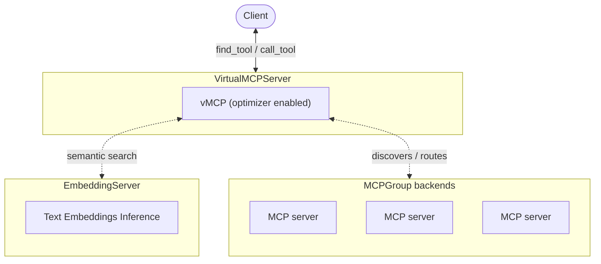

## Overview

The MCP Optimizer acts as an intelligent intermediary between AI clients and MCP
servers. It provides tool discovery, unified access to multiple MCP servers
through a single endpoint, and intelligent routing of requests to appropriate
MCP tools.

:::note[Moving to vMCP]

The optimizer is now integrated into
[Virtual MCP Server (vMCP)](../guides-vmcp/optimizer.mdx), which provides the
same tool filtering and token reduction at the team level. You can deploy it in
Kubernetes today, and a local experience is coming soon. This tutorial walks you
through the Kubernetes deployment.

:::

In this tutorial, you deploy the optimizer on Kubernetes using Virtual MCP
Server (vMCP) and an EmbeddingServer for semantic tool search.

## What you'll learn

- How to create an MCPGroup with multiple backend MCP servers
- How to deploy an EmbeddingServer for semantic search
- How to create a VirtualMCPServer with the optimizer enabled
- How to connect your AI client to the optimized endpoint

## About MCP Optimizer

Instead of exposing every backend tool to the model, the optimizer introduces
two lightweight primitives: `find_tool` for semantic search and `call_tool` for
routing. This keeps context small and improves tool selection accuracy. For the
full parameter reference and configuration options, see
[Optimize tool discovery](../guides-vmcp/optimizer.mdx).

### How it works

The workflow is as follows:

1. You send a prompt that requires tool assistance (for example, fetching a web
   page)
2. The assistant calls `find_tool` with relevant keywords extracted from the
   prompt
3. The optimizer returns the most relevant tools (up to 8 by default, but this
   is configurable)
4. Only those tools and their descriptions are included in the context sent to
   the model
5. The assistant uses `call_tool` to execute the task with the selected tool


```mermaid
flowchart TB
  subgraph vmcpGroup["VirtualMCPServer"]
    direction TB
    vmcp["vMCP (optimizer enabled)"]
  end
  subgraph embedding["EmbeddingServer"]
    direction TB
    tei["Text Embeddings Inference"]
  end
  subgraph backends["MCPGroup backends"]
    direction TB
    mcp1["MCP server"]
    mcp2["MCP server"]
    mcp3["MCP server"]
  end

  client(["Client"]) <-- "find_tool / call_tool" --> vmcpGroup
  vmcp <-. "semantic search" .-> embedding
  vmcp <-. "discovers / routes" .-> backends
```

## Prerequisites

Before starting this tutorial, make sure you have:

- A Kubernetes cluster with the ToolHive operator installed (see
  [Quickstart: Kubernetes Operator](../guides-k8s/quickstart.mdx))
- `kubectl` configured to communicate with your cluster
- The [ToolHive CLI](../guides-cli/quickstart.mdx) installed on your local
  machine (used in Step 4 to register the endpoint with your MCP clients)
- An MCP client (Visual Studio Code with GitHub Copilot is used in this
  tutorial)

:::tip[ARM64 support]

The default TEI image is x86_64-only. If you are running on ARM64 nodes (for
example, Apple Silicon with kind), set the `image` field in your EmbeddingServer
to use the ARM64 image. See
[EmbeddingServer resource](../guides-vmcp/optimizer.mdx#embeddingserver-resource)
for details.

:::

## Step 1: Create an MCPGroup and deploy backend MCP servers

Create an MCPGroup to organize the backend MCP servers that the optimizer will
index and route to:

```yaml title="mcpgroup.yaml"
apiVersion: toolhive.stacklok.dev/v1alpha1
kind: MCPGroup
metadata:
  name: optimizer-demo
  namespace: toolhive-system
spec:
  description: Backend servers for the optimizer tutorial
```

Apply the resource:

```bash
kubectl apply -f mcpgroup.yaml
```

Next, deploy two MCP servers in the group. Both reference `optimizer-demo` in
the `groupRef` field:

```yaml {11-12,31-32} title="mcpservers.yaml"
apiVersion: toolhive.stacklok.dev/v1alpha1
kind: MCPServer
metadata:
  name: fetch
  namespace: toolhive-system
spec:
  image: ghcr.io/stackloklabs/gofetch/server
  transport: streamable-http
  proxyPort: 8080
  mcpPort: 8080
  groupRef:
    name: optimizer-demo
  resources:
    limits:
      cpu: '100m'
      memory: '128Mi'
    requests:
      cpu: '50m'
      memory: '64Mi'
---
apiVersion: toolhive.stacklok.dev/v1alpha1
kind: MCPServer
metadata:
  name: osv
  namespace: toolhive-system
spec:
  image: ghcr.io/stackloklabs/osv-mcp/server
  transport: streamable-http
  proxyPort: 8080
  mcpPort: 8080
  groupRef:
    name: optimizer-demo
  resources:
    limits:
      cpu: '100m'
      memory: '128Mi'
    requests:
      cpu: '50m'
      memory: '64Mi'
```

Apply the resources and wait for both servers to be ready:

```bash
kubectl apply -f mcpservers.yaml
kubectl get mcpservers -n toolhive-system -w
```

You should see both servers with `Ready` status before continuing.

:::note

If you still have an MCPServer left over from the
[K8s Operator Quickstart](../guides-k8s/quickstart.mdx), you can delete it first
to avoid confusion:

```bash
kubectl delete mcpserver fetch -n toolhive-system
```

Then apply the YAML above, which creates a new `fetch` server with the correct
`groupRef`.

:::

## Step 2: Deploy an EmbeddingServer

The optimizer uses semantic search to find relevant tools. This requires an
EmbeddingServer, which runs a text embeddings inference (TEI) server.

Create an EmbeddingServer with default settings. This deploys the
`BAAI/bge-small-en-v1.5` model:

```yaml title="embedding-server.yaml"
apiVersion: toolhive.stacklok.dev/v1alpha1
kind: EmbeddingServer
metadata:
  name: optimizer-embedding
  namespace: toolhive-system
spec: {}
```

Apply the resource:

```bash
kubectl apply -f embedding-server.yaml
```

Wait for the EmbeddingServer to reach the `Ready` phase before proceeding. The
first startup may take a few minutes while the model downloads:

```bash
kubectl get embeddingserver optimizer-embedding -n toolhive-system -w
```

:::info[What's happening?]

The EmbeddingServer deploys a TEI container that generates vector embeddings
from text. The optimizer uses these embeddings to perform semantic search across
all backend tools, finding the most relevant tools for a given query even when
the exact keywords don't match.

:::

## Step 3: Create a VirtualMCPServer with the optimizer

Create a VirtualMCPServer that aggregates the backend servers and enables the
optimizer. Adding `embeddingServerRef` is the only change needed to enable the
optimizer - sensible defaults are applied automatically:

```yaml title="virtualmcpserver.yaml"
apiVersion: toolhive.stacklok.dev/v1alpha1
kind: VirtualMCPServer
metadata:
  name: optimizer-vmcp
  namespace: toolhive-system
spec:
  # highlight-start
  groupRef:
    name: optimizer-demo
  embeddingServerRef:
    name: optimizer-embedding
  # highlight-end
  incomingAuth:
    type: anonymous
  serviceType: ClusterIP
  config:
    aggregation:
      conflictResolution: prefix
      conflictResolutionConfig:
        prefixFormat: '{workload}_'
```

Apply the resource:

```bash
kubectl apply -f virtualmcpserver.yaml
```

Check the status:

```bash
kubectl get virtualmcpservers -n toolhive-system
```

After about 30 seconds, you should see output similar to:

```text
NAME             PHASE   URL                                                                 BACKENDS   AGE   READY
optimizer-vmcp   Ready   http://vmcp-optimizer-vmcp.toolhive-system.svc.cluster.local:4483   2          30s   True
```

:::info[What's happening?]

Setting `embeddingServerRef` tells the operator to enable the optimizer on this
VirtualMCPServer. Instead of exposing all backend tools directly, the optimizer
builds a semantic index of tools and exposes only `find_tool` and `call_tool` to
clients. This dramatically reduces the number of tools (and tokens) sent to the
model.

:::

## Step 4: Connect your AI client

The vMCP service runs inside Kubernetes and is not directly reachable by desktop
AI clients. This tutorial uses `kubectl port-forward` because it works with any
cluster, but in production you would typically expose the service through an
Ingress, Gateway API, or LoadBalancer. See
[Expose the service](../guides-vmcp/configuration.mdx#expose-the-service) for
the available options.

In a separate terminal, port-forward the vMCP service to your local machine:

```bash
kubectl port-forward service/vmcp-optimizer-vmcp -n toolhive-system 4483:4483
```

Test the health endpoint:

```bash
curl http://localhost:4483/health
```

You should see `{"status":"ok"}`.

The ToolHive CLI bridges the remaining gap: it registers the port-forwarded
endpoint as a local workload and automatically updates your MCP client
configuration to point at it.

Register the port-forwarded vMCP endpoint as a ToolHive-managed workload:

```bash
thv run http://localhost:4483/mcp --name optimizer-vmcp
```

:::tip

If you haven't set up client configuration yet, run `thv client setup` to
register your MCP clients. See
[Client configuration](../guides-cli/client-configuration.mdx) for more details.

:::

Open your AI client and check its MCP configuration. You should see only two
tools available: `find_tool` and `call_tool`. This confirms the optimizer is
working.

## Step 5: Test the optimizer

Try these sample prompts to verify the optimizer is routing requests correctly
across both backend MCP servers:

- "Fetch the contents of https://docs.stacklok.com and summarize the page"
- "Check if the Go package github.com/stacklok/toolhive has any known
  vulnerabilities"

Watch how the optimizer uses `find_tool` to locate the relevant tool across all
backends, then `call_tool` to execute it - all through a single endpoint.

To check your token savings, send this prompt to your AI client:

- "How many tokens did I save using MCP Optimizer?"

:::note

With only two backend MCP servers and a small number of tools, the optimizer may
report minimal or no token savings. The benefit becomes more significant as you
add more backends and tools to your MCPGroup.

:::

## Clean up

Remove the local workload and delete the Kubernetes resources when you're done:

```bash
thv rm optimizer-vmcp
kubectl delete virtualmcpserver optimizer-vmcp -n toolhive-system
kubectl delete embeddingserver optimizer-embedding -n toolhive-system
kubectl delete mcpserver fetch osv -n toolhive-system
kubectl delete mcpgroup optimizer-demo -n toolhive-system
```

To tear down the entire kind cluster from the K8s Quickstart:

```bash
kind delete cluster --name toolhive
```

## Next steps

- [Tune the optimizer](../guides-vmcp/optimizer.mdx#tune-the-optimizer) to
  adjust search parameters for your workload
- [Configure authentication](../guides-vmcp/authentication.mdx) for production
  deployments
- [Monitor vMCP activity](../guides-vmcp/telemetry-and-metrics.mdx) with
  OpenTelemetry tracing and metrics
- [Configure failure handling](../guides-vmcp/failure-handling.mdx) for circuit
  breakers and partial failure modes
- Provide feedback on your experience on the
  [Stacklok Discord community](https://discord.gg/stacklok)

## Related information

- [Optimize tool discovery](../guides-vmcp/optimizer.mdx) - full parameter
  reference, high availability, and ARM64 support details
- [Optimizing LLM context](../concepts/tool-optimization.mdx) - background on
  tool filtering and context pollution
- [Virtual MCP Server overview](../concepts/vmcp.mdx) - conceptual overview of
  vMCP
- [MCP Optimizer UI guide](../guides-ui/mcp-optimizer.mdx) - standalone desktop
  approach without Kubernetes (legacy, being replaced by the vMCP path)
- [Quickstart: Kubernetes Operator](../guides-k8s/quickstart.mdx) - prerequisite
  tutorial
