## Overview

The ToolHive MCP Optimizer acts as an intelligent intermediary between AI
clients and MCP servers. It provides tool discovery, unified access to multiple
MCP servers through a single endpoint, and intelligent routing of requests to
appropriate MCP tools.

:::info[Status]

The MCP Optimizer is currently experimental. If you try it out, please share
your feedback on the [Stacklok Discord community](https://discord.gg/stacklok).

:::

## About MCP Optimizer

### Benefits

- **Reduced token usage**: Narrow down the toolset to only relevant tools for a
  given task, minimizing context overload and token consumption
- **Improved tool selection**: Find the most appropriate tools across all
  connected MCP servers
- **Simplified client configuration**: Connect to a single MCP Optimizer
  endpoint instead of managing multiple MCP server connections

### How it works

Instead of flooding the model with all available tools, MCP Optimizer introduces
two lightweight primitives:

1. `find_tool`: Searches for the most relevant tools using hybrid semantic +
   keyword search
2. `call_tool`: Routes the selected tool request to the appropriate MCP server

The workflow is as follows:

1. You send a prompt that requires tool assistance (for example, interacting
   with a GitHub repo)
2. The assistant calls `find_tool` with relevant keywords extracted from the
   prompt
3. MCP Optimizer returns the most relevant tools (up to 8 by default, but this
   is configurable)
4. Only those tools and their descriptions are included in the context sent to
   the model
5. The assistant uses `call_tool` to execute the task with the selected tool


## Prerequisites

- One of the following container runtimes:
  - macOS: Docker Desktop, Podman Desktop, or Rancher Desktop (using dockerd)
  - Windows: Docker Desktop or Rancher Desktop (using dockerd)
  - Linux: Not currently supported
- ToolHive UI version 0.12.0 or later

## Step 1: Install MCP servers in a ToolHive group

Before you can use MCP Optimizer, you need to have one or more MCP servers
running in a ToolHive group. If you don't have any MCP servers set up yet,
follow these steps:

<Tabs groupId='mode' queryString='mode'>
<TabItem value='ui' label='ToolHive UI' default>

1. Open the ToolHive UI and go to the **MCP Servers** screen
2. Ensure you're in the `default` group (or create a new group if desired)
3. Run one or more MCP servers by clicking the **Add an MCP Server** button and
   selecting from the registry or using a custom server image

   For this tutorial, you can run the following example MCP servers:
   - `github`: Provides tools for interacting with GitHub repositories
     ([guide](../guides-mcp/github.mdx?mode=ui))
   - `fetch`: Provides a web search tool to fetch recent news articles
   - `time`: Provides a tool to get the current time in various time zones

4. Wait for the MCP servers to start and become healthy

See the [Run MCP servers](../guides-ui/run-mcp-servers.mdx) guide for more
details.

</TabItem>
<TabItem value='cli' label='ToolHive CLI'>

Run one or more MCP servers in the `default` group using the ToolHive CLI. For
this tutorial, you can run the following example MCP servers:

- `github`: Provides tools for interacting with GitHub repositories
  ([guide](../guides-mcp/github.mdx?mode=cli))
- `fetch`: Provides a web search tool to fetch recent news articles
- `time`: Provides a tool to get the current time in various time zones

```bash
thv run github
thv run fetch
thv run time
```

See the [Run MCP servers](../guides-cli/run-mcp-servers.mdx) guide for more
details.

Verify the MCP servers are running:

```bash
thv list
```

</TabItem>
</Tabs>

## Step 2: Connect your AI client

Connect your AI client to the ToolHive group where the MCP servers are running
(for example, the `default` group).

<Tabs groupId='mode' queryString='mode'>
<TabItem value='ui' label='ToolHive UI' default>

Open the ToolHive UI and use the **Manage Clients** button on the main MCP
Servers screen to register your AI client with the appropriate group (for
example, `default`).

See the [Client configuration](../guides-ui/client-configuration.mdx) guide for
more details.

</TabItem>
<TabItem value='cli' label='ToolHive CLI'>

Run the following command to register your AI client with the ToolHive group
where the MCP servers are running (for example, `default`):

```bash
thv client setup
```

See the [Client configuration](../guides-cli/client-configuration.mdx) guide for
more details.

</TabItem>
</Tabs>

Open your AI client and verify that it is connected to the correct MCP servers.
If you installed the `github`, `fetch`, and `time` servers, you should see
almost 50 tools available.

## Step 3: Enable MCP Optimizer

<Tabs groupId='mode' queryString='mode'>
<TabItem value='ui' label='ToolHive UI' default>

The ToolHive UI automates the setup of the MCP Optimizer.

1. Open the **Settings** (⚙️) screen and enable **MCP Optimizer** under
   **Experimental Features**
2. Click the **Configure** button on the notification that pops up, or go to the
   main **MCP Servers** screen and click **MCP Optimizer** in the left sidebar
3. Select the group that contains the MCP servers you want to optimize and click
   **Apply Changes**

ToolHive automatically updates clients that were registered with the selected
group to use the MCP Optimizer. If you want to connect a new client, go to the
`default` group and use the **Manage Clients** button to register it.

Open your AI client and check its MCP configuration. You should see a single MCP
server named `toolhive-mcp-optimizer`.

:::info[What's happening?]

When you enable MCP Optimizer, ToolHive automatically creates an internal group
and runs the `mcp-optimizer` MCP server in that group.

The MCP Optimizer server discovers the MCP servers in the selected group and
builds an index of their tools for intelligent routing. Automatic polling keeps
the index up to date as servers are added or removed from the optimized group.

ToolHive also disconnects your AI clients from the original MCP server group and
reconnects them to the MCP Optimizer group.

:::

</TabItem>
<TabItem value='cli' label='ToolHive CLI'>

The ToolHive UI is the recommended way to set up MCP Optimizer, but you can also
do it manually with the ToolHive CLI.

:::info[Prerequisites]

You need both the ToolHive CLI and UI to use the MCP Optimizer because it
depends on the UI's API server for tool discovery and management.

- ToolHive UI (version >= 0.6.0) must be running during setup and operation
- ToolHive CLI (version >= 0.3.1)

:::

**Step 1: Create a dedicated group and run mcp-optimizer**

```bash
# Create the meta group
thv group create optimizer

# Run mcp-optimizer in the dedicated group
thv run --group optimizer mcp-optimizer
```

**Step 2: Configure your AI client for the meta group**

Remove your client from the `default` group. For example, to unregister Cursor:

```bash
thv client remove cursor --group default
```

Then, register your client with the `optimizer` group:

```bash
# Run the group setup, select the optimizer group, and then select your client
thv client setup

# Verify the configuration
thv client list-registered
```

:::note

At this point, your client should be connected only to the `optimizer` group and
see only the `mcp-optimizer` MCP server.

:::

The resulting configuration should look like this:

```mermaid
flowchart TB
  subgraph meta["ToolHive group: optimizer"]
    direction TB
    optimizer["mcp-optimizer"]
  end
  subgraph def["ToolHive group: default"]
    direction TB
    mcp1["github"]
    mcp2["fetch"]
    mcp3["time"]
  end

  client(["Client"]) <-- connects --> meta
  optimizer <-. discovers/routes .-> def
  client x-. 🚫 .-x def
```



</TabItem>
</Tabs>

## Step 4: Sample prompts

After you configure and run MCP Optimizer, you can use the same prompts you
would normally use with individual MCP servers. The Optimizer automatically
discovers and routes to appropriate tools.

Using the example MCP servers above, here are some sample prompts:

- "Get the details of GitHub issue 1911 from the stacklok/toolhive repo"
- "List recent PRs from the stacklok/toolhive repo"
- "Fetch the latest news articles about AI"
- "What is the current time in Tokyo?"

Watch how MCP Optimizer intelligently selects and routes to the relevant tools
across the connected MCP servers, reducing token usage and improving response
quality.

To check your token savings, you can ask the optimizer:

- "How many tokens did I save using MCP Optimizer?"

## What's next?

Now that you've set up MCP Optimizer, consider exploring these next steps:

- Experiment with different MCP servers to see how MCP Optimizer enhances tool
  selection and reduces token usage
- Monitor the performance and effectiveness of MCP Optimizer in your AI
  applications
- Use the [ToolHive Playground](../guides-ui/playground.mdx) to test and refine
  your prompts with MCP Optimizer
- Provide feedback on your experience with MCP Optimizer on the
  [Stacklok Discord community](https://discord.gg/stacklok)

## Related information

- [MCP Optimizer UI guide](../guides-ui/mcp-optimizer.mdx)
- [Organize MCP servers into groups](../guides-ui/group-management.mdx)
