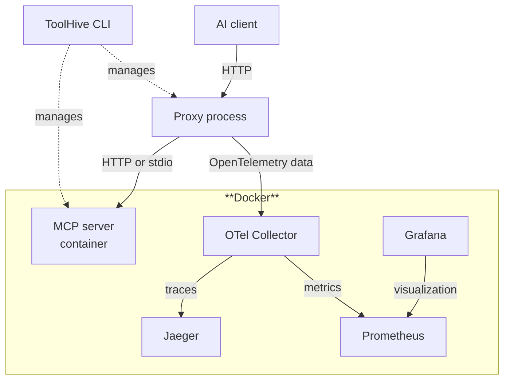
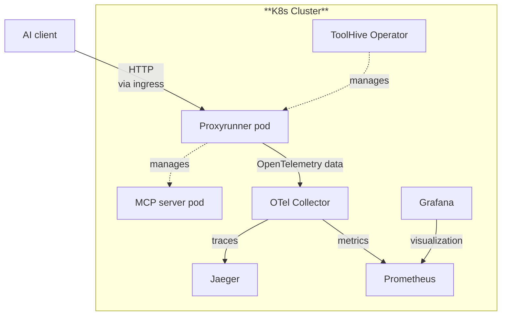

import useBaseUrl from '@docusaurus/useBaseUrl';
import ThemedImage from '@theme/ThemedImage';

In this tutorial, you'll set up comprehensive observability for your MCP
workloads using [OpenTelemetry](https://opentelemetry.io/) with
[Jaeger](https://www.jaegertracing.io/) for distributed tracing,
[Prometheus](https://prometheus.io/) for metrics collection, and
[Grafana](https://grafana.com/) for visualization.

By the end, you'll have a complete, industry-standard observability solution
that captures detailed traces and metrics, giving you visibility into your MCP
server performance and usage patterns.

<ThemedImage
  alt='Grafana dashboard showing MCP telemetry'
  sources={{
    light: useBaseUrl('/img/toolhive/otel-grafana-light.webp'),
    dark: useBaseUrl('/img/toolhive/otel-grafana-dark.webp'),
  }}
  title='Grafana dashboard showing MCP telemetry'
  style={{ marginBottom: '1rem' }}
/>

## Choose your deployment path

This tutorial offers two paths for MCP observability:

<Tabs groupId='deployment-method' queryString='deployment-method'>
<TabItem value='cli' label='ToolHive CLI' default>

**ToolHive CLI + Docker observability stack**

Use the ToolHive CLI to run MCP servers locally, with Jaeger and Prometheus
running in Docker containers. This approach is perfect for:

- Local development and testing
- Quick setup and experimentation
- Individual developer workflows
- Learning OpenTelemetry concepts

</TabItem>
<TabItem value='kubernetes' label='Kubernetes Operator'>

**ToolHive Kubernetes Operator + in-cluster observability**

Use the ToolHive Kubernetes operator to manage MCP servers in a cluster, with
Jaeger and Prometheus deployed inside Kubernetes. This approach is ideal for:

- Production-like environments
- Team collaboration and shared infrastructure
- Container orchestration workflows
- Scalable observability deployments

</TabItem>
</Tabs>

:::tip[Choose one path]

Select your preferred deployment method using the tabs above. All subsequent
steps will show instructions for your chosen path.

:::

## What you'll learn

- How to deploy Jaeger and Prometheus for your chosen environment
- How to configure OpenTelemetry collection for ToolHive MCP servers
- How to analyze traces in Jaeger and metrics in Prometheus
- How to set up queries and monitoring for MCP workloads
- Best practices for observability in your deployment environment

## Prerequisites

Before starting this tutorial, make sure you have:

<Tabs groupId='deployment-method' queryString='deployment-method'>
<TabItem value='cli' label='ToolHive CLI'>

- Completed the [ToolHive CLI quickstart](./quickstart-cli.mdx)
- A supported container runtime installed and running.
  [Docker](https://docs.docker.com/get-docker/) or
  [Podman](https://podman-desktop.io/downloads) are recommended for this
  tutorial
- [Docker Compose](https://docs.docker.com/compose/install/) or
  [Podman Compose](https://podman-desktop.io/docs/compose/setting-up-compose)
  available
- A [supported MCP client](../reference/client-compatibility.mdx) for testing

</TabItem>
<TabItem value='kubernetes' label='Kubernetes Operator'>

- Completed the [ToolHive Kubernetes quickstart](./quickstart-k8s.mdx) with a
  local kind cluster
- [`kubectl`](https://kubernetes.io/docs/tasks/tools/) configured to access your
  cluster
- [Helm](https://helm.sh/docs/intro/install/) (v3.10 minimum) installed
- A [supported MCP client](../reference/client-compatibility.mdx) for testing
- The [ToolHive CLI](./quickstart-cli.mdx) (optional, for client configuration)
- Basic familiarity with Kubernetes concepts

</TabItem>
</Tabs>

## Overview

The architecture for each deployment method:

<Tabs groupId='deployment-method' queryString='deployment-method'>
<TabItem value='cli' label='ToolHive CLI'>



Your setup will include:

- **ToolHive CLI** managing MCP servers in containers
- **Jaeger** for distributed tracing with built-in UI
- **Prometheus** for metrics collection with web UI
- **OpenTelemetry Collector** forwarding data to both backends

</TabItem>
<TabItem value='kubernetes' label='Kubernetes Operator'>



Your setup will include:

- **ToolHive Operator** managing MCP servers as Kubernetes pods
- **Jaeger** for distributed tracing
- **Prometheus** for metrics collection
- **Grafana** for metrics visualization
- **OpenTelemetry Collector** running as a Kubernetes service

</TabItem>
</Tabs>

## Step 1: Deploy the observability stack

First, set up the observability infrastructure for your chosen environment.

<Tabs groupId='deployment-method' queryString='deployment-method'>
<TabItem value='cli' label='ToolHive CLI'>

### Create Docker Compose configuration

Create a Docker Compose file for the observability stack:

```yaml title="observability-stack.yml"
services:
  jaeger:
    image: jaegertracing/jaeger:latest
    container_name: jaeger
    environment:
      - COLLECTOR_OTLP_ENABLED=true
    ports:
      - '16686:16686' # Jaeger UI
    networks:
      - observability

  prometheus:
    image: prom/prometheus:latest
    container_name: prometheus
    command:
      - '--config.file=/etc/prometheus/prometheus.yml'
      - '--storage.tsdb.path=/prometheus'
      - '--web.console.libraries=/etc/prometheus/console_libraries'
      - '--web.console.templates=/etc/prometheus/consoles'
      - '--web.enable-lifecycle'
      - '--enable-feature=native-histograms'
    ports:
      - '9090:9090'
    volumes:
      - ./prometheus.yml:/etc/prometheus/prometheus.yml
      - prometheus-data:/prometheus
    networks:
      - observability

  grafana:
    image: grafana/grafana:latest
    container_name: grafana
    environment:
      - GF_SECURITY_ADMIN_USER=admin
      - GF_SECURITY_ADMIN_PASSWORD=admin
      - GF_USERS_ALLOW_SIGN_UP=false
    ports:
      - '3000:3000'
    volumes:
      - ./grafana-prometheus.yml:/etc/grafana/provisioning/datasources/prometheus.yml
      - grafana-data:/var/lib/grafana
    networks:
      - observability

  otel-collector:
    image: otel/opentelemetry-collector-contrib:latest
    container_name: otel-collector
    command: ['--config=/etc/otel-collector-config.yml']
    volumes:
      - ./otel-collector-config.yml:/etc/otel-collector-config.yml
    ports:
      - '4318:4318' # OTLP HTTP receiver (ToolHive sends here)
      - '8889:8889' # Prometheus exporter metrics
    depends_on:
      - jaeger
      - prometheus
    networks:
      - observability

volumes:
  prometheus-data:
  grafana-data:

networks:
  observability:
    driver: bridge
```

### Configure the OpenTelemetry Collector

Create the collector configuration to export to both Jaeger and Prometheus:

```yaml title="otel-collector-config.yml"
receivers:
  otlp:
    protocols:
      http:
        endpoint: 0.0.0.0:4318

processors:
  batch:
    timeout: 10s
    send_batch_size: 1024

exporters:
  # Export traces to Jaeger
  otlp/jaeger:
    endpoint: jaeger:4317
    tls:
      insecure: true

  # Expose metrics for Prometheus
  prometheus:
    endpoint: 0.0.0.0:8889
    const_labels:
      service: 'toolhive-mcp-proxy'

service:
  pipelines:
    traces:
      receivers: [otlp]
      processors: [batch]
      exporters: [otlp/jaeger]
    metrics:
      receivers: [otlp]
      processors: [batch]
      exporters: [prometheus]
```

### Configure Prometheus and Grafana

Create a Prometheus configuration to scrape the OpenTelemetry Collector:

```yaml title="prometheus.yml"
global:
  scrape_interval: 15s

scrape_configs:
  - job_name: 'otel-collector'
    static_configs:
      - targets: ['otel-collector:8889']
```

Create the Prometheus data source configuration for Grafana:

```yaml title="grafana-prometheus.yml"
apiVersion: 1

datasources:
  - name: prometheus
    type: prometheus
    access: proxy
    url: http://prometheus:9090
    isDefault: true
    editable: true
```

### Start the observability stack

Deploy the stack and verify it's running:

```bash
# Start the stack
docker compose -f observability-stack.yml up -d

# Verify Jaeger is running
curl http://localhost:16686/api/services

# Verify Prometheus is running
curl http://localhost:9090/-/healthy

# Verify the OpenTelemetry Collector is ready
curl -I http://localhost:8889/metrics
```

Access the interfaces:

- **Jaeger UI**: `http://localhost:16686`
- **Prometheus Web UI**: `http://localhost:9090`
- **Grafana**: `http://localhost:3000` (login: admin/admin)

</TabItem>
<TabItem value='kubernetes' label='Kubernetes Operator'>

### Prerequisite

If you've completed the [Kubernetes quickstart](./quickstart-k8s.mdx), skip to
the next step.

Otherwise, set up a local kind cluster and install the ToolHive operator:

```bash
kind create cluster --name toolhive
helm upgrade -i toolhive-operator-crds oci://ghcr.io/stacklok/toolhive/toolhive-operator-crds
helm upgrade -i toolhive-operator oci://ghcr.io/stacklok/toolhive/toolhive-operator -n toolhive-system --create-namespace
```

Verify the operator is running:

```bash
kubectl get pods -n toolhive-system
```

### Create the monitoring namespace

Create a dedicated namespace for your observability stack:

```bash
kubectl create namespace monitoring
```

### Deploy Jaeger

Install Jaeger using Helm with a configuration suited for ToolHive:

```bash
helm repo add jaegertracing https://jaegertracing.github.io/helm-charts
helm repo update
helm upgrade -i jaeger-all-in-one jaegertracing/jaeger -f https://raw.githubusercontent.com/stacklok/toolhive/refs/tags/v0.3.6/examples/otel/jaeger-values.yaml -n monitoring
```

### Deploy Prometheus and Grafana

Install Prometheus and Grafana using the kube-prometheus-stack Helm chart:

```bash
helm repo add prometheus-community https://prometheus-community.github.io/helm-charts
helm repo update
helm upgrade -i kube-prometheus-stack prometheus-community/kube-prometheus-stack -f https://raw.githubusercontent.com/stacklok/toolhive/v0.3.6/examples/otel/prometheus-stack-values.yaml -n monitoring
```

### Deploy OpenTelemetry Collector

Create the collector configuration and deployment manifest:

```bash
helm repo add open-telemetry https://open-telemetry.github.io/opentelemetry-helm-charts
helm repo update
helm upgrade -i otel-collector open-telemetry/opentelemetry-collector  -f https://raw.githubusercontent.com/stacklok/toolhive/v0.3.6/examples/otel/otel-values.yaml -n monitoring
```

### Verify all components

Verify all components are running:

```bash
kubectl get pods -n monitoring
```

Wait for all pods to be in Running status before proceeding. The output should
look similar to:

```text
NAME                                                        READY   STATUS    RESTARTS   AGE
jaeger-all-in-one-6bf667c984-p5455                          1/1     Running   0          2m12s
kube-prometheus-stack-grafana-69c88f77c5-b9f7m              3/3     Running   0          37s
kube-prometheus-stack-kube-state-metrics-55cb9c8889-cnlkt   1/1     Running   0          37s
kube-prometheus-stack-operator-85655fb7cd-rxms9             1/1     Running   0          37s
kube-prometheus-stack-prometheus-node-exporter-zzcvh        1/1     Running   0          37s
otel-collector-opentelemetry-collector-agent-hqtnq          1/1     Running   0          11s
prometheus-kube-prometheus-stack-prometheus-0               2/2     Running   0          36s
```

</TabItem>
</Tabs>

## Step 2: Configure MCP server telemetry

Now configure your MCP servers to send telemetry data to the observability
stack.

<Tabs groupId='deployment-method' queryString='deployment-method'>
<TabItem value='cli' label='ToolHive CLI'>

### Set global telemetry configuration

Configure ToolHive CLI with default telemetry settings to send data to the
OpenTelemetry Collector:

```bash
# Configure the OpenTelemetry endpoint (collector, not directly to Jaeger)
thv config otel set-endpoint localhost:4318

# Enable both metrics and tracing
thv config otel set-metrics-enabled true
thv config otel set-tracing-enabled true

# Set 100% sampling for development
thv config otel set-sampling-rate 1.0

# Use insecure connection for local development
thv config otel set-insecure true
```

### Run an MCP server with telemetry

Start an MCP server with enhanced telemetry configuration:

```bash
thv run \
  --otel-service-name "mcp-fetch-server" \
  --otel-env-vars "USER,HOST" \
  --otel-enable-prometheus-metrics-path \
  fetch
```

Verify the server started and is exporting telemetry:

```bash
# Check server status
thv list

# Check Prometheus metrics are available on the MCP server
PORT=$(thv list | grep fetch | awk '{print $5}')
curl http://localhost:$PORT/metrics
```

</TabItem>
<TabItem value='kubernetes' label='Kubernetes Operator'>

### Create an MCP server with telemetry

Create an MCPServer resource with comprehensive telemetry configuration:

```yaml {18-30} title="fetch-with-telemetry.yml"
apiVersion: toolhive.stacklok.dev/v1alpha1
kind: MCPServer
metadata:
  name: fetch-telemetry
  namespace: toolhive-system
spec:
  image: ghcr.io/stackloklabs/gofetch/server
  transport: streamable-http
  proxyPort: 8080
  mcpPort: 8080
  resources:
    limits:
      cpu: '100m'
      memory: '128Mi'
    requests:
      cpu: '50m'
      memory: '64Mi'
  telemetry:
    openTelemetry:
      enabled: true
      endpoint: otel-collector-opentelemetry-collector.monitoring.svc.cluster.local:4318
      serviceName: mcp-fetch-server
      insecure: true # Using HTTP collector endpoint
      metrics:
        enabled: true
      tracing:
        enabled: true
        samplingRate: '1.0'
    prometheus:
      enabled: true
```

Deploy the MCP server:

```bash
kubectl apply -f fetch-with-telemetry.yml
```

Verify the MCP server is running and healthy:

```bash
# Verify the server is running
kubectl get mcpserver -n toolhive-system

# Check the pods are healthy
kubectl get pods -n toolhive-system -l app.kubernetes.io/instance=fetch-telemetry
```

</TabItem>
</Tabs>

## Step 3: Generate telemetry data

Create some MCP interactions to generate traces and metrics for analysis.

<Tabs groupId='deployment-method' queryString='deployment-method'>
<TabItem value='cli' label='ToolHive CLI'>

### Connect your AI client

Your MCP server is already configured to work with your AI client from the CLI
quickstart. Simply use your client to make requests that will generate telemetry
data.

</TabItem>
<TabItem value='kubernetes' label='Kubernetes Operator'>

### Port-forward to access the MCP server

In a separate terminal window, create a port-forward to connect your AI client:

```bash
kubectl port-forward service/mcp-fetch-telemetry-proxy -n toolhive-system 8080:8080
```

Leave this running for the duration of this tutorial.

### Configure your AI client

Use the ToolHive CLI to add the MCP server to your client configuration:

```bash
thv run http://localhost:8080/mcp --name fetch-k8s --transport streamable-http
```

</TabItem>
</Tabs>

### Generate sample data

Make several requests using your AI client to create diverse telemetry:

1. **Basic fetch request**: "Fetch the content from https://toolhive.dev and
   summarize it"
2. **Multiple requests**: Make 3-4 more fetch requests with different URLs
3. **Error generation**: Try an invalid URL to generate error traces

Each interaction creates rich telemetry data including:

- Request traces with timing information sent to Jaeger
- Tool call details with sanitized arguments
- Performance metrics sent to Prometheus

The CLI and Kubernetes deployments will both generate similar telemetry data,
with the Kubernetes setup including additional Kubernetes-specific attributes.

## Step 4: Access and analyze telemetry data

Now examine your telemetry data using Jaeger and Prometheus to understand MCP
server performance.

<Tabs groupId='deployment-method' queryString='deployment-method'>
<TabItem value='cli' label='ToolHive CLI'>

### Access Jaeger for traces

Open Jaeger in your browser at `http://localhost:16686`.

### Explore traces in Jaeger

1. In the **Service** dropdown, select `mcp-fetch-server`
2. Click **Find Traces** to see recent traces
3. Click on individual traces to see detailed spans

Look for traces with protocol and MCP-specific attributes like:

```json
{
  "serviceName": "mcp-fetch-server",
  "http.duration_ms": "307.8",
  "http.status_code": 200,
  "mcp.method": "tools/call",
  "mcp.tool.name": "fetch",
  "mcp.tool.arguments": "url=https://toolhive.dev",
  "mcp.transport": "streamable-http",
  "service.version": "v0.3.6"
}
```

### Access Grafana for visualization

Open `http://localhost:3000` in your browser and log in using the default
credentials (`admin` / `admin`).

### Import the ToolHive dashboard

1. Click the **+** icon in the top-right of the Grafana interface and select
   **Import dashboard**
2. In the **Import via dashboard JSON** model input box, paste the contents of
   [this example dashboard file](https://raw.githubusercontent.com/stacklok/toolhive/main/examples/otel/grafana-dashboards/toolhive-cli-mcp-grafana-dashboard-otel-scrape.json)
3. Click **Load**, then **Import**

Make some requests to your MCP server again and watch the dashboard update in
real-time.

You can also explore other metrics in Grafana by creating custom panels and
queries. See the
[Observability guide](../concepts/observability.mdx#grafana-dashboard-queries)
for examples.

</TabItem>
<TabItem value='kubernetes' label='Kubernetes Operator'>

### Port-forward to Jaeger

Access Jaeger through a port-forward:

```bash
kubectl port-forward service/jaeger-all-in-one-query -n monitoring 16686:16686
```

Open `http://localhost:16686` in your browser.

### Explore traces in Jaeger

1. In the **Service** dropdown, select `mcp-fetch-server`
2. Click **Find Traces** to see recent traces
3. Click on individual traces to see detailed spans

Review the available information including MCP and Kubernetes-specific
attributes like:

```json
{
  "serviceName": "mcp-fetch-server",
  "http.duration_ms": "307.8",
  "http.status_code": 200,
  "mcp.method": "tools/call",
  "mcp.tool.name": "fetch",
  "mcp.tool.arguments": "url=https://toolhive.dev",
  "mcp.transport": "streamable-http",
  "k8s.deployment.name": "fetch-telemetry",
  "k8s.namespace.name": "toolhive-system",
  "k8s.node.name": "toolhive-control-plane",
  "k8s.pod.name": "fetch-telemetry-7d7d55687c-glvpz",
  "service.namespace": "toolhive-system",
  "service.version": "v0.3.6"
}
```

### Port-forward to Grafana

Access Grafana through a port-forward:

```bash
kubectl port-forward service/kube-prometheus-stack-grafana -n monitoring 3000:80
```

Open `http://localhost:3000` in your browser and log in using the default
credentials (`admin` / `admin`).

### Import the ToolHive dashboard

1. Click the **+** icon in the top-right of the Grafana interface and select
   **Import dashboard**
2. In the **Import via dashboard JSON** model input box, paste the contents of
   [this example dashboard file](https://raw.githubusercontent.com/stacklok/toolhive/main/examples/otel/grafana-dashboards/toolhive-mcp-grafana-dashboard-otel-scrape.json)
3. Click **Load**, then **Import**

Make some requests to your MCP server again and watch the dashboard update in
real-time.

You can also explore other metrics in Grafana by creating custom panels and
queries. See the
[Observability guide](../concepts/observability.mdx#grafana-dashboard-queries)
for examples.

</TabItem>
</Tabs>

## Step 5: Cleanup

When you're finished exploring, clean up your resources.

<Tabs groupId='deployment-method' queryString='deployment-method'>
<TabItem value='cli' label='ToolHive CLI'>

### Stop MCP servers

```bash
# Stop and remove the MCP server
thv rm fetch

# Clear telemetry configuration (optional)
thv config otel unset-endpoint
thv config otel unset-metrics-enabled
thv config otel unset-tracing-enabled
thv config otel unset-sampling-rate
thv config otel unset-insecure
```

### Stop observability stack

```bash
# Stop all containers
docker compose -f observability-stack.yml down

# Remove all data (optional)
docker compose -f observability-stack.yml down -v

# Clean up provisioning directories (optional)
rm -rf grafana/
```

</TabItem>
<TabItem value='kubernetes' label='Kubernetes Operator'>

### Remove MCP servers

```bash
# Delete the MCP server
kubectl delete mcpserver fetch-telemetry -n toolhive-system
```

### Remove observability stack

```bash
# Delete observability components
helm uninstall otel-collector -n monitoring
helm uninstall kube-prometheus-stack -n monitoring
helm uninstall jaeger-all-in-one -n monitoring

# Remove the monitoring namespace
kubectl delete namespace monitoring
```

### Optional: Remove the kind cluster

If you're completely done:

```bash
kind delete cluster --name toolhive
```

</TabItem>
</Tabs>

## What's next?

Congratulations! You've successfully set up comprehensive observability for
ToolHive MCP workloads using Jaeger and Prometheus.

To learn more about ToolHive's telemetry capabilities and best practices, see
the [Observability concepts guide](../concepts/observability.mdx).

Here are some next steps to explore:

- **Custom dashboards**: Create Grafana dashboards that query both Jaeger and
  Prometheus
- **Alerting**: Set up Prometheus AlertManager for performance and error alerts
- **Performance optimization**: Use telemetry data to optimize MCP server
  performance
- **Distributed tracing**: Understand request flows across multiple MCP servers

<Tabs groupId='deployment-method' queryString='deployment-method'>
<TabItem value='cli' label='ToolHive CLI'>

### CLI-specific next steps

- **Review the CLI telemetry guide**: Explore
  [detailed configuration options](../guides-cli/telemetry-and-metrics.mdx)
- **Scale to multiple servers**: Run multiple MCP servers with different
  configurations
- **Production CLI setup**: Learn about
  [secrets management](../guides-cli/secrets-management.mdx) and
  [custom permissions](../guides-cli/custom-permissions.mdx)
- **Alternative backends**: Try other observability platforms mentioned in the
  [CLI telemetry guide](../guides-cli/telemetry-and-metrics.mdx)

</TabItem>
<TabItem value='kubernetes' label='Kubernetes Operator'>

### Kubernetes-specific next steps

- **Review the Kubernetes telemetry guide**: Explore
  [detailed configuration options](../guides-k8s/telemetry-and-metrics.mdx)
- **Production deployment**: Set up production-grade
  [Jaeger](https://www.jaegertracing.io/docs/deployment/) and
  [Prometheus](https://prometheus.io/docs/prometheus/latest/installation/) with
  persistent storage, or configure an OpenTelemetry Collector to work with your
  existing observability tools
- **Advanced MCP configurations**: Explore
  [Kubernetes MCP deployment patterns](../guides-k8s/run-mcp-k8s.mdx)
- **Secrets integration**: Learn about
  [HashiCorp Vault integration](./vault-integration.mdx)
- **Service mesh observability**: Integrate with Istio or Linkerd for enhanced
  tracing

</TabItem>
</Tabs>

## Related information

- [Observability concepts](../concepts/observability.mdx) - Understanding
  ToolHive's telemetry architecture
- [CLI telemetry guide](../guides-cli/telemetry-and-metrics.mdx) - Detailed CLI
  configuration options
- [Kubernetes telemetry guide](../guides-k8s/telemetry-and-metrics.mdx) -
  Kubernetes operator telemetry features
- [OpenTelemetry Collector documentation](https://opentelemetry.io/docs/collector/) -
  Official OpenTelemetry Collector documentation
- [Jaeger documentation](https://www.jaegertracing.io/docs/) - Official Jaeger
  documentation
- [Prometheus documentation](https://prometheus.io/docs/) - Official Prometheus
  documentation

## Troubleshooting

<Tabs groupId='deployment-method' queryString='deployment-method'>
<TabItem value='cli' label='ToolHive CLI'>

<details>
<summary>Docker containers won't start</summary>

Check Docker daemon and container logs:

```bash
# Verify Docker is running
docker info

# Check container logs
docker compose -f observability-stack.yml logs jaeger
docker compose -f observability-stack.yml logs prometheus
docker compose -f observability-stack.yml logs otel-collector
```

Common issues:

- Port conflicts with existing services
- Insufficient Docker memory allocation
- Missing configuration files

</details>

<details>
<summary>ToolHive CLI not sending telemetry</summary>

Verify telemetry configuration:

```bash
# Check current config
thv config otel get-endpoint
thv config otel get-metrics-enabled

```

Check the ToolHive CLI logs for telemetry export errors:

- **macOS**: `~/Library/Application Support/toolhive/logs/fetch.log`
- **Windows**: `%LOCALAPPDATA%\toolhive\logs\fetch.log`
- **Linux**: `~/.local/share/toolhive/logs/fetch.log`

</details>

<details>
<summary>No traces in Jaeger</summary>

Check the telemetry pipeline:

1. **Verify collector is receiving data**: `curl http://localhost:8888/metrics`
2. **Check collector logs**: `docker logs otel-collector`
3. **Verify Jaeger connectivity**: `curl http://localhost:16686/api/services`

</details>

</TabItem>
<TabItem value='kubernetes' label='Kubernetes Operator'>

<details>
<summary>Pods stuck in pending state</summary>

Check cluster resources and pod events:

```bash
# Check pod status
kubectl get pods -n monitoring

# Describe problematic pods
kubectl describe pod <pod-name> -n monitoring

# Check node resources
kubectl top nodes
```

Common issues:

- Insufficient cluster resources
- Image pull failures
- Network policies blocking communication

</details>

<details>
<summary>MCP server not sending telemetry</summary>

Verify the telemetry configuration and connectivity:

```bash
# Check MCPServer status
kubectl describe mcpserver fetch-telemetry -n toolhive-system

# Check OpenTelemetry Collector logs
kubectl logs deployment/otel-collector -n monitoring

# Verify service connectivity
kubectl exec -it deployment/otel-collector -n monitoring -- wget -qO- http://jaeger:16686/api/services
```

</details>

</TabItem>
</Tabs>

<details>
<summary>No metrics in Prometheus</summary>

Common troubleshooting steps:

1. **Verify Prometheus targets**: Check `http://localhost:9090/targets` to
   ensure `otel-collector` target is UP
2. **Check collector metrics endpoint**: `curl http://localhost:8889/metrics`
   (CLI) or port-forward and check in K8s
3. **Review collector configuration**: Ensure the Prometheus exporter is
   properly configured
4. **Check Prometheus config**: Verify the scrape configuration includes the
   collector endpoint

</details>
